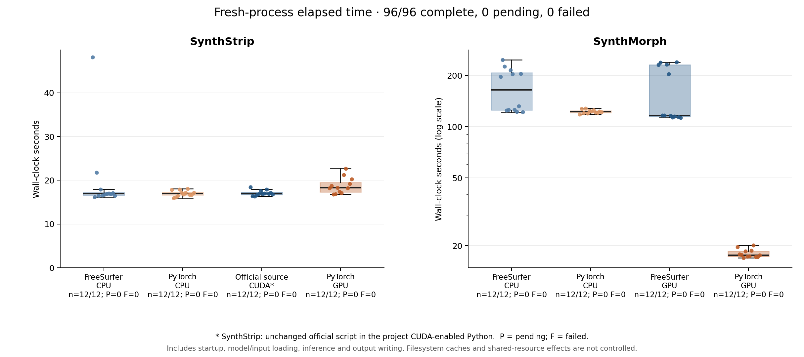

# FreeSurfer SynthStrip / SynthMorph 的独立 PyTorch 实现与对照

本报告对照 FreeSurfer 8.2.0 与独立安装的 `freesurfer-torch`。后者提供可复用的 Python 模型、命令行和 GPU 多进程批量调用。推理依赖 PyTorch、NumPy、SciPy、Surfa 和 h5py；FreeSurfer 命令、TensorFlow、VoxelMorph 和 Neurite 仅出现在参考验证流程中。

以下数值和计时来自 **0.1.0** 基准。0.2.0 重组功能目录后的回归见 [独立报告](../validation/refactor/report.public.json)。公开记录用占位符替换绝对路径，原始数值未改。

基准构建：`freesurfer-linux-centos7_x86_64-8.2.0-20260314-d932c45`。实际脚本、依赖源码和五个模型文件的 SHA-256 见 [provenance.json](provenance.json)。使用原始预训练权重，没有重新训练。

## 1. 两个函数分别做了什么

| 项目 | SynthStrip | SynthMorph |
|---|---|---|
| 任务 | 脑提取 | 刚体、仿射、非线性或联合配准 |
| 原版框架 | 已经是 PyTorch | TensorFlow/Keras |
| 本项目工作 | 保留模型与图像处理语义，整理为独立可复用 API | 移植网络、HDF5 权重加载、速度场积分和变换组合 |
| 网络输出 | 脑边界有符号距离 | 仿射矩阵或双向位移场 |
| 默认输入 | 3D；4D 各帧分别处理 | 两个单帧 3D 图像，可有不同网格和方向 |
| 网络空间 | 1 mm、LIA；裁切并填充为 64 的倍数 | 1 mm、LIA；192³ 或默认 256³ |
| 强度归一化 | 减最小值、除第 99 百分位、截断至 [0,1] | 网络空间减最小值、除最大值 |
| GPU 部分 | U-Net 推理 | 图像到网络空间采样、网络、积分、位移场组合 |
| CPU 部分 | Surfa 预处理、连通域及最终重采样、文件 I/O | HDF5 读取和超网络权重特化、矩阵平方根初始化、Surfa 最终图像重采样、文件 I/O |

表中列出的 GPU 计算在 CUDA 设备执行；最终图像重采样沿用 Surfa 的几何和插值规则。

## 2. SynthStrip 源码流程

每帧先以 nearest 插值转换到 1 mm LIA，裁去非零包围盒外的空间，再将每个维度补为 64 的倍数并限制到 192–320。强度按第 99 百分位归一化。

网络是七层 3D U-Net，卷积核 3³，每层两次卷积，LeakyReLU 斜率 0.2，特征数从 16 开始并截断到 64；下采样用 max pooling，上采样用 nearest，跳连拼接。输出是有符号距离，不是二分类概率。保持了官方 `state_dict` 参数名称，因此原始 `.pt` 直接加载。

距离场必要时向脑外延伸，再回到原始图像网格。`distance < border` 得到候选掩膜，随后保留最大连通域并填洞。默认背景填充值为 `min(image.min(), 0)`；可显式指定。`no_csf=True` 加载另一份官方 checkpoint。

网络和参数对照见 [SynthStrip 专属文档](synthstrip/README.md#网络)。

## 3. SynthMorph 源码流程

### 图像几何和仿射网络

每个输入建立以图像中心为中心的无剪切 1 mm LIA 网格。仅非线性模式把 moving 网络网格中心放在 fixed 中心，以保留已有的物理空间对齐。图像变换先在原始体素空间、网络体素空间和 RAS 世界坐标之间显式换算。

仿射网络在半分辨率上检测 64 个特征图，计算归一化质心和特征强度权重。它分别拟合两个方向的加权最小二乘仿射，再平均一个拟合结果与另一个结果的逆，得到对称变换。`rigid` 按原版的 Cholesky/Euler 分解去除尺度和剪切。

### 联合仿射与非线性网络

`joint` 用仿射矩阵平方根把图像变换到中间空间。非线性网络包含 4 层 encoder、4 层 decoder、4 层附加卷积和一个三通道输出层；主要通道数为 256。

正则化参数 `hyper` 经过四层、每层 32 单元的 MLP，生成这 13 个卷积层的权重。官方 deform HDF5 包含约 8.77 亿参数。本实现对一个模型实例固定的 `hyper` 只计算一次超网络，将结果保留为约 2658 万卷积参数（约 106 MB FP32）。这与该参数值下逐次生成权重的计算函数相同，并适合模型常驻的批量推理。改变 `hyper` 需要另一模型实例或重新特化权重。

Keras 卷积权重轴为 `(i,j,k,in,out)`，PyTorch 为 `(out,in,i,j,k)`。转换仅置换轴，不翻转卷积核。MLP 权重按原矩阵乘法方向读取。

对图像顺序交换前后的预测相减并除以二，形成反对称的平稳速度场。正反速度场分别用默认七次 scaling-and-squaring 积分；再与仿射、分辨率变换和原始图像坐标变换组合。

### 必须区分的两种插值

网络内部忠实匹配 VoxelMorph/Neurite：图像域外整点填零，位移场在边界延拓。矩阵先变成位移，再加回网格；直接简化为矩阵乘网格会在最近邻的半整数位置改变浮点取整。

最终图像则按原命令调用 Surfa。Surfa linear 的有效域为 `[0,n)`，网络采样为 `[0,n−1]`；其 nearest 半整数规则也不同。因此包内保留这两个不同步骤，不能用一个通用采样器替代全部处理。

导出的仿射是带源/目标几何的 world-space LTA；非线性变换是 FreeSurfer RAS 位移场。网络场是 fixed 输出坐标到 moving 采样坐标的 pull map，不能直接当作同名方向的点变换使用。公式和源码位置见 [SynthMorph 专属文档](synthmorph/README.md#symmetry-and-coordinate-transforms)。

## 4. 功能对应关系

| 原版功能 | 独立包 |
|---|---|
| SynthStrip image / mask / distance | `StripResult.image/mask/distance` |
| `--no-csf`、`-b`、`-f`、4D | 支持 |
| `-m joint/deform/affine/rigid` | `SynthMorph(model=...)` |
| 192 / 256 extent、smoothness、integration steps | `extent`、`hyper`、`steps`，同默认值和范围 |
| moving / fixed moved image | `RegistrationResult.moved/fixed_moved` |
| forward / inverse LTA 或 warp | `transform/inverse`，含原始图像几何 |
| 初始化仿射与中间空间初始化 | `init`、`mid_space` |
| 只更新 header | `header_only`，限 affine / rigid |
| apply 的 linear / nearest、fill、dtype、4D | `apply_transform`，使用 Surfa CPU |
| 原版调试目录 | 包提供网络空间两个输入及 `network_transforms.npz`；文件布局与原命令不同 |
| 多病例调用 | 原命令通常逐进程运行；包可复用实例或使用常驻 `BatchRunner` |
| 同 GPU 多进程 / 多 GPU | 支持，显式选择设备与每设备 worker 数 |
| 命令行语法 | 新入口 `fs-torch`；API 与参数对应见 README，并非原命令名称的替换文件 |
| apply 一条命令处理多个 image/output 对 | 当前 CLI 每次一对；Python 可循环调用，batch 入口面向两个神经网络任务 |
| 线程默认值及打印信息 | 新 CLI 默认 4 线程，可显式设置；日志/verbose 输出不复制原版格式，性能比较统一指定 8 线程 |

初始化分支还需区分服务器原版的一处问题：该构建的 `-i` 会在 TensorFlow 的 float64/float32 矩阵组合处报错。验证保留了原生失败日志，另用任务目录中的官方源码副本，仅加入两行 NumPy 类型转换检查算法一致性；没有修改系统安装。该项的 patched-reference 结果单独标记。

[options/report.json](../validation/options/report.json) 的 15 项检查通过，其中 13 项 saved-transform apply 与未修改原版的数据逐元素相同，涵盖 affine/warp、linear/nearest、float32/uint8、`fill=-7`、4D 四帧及 header-only。另两项初始化检查的未修改原命令均以退出码 1 失败；候选与两行修复后的参考相比，双向 world 仿射矩阵元素最大差为 `2.57e-5`，重采样图 NRMSE 分别为 `2.06e-6`（`-i`）和 `1.29e-6`（`-i -M`）。Header-only 的体素数据相同，header 矩阵最大差 `3.05e-5`，满足预设 `1e-3` 阈值，但不宣称 header 逐元素相同。

## 5. 批量和并行行为

`BatchRunner` 用 spawn 建立独立进程，绑定各自 CUDA 设备，按任务类型及模型参数缓存模型。连续调用同一个 runner 会复用这些模型。`run_batch` 是完成一批后关闭 worker 的便利入口。结果按输入顺序返回，包含设备、PID、开始/结束时间、成功保存的输出及错误。

批次在执行前统一检查显式输出和 SynthMorph 调试目录中的三个文件，拒绝跨任务路径冲突；已有文件需要显式 `overwrite=True`。一个任务出错会在其结果中报告，其他任务仍可完成。

默认每 GPU 一个 worker。同一 GPU 多 worker 能并发调度，但每个进程独立保留权重和激活，且可能争用计算、I/O 和显存。模板测试中双 worker 的总耗时长于串行；因此报告不把支持并发等同于吞吐必然提升。

## 6. 验证方案

1. 核对实际安装源和权重哈希；加载同一权重，不训练替代模型。
2. 原类与新类同设备比较；TensorFlow/PyTorch 分进程比较卷积特征、矩阵、速度场和位移。
3. 对不同尺寸、边界、半整数最近邻、仿射/非线性组合、积分、RAS/体素方向做差分测试。
4. 用公开 MNI 模板与已知生成的非线性/强度变化图像对照全部四种配准模式、正逆变换和输出几何。
5. 验证同 GPU / 多 GPU 独立 worker 的真实时间重叠和串行输出一致性。
6. 从用户指定目录的 901 个候选文件中，按固定排序和输入有效性选取 12 例真实 T1w。完整私有清单、输入 SHA 和原始输出保留在服务器；可分享报告仅使用 case01–case12。

真实配准统一为原始 T1w → MNI152 T1 2 mm 模板，使用默认 joint、256³ 网络空间、`hyper=0.5`、七次积分。脑提取使用默认标准权重。两种任务分别测原版 CPU、原版 GPU、新包 CPU、新包 GPU。

每进程线程数设为 8，并通过 `taskset` 绑定 8 个指定 CPU 编号；两个 CPU 队列使用不重叠的编号。GPU 对照使用同一张 H100，主机处理绑定另外 8 个 CPU 编号。每个病例启动新命令进程，计时包含 Python/框架启动、权重和输入读取、计算及相同输出文件写出，质量分析不计入。新包 API 每次返回双向图像，因而即便这里只写出正向图像，仍包含反向图像重采样；原命令按所请求的图像选择重采样。计时反映各自实际入口的耗时，不是仅网络内核的测量。模型构造时关闭所在进程的 PyTorch TF32 开关；批量时各 worker 独立设置。TF32 在双方关闭；这组时间是统一 FP32 条件，未测量启用 TF32 时原版的最快运行时间。文件系统缓存未清空，服务器仍为共享环境；给出逐例时间和中位数/IQR。

参考运行时为 FreeSurfer 自带 Python 3.8、PyTorch 2.1.2+cpu、TensorFlow 2.13.1；新包使用 Python 3.11.7、PyTorch 2.5.1/CUDA 11.8。双方图像处理依赖均为 Surfa 0.6.3。CPU 对照反映这两个实际运行环境，未将框架版本差异从时间中分离。

FreeSurfer 自带的 SynthStrip 环境是 PyTorch CPU build，其原命令不能运行 CUDA。GPU 参考使用**未修改的官方脚本与官方权重**，由项目的 CUDA PyTorch 环境执行，报告标为 `official_source_cuda`。SynthMorph CPU/GPU 参考均调用原生 `mri_synthmorph`。

## 7. 已完成的基础测试

- 最终 130 项空间/插值差分检查通过。
- 26 项回归测试通过，包括两个设备的空间检查和批量错误/路径保护测试。
- SynthStrip 同框架同 GPU 网络输出逐元素相同。模板四个分支中，原版 CPU 与新包 GPU 掩膜和脑图逐元素相同；SDT 最大差约 `2.46e-5`。同 CPU 默认分支三个输出逐元素相同。
- SynthMorph 64³ 测试中 affine/rigid 特征逐元素相同；deform 位移最大差约 `1.15e-5` 体素，joint 约 `1.07e-4` 体素。额外 `hyper=0.7` 非线性测试最大位移差约 `9.54e-6` 体素。
- 模板 192³ 全流程的正向 moved 图像 NRMSE 为 `9.7e-7`–`6.7e-6`，输出几何一致；反向图像的非线性分支有少量边界跳变，详见下表。
- 同 GPU 两进程与两 GPU 各一进程均观察到独立 PID 的任务区间重叠，输出一致性检查通过。

[full192/report.json](../validation/full192/report.json) 在同一公开模板及其非线性、强度变化副本上记录了如下结果；NRMSE 为 RMSE 除以参考图像的均方根。

| 模式 | 正向 moved NRMSE | 反向 fixed_moved NRMSE | 反向图像最大强度差 |
|---|---:|---:|---:|
| affine | 1.25e-6 | 1.56e-6 | 0.0659 |
| rigid | 1.25e-6 | 8.36e-7 | 0.0425 |
| deform | 9.68e-7 | 1.91e-3 | 6307.32 |
| joint | 6.65e-6 | 1.17e-3 | 3865.34 |

四种模式的双向输出几何均完全一致。Deform 的正反向 RAS 位移场最大差均为 `4.58e-5 mm`；joint 分别为 `3.05e-4 mm` 和 `1.68e-4 mm`。[异常体素定位](../validation/full192/reverse_output_diagnosis/report.json)确认：deform 有 1 个、joint 有 2 个体素的误差超过输入最大强度的 0.1%，全部位于采样有效域边界，且全部发生域内/域外状态变化。重载变换后，最大误差处的原版源坐标为 `k=-7.63e-6` 体素，新包为 `k=0`（deform）或 `1.53e-5`（joint），使填零变为边缘强度采样。保存的 RAS warp 再应用也复现这些位置。因此保留原始误差统计，不通过改变边界规则将其消除。在该模板对上，原版与候选的双向 Jacobian 非正比例均为 0。Deform/joint 的前景逆一致性 RMS 为 `0.105–0.111 mm`，两实现接近；这不是零逆误差，也不是人群准确率验证。

## 8. 独立安装和并行验证

wheel 已构建并安装至独立目标目录。清除 `FREESURFER_HOME` 和 `PYTHONPATH` 后，明确从 wheel 安装目录导入，完成 SynthStrip 与 joint 配准；运行时未导入 TensorFlow、VoxelMorph、Neurite 或 FreeSurfer SynthMorph 包。wheel 包含三方许可文件，权重在项目 `weights/` 独立保存。环境版本见 [runtime.json](../validation/runtime.json)，安装验证见 [wheel_smoke.json](../validation/wheel_smoke.json)。

最终同 GPU 双 worker 验证使用非恒等模板对，两个函数共四个任务、14 个输出，全部与串行输出逐元素一致；串行/批量总时长为 63.16/96.55 s。双 GPU 验证同样 14 个输出逐元素一致，总时长为 44.24/61.29 s。两者均有不同 PID 的任务时间区间重叠。这些短批次含模型冷启动，且使用共享 GPU；证明功能和并发调度，不构成吞吐提升证据。详见 [同 GPU 记录](../validation/batch_same_gpu_final/report.json)与[双 GPU 记录](../validation/batch_two_gpu/report.json)。

## 9. 真实 T1w 对照

已完成固定 12 例、两函数 × 四组的 **96 次单例运行，零失败**。匿名逐例记录见 [完整 JSON](../benchmark/summary.public.json)、[时间 CSV](../benchmark/public_report/timing.csv)、[准确性 CSV](../benchmark/public_report/accuracy.csv)和[统计表](../benchmark/public_report/summary.md)。

### 正确性

SynthStrip 在同一设备上与对应原版逐元素一致：12 例 CPU 与 12 例 GPU 对照的脑图、掩膜和距离场均完全相同，Dice 全部为 1，图像几何无差异。跨 CPU/GPU 比较时，两种实现均仅在 case01 出现 1 个掩膜体素差异，最低 Dice 为 `0.999999858562`；距离场最大差为 `2.72e-5 mm`。

SynthMorph 默认 joint、256³ 的配准结果如下。表中形变误差是每个体素的三维 RAS 位移向量差，单位 mm；“全组最大”取 12 例的所有体素最大值。

| 原版与新包对照 | 逐例平均形变误差的中位数 | 全组最大形变误差 | moved 图像 NRMSE 范围 |
|---|---:|---:|---:|
| CPU 对 CPU | 7.45e-5 mm | 0.000502 mm | 8.63e-6–2.99e-5 |
| GPU 对 GPU | 8.22e-5 mm | 0.000790 mm | 1.38e-5–4.05e-5 |

所有配准后图像和变换的源/目标几何一致（几何矩阵系数最大差 `3.47e-18`），数值均有限。四组的 48 个正向场在固定模板网格上计算的 Jacobian 非正比例均为 0。作为浮点差异的参照，原版自身 CPU/GPU 的最大形变向量差为 `0.000491 mm`、最大 moved NRMSE 为 `4.25e-5`。这些结果支持所测试版本和参数下的数值复现；模板反向图像的边界跳变仍按第 7 节完整报告。

### CPU/GPU 时间

单位为秒，数值为 **中位数 [第 25、第 75 百分位]**。每格 12 例；CPU 固定 8 线程/8 个 CPU 编号，GPU 使用同一张 H100，统一关闭 TF32，包含进程启动、加载、推理和写出。

| 函数 | 原版 CPU | 新包 CPU | 原版 GPU* | 新包 GPU |
|---|---:|---:|---:|---:|
| SynthStrip | 16.92 [16.56, 17.27] | 16.96 [16.62, 17.34] | 16.92 [16.74, 17.29] | 18.27 [17.29, 19.48] |
| SynthMorph joint | 164.55 [125.41, 207.09] | 122.33 [120.61, 124.26] | 116.59 [114.56, 231.11] | 17.62 [17.30, 18.60] |

\* SynthStrip GPU 指未修改官方脚本在项目 CUDA Python 中运行；该 FreeSurfer 自带的 CPU Torch 环境不能直接执行 GPU 推理。SynthMorph 的 CPU/GPU 对照均为原生命令。

按每个病例分别计算“原版耗时 / 新包耗时”后取中位数，SynthMorph 的 CPU 比值为 **1.38**、GPU 比值为 **6.79**。新包自身 CPU/GPU 配对耗时比的中位数为 **6.97**。SynthStrip 在本次包含启动和 I/O 的口径下没有获得 GPU 加速。原版配准时间波动较大；这些比值描述本次共享服务器实测，不代表独占硬件、启用 TF32 或只计网络计算时的速度。



### 真实病例的常驻并行批量验证

另在物理 GPU 1 上，用两个常驻 worker、每 worker 4 线程，连续提交 12 个 SynthStrip 和 12 个默认 joint 配准任务。**24 个任务全部成功，60 个保存输出与 GPU 0 单例结果逐元素一致，几何差为 0。** 同一组两个 PID 跨两次 `runner.run()` 保持运行，并观察到任务时间区间重叠。

脑提取批次耗时 72.68 s、配准批次 247.59 s，总时长 320.97 s。GPU 1 同时有其他工作负载，此记录用于验证真实尺寸输入、模型缓存和并行结果，不与 GPU 0 单例时间直接计算加速比。详见[运行记录](../benchmark/real_batch/execution.public.json)和[60 个输出的比较](../benchmark/real_batch/comparison.public.json)。


## 10. 复现

包的普通使用和批量 JSON 示例见 [README](../README.md)。仅运行原版对照时才需加载 FreeSurfer：

```bash
cd Weikang-BrainMRI
source .venv/bin/activate
module load freesurfer
# 根据本机 TensorFlow/CUDA 安装设置动态库路径。
export TF_FORCE_GPU_ALLOW_GROWTH=true
export NVIDIA_TF32_OVERRIDE=0

# 先生成并固定新的私有数据清单；真实病例不随仓库发布。
python tools/benchmark_real_t1w.py prepare \
  --manifest benchmark/new_manifest.private.json --count 12 \
  --input-glob "/data/study/*/T1w.nii.gz" --template /data/templates/MNI152_T1_2mm.nii.gz

# 每个命令可指定一组或多组；既有成功且签名一致的任务会跳过。
# 使用新的输出目录可完整重跑。
python tools/benchmark_real_t1w.py run \
  --manifest benchmark/new_manifest.private.json --output-dir benchmark/rerun \
  --weights weights --function strip --threads 8 --cpu-affinity 0-7 --gpu 0 \
  --arms reference_cpu reference_gpu candidate_cpu candidate_gpu
python tools/benchmark_real_t1w.py run \
  --manifest benchmark/new_manifest.private.json --output-dir benchmark/rerun \
  --weights weights --function morph --threads 8 --cpu-affinity 0-7 --gpu 0 \
  --arms reference_cpu reference_gpu candidate_cpu candidate_gpu
python tools/benchmark_real_t1w.py summarize \
  --manifest benchmark/new_manifest.private.json --output-dir benchmark/rerun \
  --report benchmark/rerun_summary.public.json
python tools/report_benchmark.py \
  --summary benchmark/rerun_summary.public.json --out-dir benchmark/rerun_report
```

上述复现命令按组串行运行；本次记录采用三队列，原版 CPU 绑定 0–7、新包 CPU 绑定 8–15、GPU 队列主机处理绑定 16–23，两个 GPU 组在物理 GPU 0 上依次运行。两种方式都应保留实际 affinity 和共享负载，不能要求重跑得到相同秒数。

真实病例无人工脑掩膜或配准地标，因此这些比较验证对原版的数值复现与执行行为；解剖学准确率没有独立真值评估。病例标识、原始路径、输入哈希和完整影像结果保留在服务器 `benchmark/manifest.private.json` 及 `benchmark/runs/`；本地发行包只包含匿名化统计。
