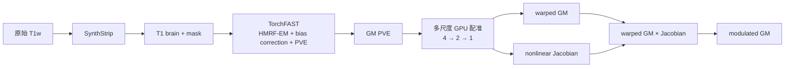
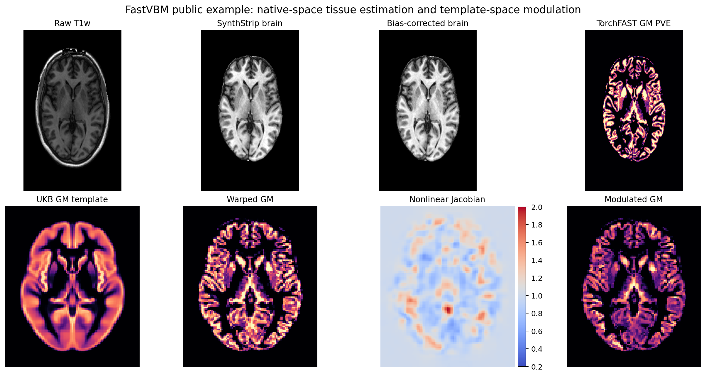
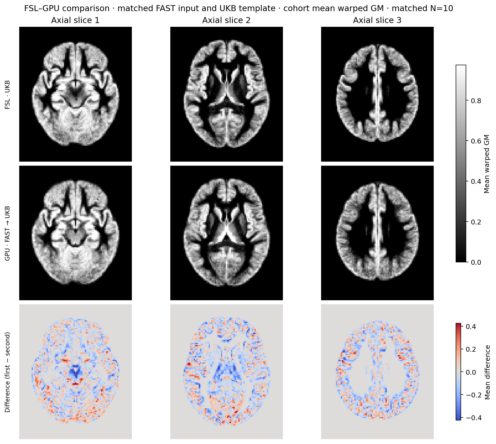
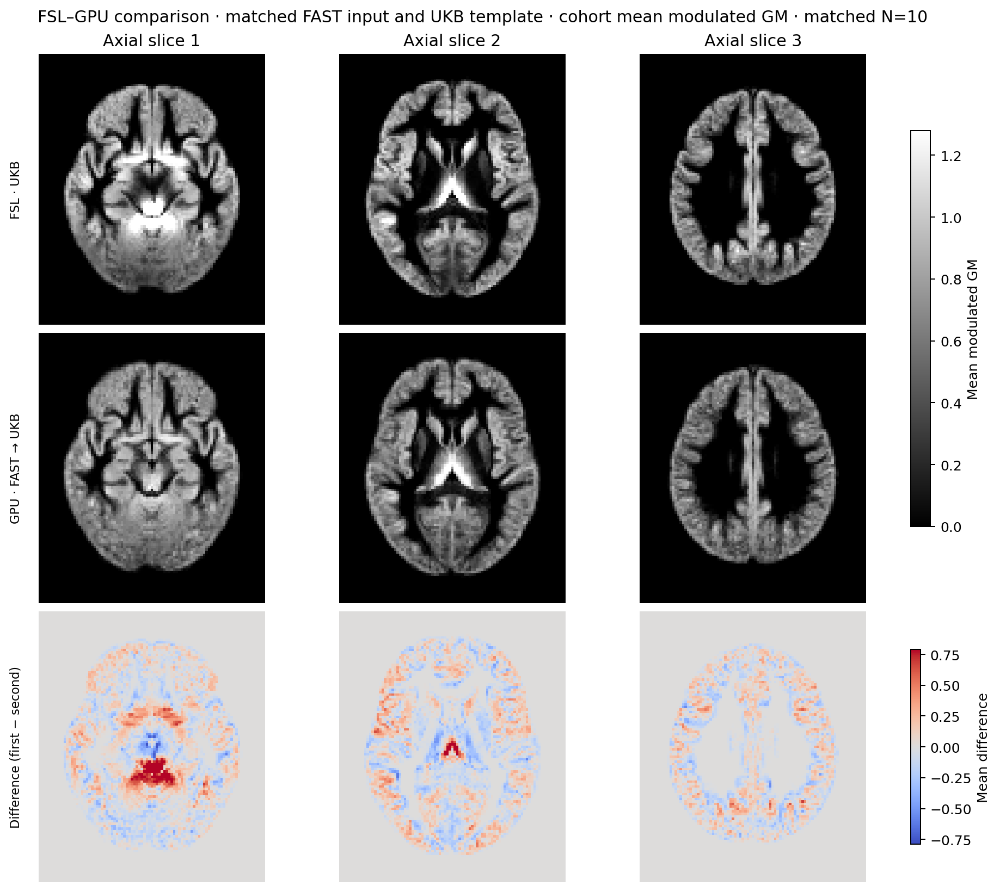

# GPU FAST VBM：从原始 T1w 到 modulated GM

[返回首页](../../README.md) · [源码目录](../../src/freesurfer_torch/fast_vbm/) · [TorchFAST](../fast/README.md) · [UKB/FSL 对照实验](../ukb_vbm/README.md) · [包级验证](../../validation/fast_vbm/README.md) · [科学对照](../../validation/fast/README.md#原始-t1-到-vbm)

GPU FAST VBM 把原始 T1w 的脑提取、三组织分割、偏置场校正、GM 配准、Jacobian
计算和 modulation 组成一个可重复调用的 PyTorch 流程。它接受一幅原始 3D T1w
和一幅目标 GM 模板，返回原始 T1 网格上的脑与组织图，以及模板网格上的 warped
GM、Jacobian 和 modulated GM。

该流程不调用 FSL 或 FreeSurfer 程序。SynthStrip 使用 FreeSurfer 官方权重；
TorchFAST 和 GPU 配准是数值算法，不读取 checkpoint。GPU 配准用于缩短 VBM
预处理时间，其算法不同于 FLIRT/FNIRT，因此输出不能称为 FNIRT 等价结果。

## 流程



1. **SynthStrip** 在输入 T1 网格上生成脑图和二值 mask。已有同网格 mask 时可直接
   提供，跳过 SynthStrip。
2. **TorchFAST** 在脑区联合估计 CSF、GM、WM partial-volume fraction 和平滑乘性
   bias field。偏置场校正默认启用；GM PVE 是后续配准的 moving 图像。
3. **GPU 配准**先估计 GM 重心初始化和可优化仿射，再在 4、2、1 三个尺度优化低
   分辨率位移控制网格。每个尺度的图像项为整幅图像的
   `1 - global normalized correlation + 0.2 × MSE`，并加入位移平滑项。
4. 位移场若产生非法 Jacobian，流程整体缩放 deformation，直到 determinant 落入
   允许范围；这是一项输出约束，不是配准正确性的独立证据。
5. 最终在 GM 模板网格计算 warped GM 与 nonlinear Jacobian，并保存
   `modulated GM = warped GM × Jacobian`。

下图使用仓库中的 OpenNeuro `sub-02` 公开 T1w、官方 UKB GM template 和本页验证
参数，依次展示 raw T1、脑提取、bias-corrected brain、GM PVE 及三项模板空间输出。
它用于说明完整 pipeline 的输入、空间转换和输出，不是同一病例的 FSL 逐项对照。



图由 [`tools/plot_fast_vbm.py`](../../tools/plot_fast_vbm.py) 从实际 NIfTI 输出生成；
定量结论使用完整三维影像。

## Python API

构造一次 `FastVBM` 后可连续处理多例，SynthStrip 模型保持在指定设备上：

```python
from freesurfer_torch import FastVBM, FastVBMResult

pipeline = FastVBM(
    device="cuda:0",
    threads=4,
    bias_correction=True,
    affine_steps=50,
    deform_steps=40,
    smoothness=10.0,
    scales=(4, 2, 1),
)

result: FastVBMResult = pipeline(
    "subject_T1w.nii.gz",
    "template_GM.nii.gz",
)
result.save("results/sub-01")
```

也可由 pipeline 直接运行并写出全部结果：

```python
result = pipeline.run(
    "subject_T1w.nii.gz",
    "template_GM.nii.gz",
    "results/sub-01",
    overwrite=False,
)
```

已有脑掩膜时，它必须与 T1w 的 shape 和 voxel-to-world affine 一致：

```python
result = pipeline(
    "subject_T1w.nii.gz",
    "template_GM.nii.gz",
    brain_mask="subject_brain_mask.nii.gz",
)
```

### 构造参数

`FastVBM(*, device="cpu", threads=None, synthstrip_weights=None,
bias_correction=True, affine_steps=50, deform_steps=40, smoothness=10.0,
scales=(4, 2, 1))`：

| 参数 | 含义 |
|---|---|
| `device` | `cpu` 或 `cuda:N`；SynthStrip、TorchFAST 和配准在该设备执行 |
| `threads` | 当前进程的 PyTorch CPU 线程数 |
| `synthstrip_weights` | SynthStrip checkpoint 或权重目录；省略时使用统一权重查找顺序 |
| `bias_correction` | 默认 `True`；联合更新 TorchFAST bias field |
| `affine_steps` | GPU 仿射优化步数，默认 50 |
| `deform_steps` | 每个尺度的位移优化步数，默认 40 |
| `smoothness` | 位移场平滑项权重，默认 10 |
| `scales` | 从粗到细的优化尺度，默认 `(4, 2, 1)` |

调用参数 `image` 和 `template` 接受 3D NIfTI 路径或 `surfa.Volume`；
`brain_mask` 可选。高级参数 `initial_pull` 是从 fixed/template world 坐标到
moving world 坐标的 4×4 pull transform，常规运行应省略。

### 返回值

`FastVBMResult` 将中间结果分组保存：

| 字段 | 内容 |
|---|---|
| `brain`、`brain_mask` | 输入 T1 网格上的脑图与二值 mask |
| `fast` | 完整 `FASTResult`，含三张 PVE、分类、mixel、bias 和 restore |
| `registration` | GPU 配准、Jacobian 与 modulation 的结果对象 |
| `pve_gm` | `fast.pve_gm` 的便利属性 |
| `warped_gm`、`jacobian`、`modulated_gm` | 模板网格上的三项 VBM 结果 |
| `settings` | 该次运行实际使用的设备与算法参数 |
| `timing_sec` | 分阶段墙钟时间；定义见下文 |

`timing_sec` 包含 `brain_extraction`、`fast`、
`registration_jacobian_modulation` 和 `total`。它在 `__call__` 内测量读图和计算，
不包含随后执行的 `result.save()`。`TorchFAST` 在构造 pipeline 时创建，因此其构造
时间不在字典内；SynthStrip 延迟到首次需要脑提取时创建，所以第一次无显式 mask 的
`brain_extraction` 会包含模型加载，后续调用会复用模型。下文验证表使用单独的保存
阶段墙钟记录，不能与这个字典直接混用。

## 命令行

```bash
fs-torch fast-vbm \
  -i subject_T1w.nii.gz \
  --template template_GM.nii.gz \
  -o results/sub-01 \
  --device cuda:0 --threads 4
```

这条命令读取 raw T1w 和 GM 模板，默认执行 SynthStrip、带 bias correction 的
TorchFAST 及多尺度 GPU 配准，并在 `results/sub-01/` 写出所有结果。已有输出时
默认终止；确认重算后显式添加 `--overwrite`。已有 mask 时用
`--brain-mask subject_brain_mask.nii.gz`；它与输入 T1 必须同网格。

| 参数 | 作用 |
|---|---|
| `-i`, `--image` | 单帧 3D raw T1w |
| `--template` | GM 模板；决定 warped、Jacobian 和 modulated 输出网格 |
| `-o`, `--output-dir` | 保存本页列出的 13 幅影像和一份 JSON 报告 |
| `--brain-mask` | 同 T1 网格的现有 mask；提供后跳过 SynthStrip |
| `--synthstrip-weights` | 官方 SynthStrip checkpoint 或所在目录 |
| `--device`, `--threads` | Torch 设备与 CPU 线程数；设备默认 `cpu` |
| `--affine-steps` | 仿射优化步数，默认 50 |
| `--deform-steps` | 每个尺度的 deformation 优化步数，默认 40 |
| `--smoothness` | 位移平滑权重，默认 10 |
| `--no-bias` | 关闭 TorchFAST bias 更新；仅用于消融 |
| `--overwrite` | 允许替换该输出目录内已有的同名结果 |

偏置场校正是正式默认路径。完整参数以 `fs-torch fast-vbm --help` 为准。

## 输出文件与网格

`result.save(output_dir)` 和 `fs-torch fast-vbm -o output_dir` 使用相同文件名：

| 文件 | 网格 | 含义 |
|---|---|---|
| `T1_brain.nii.gz` | 输入 T1 | 去除脑外背景的 T1 |
| `brain_mask.nii.gz` | 输入 T1 | 二值脑掩膜 |
| `T1_brain_pve_0.nii.gz` | 输入 T1 | CSF PVE |
| `T1_brain_pve_1.nii.gz` | 输入 T1 | GM PVE；配准 moving 图像 |
| `T1_brain_pve_2.nii.gz` | 输入 T1 | WM PVE |
| `T1_brain_seg.nii.gz` | 输入 T1 | PVE 前硬分类 |
| `T1_brain_pveseg.nii.gz` | 输入 T1 | 最大 PVE 分类 |
| `T1_brain_mixeltype.nii.gz` | 输入 T1 | pure/mixed tissue 类型 |
| `T1_brain_bias.nii.gz` | 输入 T1 | 乘性 bias field；脑外为 1 |
| `T1_brain_restore.nii.gz` | 输入 T1 | `T1_brain / bias`；脑外为 0 |
| `T1_GM_to_template_GM.nii.gz` | GM 模板 | warped GM PVE |
| `T1_GM_JAC_nl.nii.gz` | GM 模板 | nonlinear-only pull-map Jacobian；full determinant 除以 affine determinant |
| `T1_GM_to_template_GM_mod.nii.gz` | GM 模板 | warped GM × Jacobian |
| `fast_vbm_report.json` | JSON | 设置、分阶段时间和 deformation 检查；不保存输入路径 |

`fast_vbm_report.json` 不记录输入文件路径。Python 批量运行产生的 `BatchResult` 或
批量汇总会包含输出路径，失败时还可能含 traceback，应作为私有运行记录。每幅影像
先写同目录临时文件，成功后原子替换该文件；这是单文件写入保证，不是整例多文件事务。

## 权重与 UKB GM 模板

GPU FAST VBM 只需默认 SynthStrip 权重：

```bash
python tools/setup_weights.py --model fast-vbm
```

`fast-vbm` 只配置 `synthstrip.1.pt`；同样可显式写 `--model synthstrip`。TorchFAST、
配准、Jacobian 和 modulation 不需要权重。官方 URL、SHA-256 和共享权重目录部署见
[权重文档](../WEIGHTS.md)。

GM 模板不随仓库分发。10 例验证使用 UK Biobank v1.5 ancillary archive 中的
`templates/template_GM.nii.gz`。下载、archive SHA-256、模板 SHA-256 和只提取所需
文件的命令见 [UKB VBM 文档](../ukb_vbm/README.md#官方模板和权重)。

## 多病例与多 GPU

多被试 FastVBM 只提供 Python 内调用。每例建立一个 `fast_vbm` job，交给
`BatchRunner` 在两张 GPU 间动态分配：

```python
from pathlib import Path
from freesurfer_torch import BatchRunner


def main():
    template = "assets/template_GM.nii.gz"
    model = {
        "bias_correction": True,
        "smoothness": 10.0,
    }
    jobs = []
    for image in sorted(Path("inputs").glob("*_T1w.nii.gz")):
        subject = image.name.removesuffix("_T1w.nii.gz")
        output = Path("results") / subject
        jobs.append({
            "task": "fast_vbm",
            "model": model,
            "kwargs": {
                "image": str(image),
                "template": template,
            },
            "outputs": {
                "pve_gm": str(output / "T1_brain_pve_1.nii.gz"),
                "warped_gm": str(output / "T1_GM_to_template_GM.nii.gz"),
                "jacobian": str(output / "T1_GM_JAC_nl.nii.gz"),
                "modulated_gm": str(output / "T1_GM_to_template_GM_mod.nii.gz"),
            },
        })

    with BatchRunner(
        devices=("cuda:0", "cuda:1"),
        workers_per_device=1,
        threads_per_worker=4,
    ) as runner:
        reports = runner.run(jobs)

    failed = [report for report in reports if not report.ok]
    if failed:
        raise RuntimeError([report.error for report in failed])


if __name__ == "__main__":
    main()
```

全部病例使用同一份 `model` 配置，使每个 worker 只缓存一套 `FastVBM` pipeline；
`kwargs` 对应单例调用，`outputs` 把结果属性映射到文件路径。每个 worker 固定到一张 GPU，空闲时领取下一例，
返回顺序仍与 `jobs` 一致。不同病例无需具有相同 shape。多进程使用 `spawn`，脚本必须
保留 `if __name__ == "__main__":`。

整条流程的中间张量多于单独 FAST，建议先使用每卡一个 worker；同卡增加 worker 会
按进程重复占用权重和显存。通用输出冲突和错误记录规则见
[批量执行](../ARCHITECTURE.md#批量执行)。FastVBM 多被试运行不提供 JSON/shell batch
入口，避免把完整 pipeline 的调度参数与单例 CLI 混在一起。

## 与 UKB v1.5/FSL VBM 的差异

| 阶段 | UKB v1.5/FSL 参考 | GPU FAST VBM |
|---|---|---|
| 原始 T1 处理 | robustfov、递归 BET、标准 mask 逆变换 | SynthStrip，或用户提供同网格 mask |
| 组织与 bias | FSL FAST | TorchFAST；bias correction 默认启用 |
| 初始对齐 | FLIRT/`fsl_reg` | GM 重心初始化和可优化仿射 |
| 非线性配准 | FNIRT cubic B-spline 与其强度模型 | PyTorch 位移控制网格；全局相关 + 0.2 MSE |
| 正则化 | `GM_2_MNI152GM_2mm.cnf` | 多尺度位移平滑，默认权重 10 |
| Jacobian | FNIRT `--jout` | PyTorch pull-map determinant，非法时全场回退缩放 |
| modulation | warped GM × Jacobian | 相同公式 |
| 终点 | modulated GM | modulated GM；不含群体平滑或统计 |

验证数据不是 UK Biobank 扫描，缺少扫描仪 gradient-coefficient 文件，因此 FSL
参考走 `coeff=none` 分支。流程在 modulated GM 结束，不包含 FIRST、SIENAX、
BIANCA、去面容、群体平滑、QC 或统计模型。UKB v1.5 复现范围和
`BWAS_preprocess_VBM.py` 的差异见[研究流程说明](../ukb_vbm/README.md)。

## 偏置场校正

在相同的 10 例 brain-only T1 上，默认 bias correction 的 TorchFAST GM 与 FSL FAST
GM 的 Pearson、0.5 Dice 中位数分别为 **0.98488、0.99232**；关闭 bias 更新后降至
**0.93647、0.93703**。因此完整 VBM pipeline 默认保留 bias correction。该消融使用
相同 HMRF 外循环，只关闭 bias 更新；并非跳过组织分割。

## 10 例真实 T1w 验证

验证集为一个非 UKB 临床队列的 10 例真实 T1w，只公开聚合数字。GPU 路径为
raw T1 → SynthStrip → TorchFAST（bias 开启）→ GPU 配准 → Jacobian → modulation。

迁入正式 package 后，另以 Python `BatchRunner` 在两张 H100 上重跑同样数量的真实
T1w：两个 worker 各完成 5 例，13×10 个有限值和网格检查全部通过，最终 Jacobian
为 0.20016–4.77491 且无非正值。完整包级 QC、CPU/CUDA smoke 和 wheel clean-install
结果见[FastVBM package release validation](../../validation/fast_vbm/README.md)。该次
双 GPU 墙钟时间与下表较早的单 GPU、分阶段验证边界不同，不用于替换下表的科学对照。

| 比较或时间边界 | 中位数 |
|---|---:|
| TorchFAST raw GM 与 FSL FAST GM Pearson | 0.79063 |
| TorchFAST raw GM 与 FSL FAST GM Dice 0.5 | 0.95407 |
| 同一 GPU 配准器：TorchFAST GM 与 FSL FAST GM 的 warped Pearson | 0.79231 |
| 同一 GPU 配准器：两种 GM 输入的 modulated Pearson | 0.76820 |
| 完整 GPU pipeline 与 FSL/FNIRT warped GM Pearson | 0.58925 |
| 完整 GPU pipeline 与 FSL/FNIRT modulated GM Pearson | 0.50877 |
| SynthStrip + TorchFAST + 原始网格文件写出 | 23.05 s |
| GPU 配准、Jacobian、modulation 与写出 | 10.99 s |
| GPU raw T1 → modulated GM | 36.47 s |
| FSL raw T1 → modulated GM，9 例有完整分阶段时间 | 3637.20 s |

GPU 时间是持久模型已加载后的逐例保存阶段墙钟时间；FSL 时间是可用原始到 VBM
阶段之和。两种方法在共享节点的不同时段运行，不能把比值解释为隔离负载下的硬件
加速倍数。10 例 GPU 最终 Jacobian 均为正；这部分来自约束后的场。

完整 pipeline 与 FSL/FNIRT 的相关性明显低于单独 TorchFAST 与 FSL FAST 的一致性，
说明非线性配准仍是主要差异来源。当前实现适合可审计的 GPU 替代实验，不应在没有
独立解剖学验证的情况下替换既有 FNIRT 研究结果。

下面两图比较**相同 FSL FAST GM 输入**分别经过 FSL/FNIRT 与 PyTorch GPU 注册后的
队列平均图，用于隔离注册阶段；它们不是 TorchFAST raw-T1 全流程的逐例展示。





TorchFAST 组织估计和 bias 校正的公开单例图见
[TorchFAST 对照图](../../validation/fast/README.md#公开图示)。新 raw-T1 整链结果的
环境、病例聚合范围、mask 定义和计时边界见
[原始 T1 到 VBM](../../validation/fast/README.md#原始-t1-到-vbm)。
[UKB/FSL 注册验证](../../validation/ukb_vbm/README.md)记录的是较早的注册和模板研究，
用于解释注册器与 FNIRT 的差异，不是新 FastVBM API 的独立验证集。
