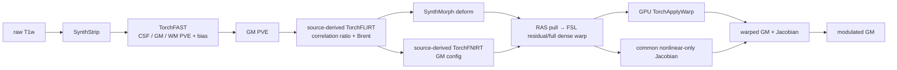
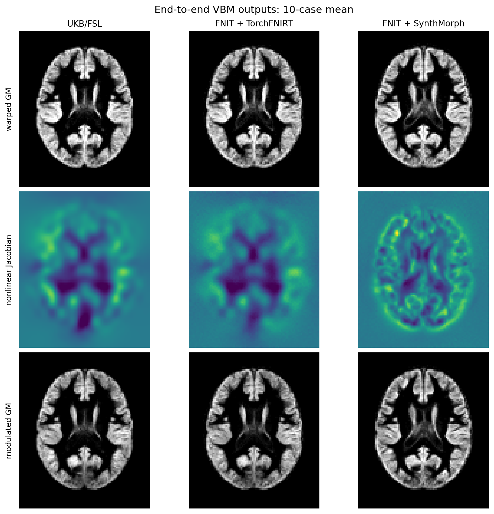

# FastVBM：原始 T1w 到 modulated GM

[返回首页](../../README.md) · [源码目录](../../src/fnit/fast_vbm/) · [TorchFAST](../fast/README.md) · [权重](../WEIGHTS.md) · [验证记录](../../validation/fast_vbm/README.md)

`FastVBM` 接收一幅原始 3D T1w 和一幅 GM 模板，输出脑提取、三组织 PVE、偏置场校正结果，以及模板空间 warped GM、nonlinear-only Jacobian 和 modulated GM。整条流程在 Python 内运行，不调用 FreeSurfer 或 FSL 可执行文件。

CUDA 路径默认允许 TF32 matmul 和 cuDNN 内核，输入、权重及输出张量仍为 float32；不启用 float16 或 bfloat16。`fast_vbm_report.json` 的 `settings.tf32` 记录运行时开关。

非线性配准由 `registration_backend` 选择：

- `"synthmorph"`：本包 PyTorch SynthMorph `deform`，默认分支；
- `"fnirt"`：本包 CUDA/CPU PyTorch FNIRT GM-config 优化器。

两个分支只在“估计 nonlinear pull field”这一步分开；各自的目标函数、正则化和
mask 使用属于该估计器。FAST GM、source-derived `TorchFLIRT` 的 FSL 默认
correlation-ratio/Brent 路径、template grid、RAS pull 到 FSL scaled-mm
residual 的转换、GPU `TorchApplyWarp`、nonlinear-only Jacobian 和 modulation
均使用同一段代码。每次运行的 `pre_nonlinear_signature` 会记录 moving GM、
template、reference mask、几何和 FLIRT matrix 的 SHA-256；两后端使用相同配准
上下文时，该签名必须完全一致。FNIRT estimator 消费 reference mask；官方
SynthMorph deform 网络没有 mask 输入，因此该 mask 在 SynthMorph 分支用于共同
上下文记录和配对验证，不送入网络。
FNIRT 返回的 spline analytic Jacobian 只用于 estimator QC；三幅 VBM 图始终使用
两分支共同计算的 dense-field Jacobian。



## 两个非线性后端

| 项目 | `registration_backend="synthmorph"` | `registration_backend="fnirt"` |
|---|---|---|
| 实现 | 本包 `fnit.synthmorph.SynthMorph(model="deform")` | 本包 `fnit.fnirt.TorchFNIRT` |
| 形变模型 | 官方 SynthMorph 网络；外部仿射作为 `init`；`mid_space=False` | 固定网格上的 cubic B-spline residual displacement |
| 优化坐标 | SynthMorph/Surfa world-RAS pull | 内部为 FSL scaled-mm；输出转换为 world-RAS pull |
| 图像目标 | 由官方 SynthMorph checkpoint 定义 | 全局线性强度拟合后的 SSD |
| 正则化与优化 | SynthMorph stationary velocity field | FSL GM schedule、bending energy、Gauss–Newton/LM + PCG |
| reference mask | 网络无 mask 输入；记录在共同上下文 | 最后一层优化实际使用 |
| nonlinear-only Jacobian | 两分支统一使用 `det(I + ∂u/∂q)`；`u=source_fsl-inv(FLIRT)@target_fsl` | 相同 |
| 重采样 | 两分支统一把 full relative FSL field 交给 GPU `TorchApplyWarp` | 相同 |
| 额外权重 | `synthmorph.deform.3.h5` | 无 |
| FastVBM 文件名与输出网格 | 下列 13 个稳定文件名；后三项在模板网格 | 相同 |

FNIRT 分支沿用 UKB GM 配置的四层下采样、输入/参考平滑、10 mm 控制点
间距、bending-energy 权重和 0.2–5 Jacobian 范围。FastVBM 的 common
Jacobian 对 dense residual 使用 FSL 的中心有限差分（边界单侧差分）；独立
`TorchFNIRT` 仍保留 spline analytic Jacobian。case01 matched-input 诊断
使用官方 intent-2007 coefficient；common dense 与 `fnirtfileutils --jout`
analytic 的全图相关为 0.999916，MAE 0.001555，最大绝对差 0.07110；这属于 FastVBM common
postprocessing 的离散化差异，不能写成逐体素相同。

FNIRT 与 FSL 的配对比较必须传入官方 FNIRT 使用的同一 reference mask。已核对的 UKB 日志使用
`MNI152_T1_2mm_brain_mask_dil`。未提供 `reference_mask` 时，代码退化为
`template > 0`，并在 QC 标为 `derived-fixed-positive-non-fsl-exact`；该默认值不能
用于宣称 FNIRT 与 FSL 数值等价。SynthMorph 不消费该 mask。

## 单被试：Python

先配置默认 SynthMorph 分支所需的两份官方权重：

```bash
python tools/setup_weights.py --model fast-vbm
```

然后构造一个可复用实例并运行一例：

```python
from fnit import FastVBM

pipeline = FastVBM(
    device="cuda:0",
    threads=4,
    registration_backend="synthmorph",
)

result = pipeline.run(
    "subject_T1w.nii.gz",
    "template_GM.nii.gz",
    "results/sub-01",
    reference_mask="MNI152_T1_2mm_brain_mask_dil.nii.gz",
    overwrite=False,
)
```

各行作用：

1. `from fnit import FastVBM` 导入完整 raw-T1-to-VBM pipeline。
2. `device="cuda:0"` 让 SynthStrip、TorchFAST、仿射、非线性配准和 Jacobian 计算使用第一张可见 GPU。
3. `threads=4` 设置当前进程的 PyTorch CPU 线程数。
4. `registration_backend="synthmorph"` 选择 PyTorch SynthMorph；改为 `"fnirt"` 即选择本包 PyTorch FNIRT 分支。
5. `.run()` 的前三个参数依次是单帧 3D raw T1w、fixed GM template 和输出目录。模板的 shape 与 voxel-to-world affine 决定后三幅 VBM 图的网格。
6. `reference_mask` 是与 template 同网格的 FNIRT reference mask。比较 UKB/FSL 的 FNIRT 路径时必须传原 pipeline 使用的同一 mask；它进入两个分支的共同上下文签名，但 SynthMorph 网络不消费它。
7. `overwrite=False` 在任一同名结果存在时停止。成功后写出 13 幅影像和 `fast_vbm_report.json`，并返回 `FastVBMResult`。

只运行 FNIRT 分支时不需要 SynthMorph 权重：

```bash
python tools/setup_weights.py --model synthstrip
```

```python
pipeline = FastVBM(
    device="cuda:0",
    registration_backend="fnirt",
    synthstrip_weights="/models/synthstrip.1.pt",
)
result = pipeline.run(
    "subject_T1w.nii.gz",
    "template_GM.nii.gz",
    "results/sub-01-fnirt",
    reference_mask="MNI152_T1_2mm_brain_mask_dil.nii.gz",
)
```

已有与 T1w 同网格的脑掩膜时可跳过 SynthStrip：

```python
result = pipeline.run(
    "subject_T1w.nii.gz",
    "template_GM.nii.gz",
    "results/sub-01",
    brain_mask="subject_brain_mask.nii.gz",
)
```

只需内存结果时直接调用实例：

```python
result = pipeline("subject_T1w.nii.gz", "template_GM.nii.gz")
result.warped_gm.save("warped_gm.nii.gz")
result.jacobian.save("jacobian_nonlinear.nii.gz")
result.modulated_gm.save("modulated_gm.nii.gz")
```

`image`、`template`、`brain_mask` 和 `reference_mask` 可传路径或
`surfa.Volume`。输入必须是有限值单帧 3D 影像；`brain_mask` 必须与 T1w
同网格，`reference_mask` 必须与 template 同网格；模板必须包含正 GM 值。

### 构造参数

```text
FastVBM(
    device="cpu", threads=None,
    synthstrip_weights=None, synthmorph_weights=None,
    bias_correction=True,
    registration_backend="synthmorph",
    synthmorph_extent=256,
    synthmorph_hyper=0.5,
    synthmorph_steps=7,
    fnirt_strides=(4, 2, 1, 1),
    fnirt_steps=(5, 5, 10, 5),
    fnirt_input_fwhm_mm=(6, 4, 2, 2),
    fnirt_reference_fwhm_mm=(4, 2, 0, 0),
    fnirt_warp_resolution_mm=10,
    fnirt_regularization=(150, 75, 50, 30),
)
```

| 参数 | 作用 |
|---|---|
| `device` | `cpu` 或 `cuda:N`；选择整条流程的设备 |
| `threads` | 当前调用的 PyTorch CPU 线程数；`None` 保留现有设置 |
| `synthstrip_weights` | `synthstrip.1.pt` 或其目录；有显式 `brain_mask` 时不读取 |
| `synthmorph_weights` | `synthmorph.deform.3.h5` 或其目录；仅 SynthMorph 分支读取 |
| `bias_correction` | 默认 `True`；TorchFAST 同时估计平滑乘性 bias field |
| `registration_backend` | `"synthmorph"` 或 `"fnirt"` |
| `synthmorph_*` | 仅 SynthMorph 分支使用的网络空间、正则化超参数和积分次数 |
| `fnirt_strides` | `TorchFNIRT` 四层 fixed-grid 下采样步长 |
| `fnirt_steps` | FNIRT 四层 `miter`，默认 `(5, 5, 10, 5)` |
| `fnirt_input_fwhm_mm`、`fnirt_reference_fwhm_mm` | 各层 moving/reference Gaussian FWHM，单位 mm |
| `fnirt_warp_resolution_mm` | cubic B-spline 控制点目标间距，单位 mm |
| `fnirt_regularization` | 各层 bending-energy 权重 |

公开 `FastVBM` 不接受外部 affine，也不能跳过线性阶段。每次调用固定运行本包
`TorchFLIRT`，因此两个后端进入非线性估计器前只有一条公开计算路径。matched-affine
验证所需的固定变换注入只存在于仓库的私有验证入口。

### 返回值

| 字段 | 内容 |
|---|---|
| `brain`、`brain_mask` | 输入 T1 网格上的脑图和二值 mask |
| `fast` | `FASTResult`：三类 PVE、分类、mixel、bias 和 restored T1 |
| `registration` | `VBMRegistrationResult`：模板空间结果和配准 QC |
| `pve_gm` | `fast.pve_gm` 的便利属性 |
| `warped_gm` | 仿射与所选非线性后端共同重采样后的 GM |
| `jacobian` | 所选后端的 nonlinear-only pull Jacobian |
| `modulated_gm` | `warped_gm × jacobian` |
| `settings` | 实际设备、固定 TorchFLIRT 路径和所选非线性后端参数 |
| `timing_sec` | 脑提取、FAST、配准/Jacobian/modulation 和总墙钟时间 |

`timing_sec` 包含读取和输出回到 CPU，不包含 `result.save()` 的 NIfTI 写入。第一次无显式 mask 的调用包含 SynthStrip 延迟加载；SynthMorph 分支第一次配准还包含 3.51 GB checkpoint 的加载，后续调用复用模型。FNIRT 分支没有非线性 checkpoint。

## 单被试：命令行

SynthMorph 分支：

```bash
fnit fast-vbm \
  -i subject_T1w.nii.gz \
  --template template_GM.nii.gz \
  -o results/sub-01 \
  --registration-backend synthmorph \
  --reference-mask MNI152_T1_2mm_brain_mask_dil.nii.gz \
  --device cuda:0 \
  --threads 4
```

`TorchFNIRT` 分支只需更换后端和输出目录：

```bash
fnit fast-vbm \
  -i subject_T1w.nii.gz \
  --template template_GM.nii.gz \
  -o results/sub-01-fnirt \
  --registration-backend fnirt \
  --reference-mask MNI152_T1_2mm_brain_mask_dil.nii.gz \
  --device cuda:0 \
  --threads 4
```

各行作用：

1. `fnit fast-vbm` 选择单被试 raw-T1-to-VBM 入口。
2. `-i` 指定单帧 3D raw T1w。
3. `--template` 指定 fixed GM template，并定义三幅模板空间结果的 shape、方向和体素尺寸。
4. `-o` 是完整输出目录。
5. `--registration-backend` 在 `synthmorph` 与 `fnirt` 之间选择非线性阶段。
6. `--reference-mask` 记录同一 template-grid 配准上下文；`TorchFNIRT` 在最后一级优化中使用它，SynthMorph 仅记录而不送入网络。
7. `--device` 选择 PyTorch 设备；`--threads` 设置该进程的 CPU 线程数。

| 常用参数 | 作用 |
|---|---|
| `--brain-mask MASK` | 使用现有输入网格 mask，跳过 SynthStrip |
| `--reference-mask MASK` | template-grid reference mask；两分支共同记录，仅 `TorchFNIRT` estimator 消费 |
| `--synthstrip-weights PATH` | 显式指定 SynthStrip checkpoint 或目录 |
| `--synthmorph-weights PATH` | 显式指定 deform checkpoint；仅 SynthMorph 分支读取 |
| `--synthmorph-extent / --synthmorph-hyper / --synthmorph-steps` | SynthMorph 分支参数 |
| `--fnirt-strides / --fnirt-steps` | `TorchFNIRT` 四层下采样和 `miter` 参数 |
| `--fnirt-input-fwhm-mm / --fnirt-reference-fwhm-mm` | `TorchFNIRT` 四层平滑参数 |
| `--fnirt-warp-resolution-mm` | B-spline 控制点目标间距 |
| `--fnirt-regularization` | `TorchFNIRT` bending-energy 权重 |
| `--no-bias` | 关闭 TorchFAST bias correction，用于消融 |
| `--overwrite` | 允许覆盖同名输出 |

完整参数以 `fnit fast-vbm --help` 为准。

## 独立 PyTorch FLIRT 接口

FastVBM 与独立接口调用同一个 source-derived `TorchFLIRT`。当前公开路径对应
FSL FLIRT 2111.2 的默认 12-DOF、correlation-ratio、8/4/2/1 mm schedule 和
MISCMATHS Brent coordinate optimizer；运行时不调用 FSL executable。

### Python

```python
from pathlib import Path
from fnit import TorchFLIRT

Path("results").mkdir(exist_ok=True)
flirt = TorchFLIRT(device="cuda:0")
result = flirt.run(
    input="subject_GM.nii.gz",
    reference="template_GM.nii.gz",
    output="results/subject_to_template.nii.gz",
    omat="results/subject_to_template.mat",
)
```

`result.moved` 是 float32 reference-grid image；其 shape 和 voxel-to-world affine 取自 reference。`result.matrix` 与 `result.fsl_matrix` 是同一个 4×4 input → reference FSL scaled-mm 矩阵。`moving_to_fixed_world` 和 `fixed_to_moving_world` 分别保存 RAS forward 与 pull 形式。

### 命令行

```bash
fnit flirt \
  -in subject_GM.nii.gz \
  -ref template_GM.nii.gz \
  -out results/subject_to_template.nii.gz \
  -omat results/subject_to_template.mat \
  -dof 12 \
  -cost corratio \
  --device cuda:0
```

| 参数或输出 | FSL `flirt` 角色 | 本包保证的契约 |
|---|---|---|
| `-in` | 被变换的 input | moving 单帧 3D 影像 |
| `-ref` | reference，定义输出 FOV | fixed 影像；输出 shape 和 affine 与其一致 |
| `-out` | 重采样后的 input | float image on reference grid |
| `-omat` | input → reference 4×4 ASCII matrix | input FSL scaled-mm → reference FSL scaled-mm |
| `-dof 12` | 12 参数 affine | 当前唯一支持值 |
| `-cost corratio` | correlation ratio | 当前唯一支持值；使用 source-derived FSL default cost 和 Brent 路径 |

该实现来自 FSL 默认路径源码。当前 10 例 reference suite 的 matrix
functional gate 为 10/10 通过（FSL reference-centred
`rmsdiff ≤ 0.05 mm`；中位数 0.008544 mm，最大值 0.028984 mm）。
这是指定套件的 tolerance gate；运行时仍报告
`validated_fsl_equivalent=false` 和 `current_input_compared_with_fsl=false`，不表示当前
输入、bitwise 或完整数值等价。

支持范围、许可和完整数值见
[PyTorch FLIRT 页面](../flirt/README.md)。官方 FLIRT 对 input/reference、
`-omat` 和 reference-defined output grid 的定义见
[FLIRT user guide](https://fsl.fmrib.ox.ac.uk/fsl/docs/registration/flirt/user_guide.html)，
scaled-mm 与 handedness 规则见
[FLIRT FAQ](https://fsl.fmrib.ox.ac.uk/fsl/docs/registration/flirt/faq.html)。

## 坐标、warp 与 Jacobian

FSL、NIfTI world-RAS 和 Surfa/SynthMorph 表示不能按数组元素直接互换：

- FLIRT `.mat` 把 input FSL scaled-mm 映射到 reference FSL scaled-mm。正行列式 NIfTI 几何还包含 FSL 的 x 轴 handedness flip。
- FastVBM 内部 affine forward 是 moving-world → fixed-world RAS；重采样使用它的 fixed-world → moving-world 逆矩阵。
- 两个非线性后端对外均返回 fixed/template 网格上的 `surfa.Warp(format=disp_ras)`；每个 fixed 体素保存 `source_world(target) - target_world`。
- FNIRT 分支内部残差是 fixed FSL scaled-mm → moving FSL scaled-mm 的 nonlinear displacement，并在输出前与 affine pull 合成、转换为 world-RAS。

FLIRT matrix 转为 moving → fixed RAS forward 的公式为：

```text
A_world = fixed_vox2world
          @ inv(V2FSL_fixed)
          @ M_flirt
          @ V2FSL_moving
          @ inv(moving_vox2world)
```

本包的 `flirt_to_world_affine()`、`flirt_to_world_pull()` 和 `world_to_flirt_affine()` 需要 moving/fixed 两端的 affine 与 shape，因为 `V2FSL` 依赖 voxel size、shape 和 handedness。手工转换带 shear 的 sform 时，还应通过 `moving_voxel_sizes=` 和 `fixed_voxel_sizes=` 传入 NIfTI header 中保存的 pixdim；`TorchFLIRT` 和 `TorchFNIRT` 已从 Surfa geometry 自动传入，普通调用无需设置。

FSL FNIRT `--jout` 用于 VBM 时是 nonlinear-only Jacobian；`fnirtfileutils --withaff` 才把 affine 计入。当前 FastVBM 把两个 estimator 返回的 world-RAS pull 都转换成相对于同一 FLIRT affine 的 FSL scaled-mm residual，然后用同一个 dense-field finite-difference 实现计算 nonlinear-only `jacobian`。因此 SynthMorph 与 FNIRT 分支在 Jacobian 和 modulation 阶段没有第二条实现路径。

FSL `--cout` 是带专用 NIfTI intent/header 的 B-spline coefficient file，`--fout` 是另一种 dense field 表示。独立 `TorchFNIRT` 可写 intent-2007 `--cout`，`TorchApplyWarp` 可读取该文件；FastVBM 本身不另存 coefficient 或 dense warp 文件，而是在内存中完成统一转换和重采样。可对比同一 reference 网格上的 warped GM、Jacobian 和 modulated GM，但不能把 Surfa world-RAS displacement 与 FSL scaled-mm warp 数组直接逐元素比较。详见 [TorchFNIRT](../fnirt/README.md)、[TorchApplyWarp](../applywarp/README.md) 和 [FNIRT user guide](https://fsl.fmrib.ox.ac.uk/fsl/docs/registration/fnirt/user_guide.html)。

## 13 幅稳定输出

`FastVBMResult.save()`、`FastVBM.run()` 和单被试 CLI 在两个后端下使用相同文件名。后三项均为 float32 NIfTI，并复制 GM template 的 shape 和 voxel-to-world geometry：

| Python 键 | 文件 | 网格 | 含义 |
|---|---|---|---|
| `brain` | `T1_brain.nii.gz` | 输入 T1 | mask 外清零后的 T1 |
| `brain_mask` | `brain_mask.nii.gz` | 输入 T1 | 二值脑掩膜 |
| `pve_csf` | `T1_brain_pve_0.nii.gz` | 输入 T1 | CSF PVE |
| `pve_gm` | `T1_brain_pve_1.nii.gz` | 输入 T1 | GM PVE，也是配准 moving image |
| `pve_wm` | `T1_brain_pve_2.nii.gz` | 输入 T1 | WM PVE |
| `hard_segmentation` | `T1_brain_seg.nii.gz` | 输入 T1 | PVE 前硬分类 |
| `pve_segmentation` | `T1_brain_pveseg.nii.gz` | 输入 T1 | 最大 PVE 分类 |
| `mixel_type` | `T1_brain_mixeltype.nii.gz` | 输入 T1 | pure/mixed tissue 类型 |
| `bias_field` | `T1_brain_bias.nii.gz` | 输入 T1 | 乘性 bias field；脑外为 1 |
| `restored` | `T1_brain_restore.nii.gz` | 输入 T1 | `T1_brain / bias_field`；脑外为 0 |
| `warped_gm` | `T1_GM_to_template_GM.nii.gz` | GM 模板 | affine + 所选非线性后端后的 GM |
| `jacobian` | `T1_GM_JAC_nl.nii.gz` | GM 模板 | nonlinear-only pull determinant |
| `modulated_gm` | `T1_GM_to_template_GM_mod.nii.gz` | GM 模板 | `warped_gm × jacobian` |

另写 `fast_vbm_report.json`，记录后端、参数、分阶段时间、FAST 摘要、配准 QC 和文件名，不记录输入路径。

## 与 UKB v1/FSL VBM 的对应关系

官方 UK Biobank pipeline 的 `bb_vbm` 以 FAST GM PVE 和 `template_GM` 为输入，调用 `fsl_reg ... -fnirt`，随后把 warped GM 乘以 `--jout`：

```bash
fsl_reg T1_brain_pve_1.nii.gz template_GM.nii.gz \
  T1_GM_to_template_GM -fnirt \
  "--config=GM_2_MNI152GM_2mm.cnf --jout=T1_GM_JAC_nl"
fslmaths T1_GM_to_template_GM -mul T1_GM_JAC_nl \
  T1_GM_to_template_GM_mod -odt float
```

| 阶段 | UKB/FSL | 本包 | 对齐范围 |
|---|---|---|---|
| 脑提取 | UKB 前序流程的 BET 与标准 mask | SynthStrip，或显式 input-grid mask | 输出角色一致；算法不同 |
| GM 与 bias | FSL FAST，GM 为 `T1_brain_pve_1` | TorchFAST，bias 默认开启 | 文件角色和组织顺序对应；数值算法独立 |
| affine | `fsl_reg` 内部 FLIRT | source-derived `TorchFLIRT`：12-DOF、correlation ratio、FSL default schedule 与 Brent | input/reference 与 FSL scaled-mm `.mat` 契约对应；10 例 matrix functional gate 通过，运行时仍不标为当前输入或完整数值等价 |
| affine 文件 | `T1_GM_to_template_GM.mat` | 独立 `TorchFLIRT(...).run(omat=...)` 可写；FastVBM 不单独保存 | 4×4 input → reference FSL scaled-mm contract 对应 |
| nonlinear，SynthMorph 分支 | FNIRT | PyTorch SynthMorph deform | 共同生成 template-grid warped GM；模型不同 |
| nonlinear，FNIRT 分支 | cubic B-spline FNIRT | source-derived `TorchFNIRT` GM config | schedule、FSL scaled-mm residual、coefficient header 和输出用途对应；十例 matched-input 对照已完成，仍标记 `fsl_fnirt_numerically_equivalent=false` |
| nonlinear warp 文件 | `_warp.nii.gz` 是带专用 header/intent 的 FSL coefficient file | FastVBM 在内存中保留 Surfa `disp_ras` 并转换为 FSL dense field；独立 `TorchFNIRT` 可写 intent-2007 coefficient | FastVBM 不另存 warp；不同表示不能直接逐元素比较 |
| 重采样 | `applywarp` | 两分支共用 GPU `TorchApplyWarp` | 两分支使用同一 full relative FSL field contract、template grid 和 trilinear 路径；与 FSL 的数值范围以 `TorchApplyWarp` 已验证子集为准 |
| Jacobian | FNIRT nonlinear-only `--jout` | 两分支共用 FSL scaled-mm residual 的 dense finite-difference determinant | 文件角色、template grid 与 modulation 用途对应 |
| modulation | `fslmaths warped -mul jacobian` | 两分支共用 `warped_gm * jacobian` | 公式一致 |

FastVBM 在 modulated GM 结束，不包含 UKB gradient distortion correction、群体平滑、统计模型或其他结构 IDP。官方代码见 [UK Biobank pipeline v1](https://git.fmrib.ox.ac.uk/open-science/analysis/UK_biobank_pipeline_v_1)，FSL FNIRT 源码见 [FMRIB GitLab](https://git.fmrib.ox.ac.uk/fsl/fnirt)。模板下载和 FSL 参考实验见 [UKB/FSL 专页](../ukb_vbm/README.md)。

## 权重和模板

| 场景 | 所需 checkpoint |
|---|---|
| SynthMorph 分支，从 raw T1w 开始 | `synthstrip.1.pt` + `synthmorph.deform.3.h5` |
| FNIRT 分支，从 raw T1w 开始 | `synthstrip.1.pt` |
| 任一分支，提供显式脑 mask | SynthMorph 分支只需 deform；FNIRT 分支无需 checkpoint |

`python tools/setup_weights.py --model fast-vbm` 安装两个后端的权重超集，即 SynthStrip 和 SynthMorph deform。只运行 FNIRT 分支可改用 `--model synthstrip`。TorchFAST、source-derived `TorchFLIRT`、`TorchFNIRT`、`TorchApplyWarp`、Jacobian 和 modulation 不读取 checkpoint。

GM template 是运行输入，不是模型权重，也不由配置脚本下载。UKB 公开 `template_GM.nii.gz` 的下载和 SHA-256 见 [UKB/FSL 专页](../ukb_vbm/README.md)；模型 URL、权重校验和离线部署见[权重文档](../WEIGHTS.md)。

## 图示与验证

当前 0.9 FastVBM 使用本页所述共享链路。正式 10 例报告只运行
`end_to_end`：raw T1w 依次经过本包 SynthStrip、TorchFAST、source-derived
`TorchFLIRT` 和所选 nonlinear backend。详细的三输出 median [Q1–Q3]、compute/save、
release gate 见
[`validation/fast_vbm`](../../validation/fast_vbm/README.md)。

与 UKB/FSL 端到端输出的 10 例中位数如下。Pearson 和 Dice 都在官方 MNI
reference mask 内计算；Dice 阈值分别为 warped/modulated GM `0.2`、Jacobian
`1.0`。

| 非线性分支 | warped GM Pearson / Dice | Jacobian Pearson / Dice | modulated GM Pearson / Dice | 本包 compute + 三幅输出写盘中位数 |
|---|---:|---:|---:|---:|
| TorchFNIRT | 0.898466 / 0.914901 | 0.894475 / 0.862602 | 0.886469 / 0.911365 | 180.096 s |
| SynthMorph | 0.721780 / 0.828445 | 0.310599 / 0.640193 | 0.636723 / 0.824325 | 35.216 s |

UKB/FSL 历史记录的 GM 配准与调制中位数为 897.294 s（10 例）；从 raw T1w
到 modulated GM 的完整记录中位数为 3637.203 s（9 例）。原记录没有保存硬件和
线程数，与本包运行也不在同一时间窗，因此这些数字只说明本次观察到的墙钟时间，
不能作为受控加速倍数。

下图按列显示 UKB/FSL、FNIT+TorchFNIRT 和 FNIT+SynthMorph，按行显示 warped GM、
nonlinear-only Jacobian 和 modulated GM。每个面板是正式 10 例结果的组平均，
没有展示单个受试者；同一行使用相同色阶。



FLIRT reference-suite matrix gate 为 10/10 通过；其 matrix RMS difference
中位数为 0.008544 mm，最大值为 0.028984 mm。这排除了“affine
没有达到预设 matrix gate”这一解释，但该 gate 不是当前输入或完整数值等价证明。

独立 direct FNIRT matched-input 实验固定了 FSL FAST GM、模板、官方 FSL affine 和
reference mask；warped GM、Jacobian 与 modulated GM 的中位 Pearson 分别为
0.998695、0.999267 和 0.998507。误差仍大于舍入误差，
所以 `fsl_fnirt_numerically_equivalent=false`。同一 brain-only T1 输入上的
TorchFAST/FSL FAST GM Pearson 中位数为 0.98488。端到端还包含
SynthStrip/UKB 前处理和 GM 估计差异；SynthMorph 使用不同 nonlinear 算法；
Jacobian modulation 又把 warped GM 与 Jacobian 的差异共同带入 modulated GM。
正式报告没有新的 matched-GM/matched-affine 消融，不能据此量化每一步的因果占比。

0.9 公开文件为 [`report.v0.9.public.json`](../../validation/fast_vbm/report.v0.9.public.json)、[`backend_comparison.v0.9.public.csv`](../../validation/fast_vbm/backend_comparison.v0.9.public.csv)、[`test_summary.v0.9.public.json`](../../validation/fast_vbm/test_summary.v0.9.public.json) 和 [`release.v0.9.public.json`](../../validation/fast_vbm/release.v0.9.public.json)。Direct FNIRT 报告见
[`fnirt_fsl_10case.v0.9.public.json`](../../validation/fast_vbm/fnirt_fsl_10case.v0.9.public.json)。
