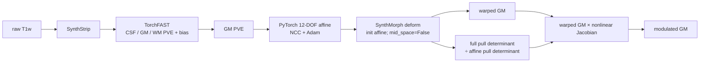

# FastVBM：原始 T1w 到 modulated GM

[返回首页](../../README.md) · [源码目录](../../src/freesurfer_torch/fast_vbm/) · [TorchFAST](../fast/README.md) · [权重](../WEIGHTS.md) · [当前版本验证](../../validation/fast_vbm/README.md)

`FastVBM` 把一幅原始 3D T1w 和一幅 GM 模板处理为组织分割及模板空间 VBM
结果。整条流程在 Python 内运行，不调用 FreeSurfer 或 FSL 可执行文件：

```text
raw T1w
  → SynthStrip 脑提取
  → TorchFAST 三组织 PVE + bias-field correction
  → 独立 PyTorch FLIRT-compatible 12-DOF 仿射（NCC + Adam）
  → 本包 PyTorch SynthMorph deform（官方权重，init=上述仿射）
  → nonlinear-only pull Jacobian
  → warped GM × Jacobian
  → modulated GM
```



线性阶段使用 FLIRT 的 12 参数类别：三轴旋转、三轴平移、三轴缩放和三项剪切，
围绕 moving GM 的加权重心构造 world-space 仿射。这里的“FLIRT-compatible”只指
参数含义和 moving-to-fixed 仿射用途相容。它使用 normalized correlation 和 Adam；
FSL FLIRT 默认使用 correlation ratio 和 Brent/direction-set 优化，并有自己的搜索与
多分辨率 schedule。因此本实现**不是 FSL FLIRT 的数值等价重写**，不能把两者的矩阵
或结果称为相同。

非线性阶段调用本包
`freesurfer_torch.synthmorph.SynthMorph(model="deform")`，读取官方
`synthmorph.deform.3.h5`，将上一步的 moving-to-fixed 仿射作为 `init`
传入，并固定
`mid_space=False`，使该仿射只应用一次。最终 warp 是定义在 fixed/template 网格上的
target-to-source pull map。流程先计算完整 pull determinant，再除以仿射 pull
determinant，得到只含非线性部分的 Jacobian。Jacobian 按计算值输出，非正
determinant 数量原样写入 QC。

### 坐标与 warp 约定

FSL、world-RAS 和 Surfa/SynthMorph 使用的表示不能直接互换：

- FSL FLIRT 的 `.mat` 把 **input FSL scaled-mm** 坐标映射到 **reference FSL
  scaled-mm** 坐标。它不是 NIfTI world-RAS 仿射，也不能直接传给
  `initial_pull`。
- 本包线性优化返回 `moving_to_fixed_world`，即 moving-world → fixed-world 的
  world-RAS 仿射；`result.registration.pull_world_affine` 是它的逆矩阵，即
  fixed-world → moving-world pull affine。
- SynthMorph/Surfa 的 warp 带有 `source=moving` 和 `target=fixed` 几何。warp 数据定义
  在 fixed 网格上；转为 `disp_ras` 后，每个 fixed 体素保存
  `source_world(target) - target_world`，也就是 fixed → moving 的
  target-to-source pull displacement。Jacobian 从这一 `disp_ras` pull field 计算。

若必须把 FLIRT 矩阵转换为本包使用的 moving → fixed world-RAS 仿射，应先分别构造
moving 和 fixed 的 voxel-index → FSL scaled-mm 矩阵 `V2FSL`，再计算：

```text
A_world = fixed_vox2world
          @ inv(V2FSL_fixed)
          @ M_flirt
          @ V2FSL_moving
          @ inv(moving_vox2world)
```

`initial_pull` 接收的是 `inv(A_world)`。本包提供
`flirt_to_world_affine()` 和 `flirt_to_world_pull()` 执行该转换；两者要求同时传入
moving/fixed 的 voxel-to-world affine 和 shape，不能只传 `.mat`。`V2FSL` 必须按
FSL 的 voxel size 和 handedness 规则构造，不能用 NIfTI affine 直接代替。FSL 对照
优先比较同一 reference 网格上的重采样输出；需要比较矩阵时再执行上述严格转换。
FNIRT coefficient、absolute warp、relative warp 与本包的 world-RAS `disp_ras` 也不是
同一表示，不能互相当作输入。

## 0.7 公开流程图

下图由仓库的公开去面容 T1w 使用当前 0.7 pipeline 生成。第一行为原始
T1w、SynthStrip brain、bias-corrected brain 和 TorchFAST GM PVE；第二行为
UKB GM template、本包 PyTorch SynthMorph warped GM、nonlinear-only Jacobian 和
modulated GM。这次运行不调用 FreeSurfer 或 FSL 可执行文件。


FreeSurfer 原版与本包结果的直接图像对照分别见
[SynthStrip 脑提取](../synthstrip/README.md)和
[SynthMorph 配准](../synthmorph/README.md)。当前 FastVBM 数值验证见
[验证记录](../../validation/fast_vbm/README.md)。

## 单被试：Python

先配置两个官方权重：

```bash
python tools/setup_weights.py --model fast-vbm
```

然后运行一例：

```python
from freesurfer_torch import FastVBM

pipeline = FastVBM(
    device="cuda:0",
    threads=4,
)

result = pipeline.run(
    "subject_T1w.nii.gz",
    "template_GM.nii.gz",
    "results/sub-01",
    overwrite=False,
)
```

逐行含义如下：

1. `from freesurfer_torch import FastVBM` 导入完整 pipeline。
2. `FastVBM(...)` 构造可复用实例。`device="cuda:0"` 让 SynthStrip、TorchFAST、
   线性优化、SynthMorph 和 Jacobian 计算使用第一张可见 GPU；`threads=4` 设置该进程
   的 PyTorch CPU 线程数。
3. `pipeline.run(...)` 的第一个参数是单帧 3D raw T1w；第二个参数是 GM 模板；第三个
   参数是输出目录。模板的 shape 和 voxel-to-world affine 决定三幅 VBM 结果的网格。
4. `overwrite=False` 在任一同名结果已存在时停止，避免静默覆盖。
5. 返回的 `result` 是 `FastVBMResult`；`.run()` 已写出 13 幅影像和
   `fast_vbm_report.json`。

权重已放在非默认目录时，可在构造时分别传入文件或目录：

```python
pipeline = FastVBM(
    device="cuda:0",
    synthstrip_weights="/models/synthstrip.1.pt",
    synthmorph_weights="/models/synthmorph.deform.3.h5",
)
```

只需内存结果时调用实例本身，随后按需保存：

```python
result = pipeline("subject_T1w.nii.gz", "template_GM.nii.gz")
result.warped_gm.save("warped_gm.nii.gz")
result.jacobian.save("jacobian_nonlinear.nii.gz")
result.modulated_gm.save("modulated_gm.nii.gz")
```

已有脑掩膜时，它必须与 T1w 的 shape 和 voxel-to-world affine 一致：

```python
result = pipeline.run(
    "subject_T1w.nii.gz",
    "template_GM.nii.gz",
    "results/sub-01",
    brain_mask="subject_brain_mask.nii.gz",
)
```

这会跳过 SynthStrip，但不跳过 TorchFAST。`image`、`template` 和 `brain_mask` 也可传
`surfa.Volume`。`image` 与 `template` 必须是有限值单帧 3D 影像，模板必须包含正的
GM 值。

### Python 构造参数

```text
FastVBM(
    device="cpu", threads=None,
    synthstrip_weights=None, synthmorph_weights=None,
    bias_correction=True,
    linear_strides=(4, 2, 1),
    linear_steps=(80, 60, 50),
    linear_learning_rates=(0.05, 0.025, 0.0125),
    synthmorph_extent=256,
    synthmorph_hyper=0.5,
    synthmorph_steps=7,
)
```

| 参数 | 作用 |
|---|---|
| `device` | `cpu` 或 `cuda:N`；选择整条计算流程的设备 |
| `threads` | 当前 worker 的 PyTorch CPU 线程数；`None` 保留现有设置 |
| `synthstrip_weights` | `synthstrip.1.pt` 文件或权重目录；省略时按统一顺序查找 |
| `synthmorph_weights` | `synthmorph.deform.3.h5` 文件或权重目录；省略时按统一顺序查找 |
| `bias_correction` | 默认 `True`；TorchFAST 同时估计平滑乘性 bias field |
| `linear_strides` | 仿射优化的 fixed-grid 粗到细采样步长 |
| `linear_steps` | 每个仿射尺度的 Adam 更新次数 |
| `linear_learning_rates` | 每个仿射尺度的 Adam 学习率 |
| `synthmorph_extent` | SynthMorph 网络空间边长，支持 192 或 256 |
| `synthmorph_hyper` | SynthMorph deform 正则化参数 |
| `synthmorph_steps` | stationary velocity field 的 scaling-and-squaring 次数 |

已有 4×4 fixed/template-world → moving-world RAS pull 时，可显式声明约定并跳过
线性估计：

```python
result = pipeline(
    image,
    template,
    initial_pull=matrix,
    initial_pull_convention="fixed-to-moving-world-ras",
)
```

裸矩阵若没有 `initial_pull_convention` 会被拒绝，避免把 FLIRT scaled-mm `.mat` 误当
RAS。也可传 `source=fixed`、`target=moving` 且带坐标空间的 `surfa.Affine`；此时几何
本身标明方向，无需约定字符串。流程将 pull 求逆后作为 moving-to-fixed `init` 交给
SynthMorph。常规调用应省略这两个参数。

### Python 返回值

| 字段 | 内容 |
|---|---|
| `brain`、`brain_mask` | 输入 T1 网格上的脑图和二值 mask |
| `fast` | `FASTResult`，包含三类 PVE、分类、mixel、bias 和 restored T1 |
| `registration` | `VBMRegistrationResult`，包含模板空间结果及配准 QC |
| `pve_gm` | `fast.pve_gm` 的便利属性 |
| `warped_gm` | moving GM 经仿射和 SynthMorph deform 后的模板网格影像 |
| `jacobian` | nonlinear-only pull Jacobian |
| `modulated_gm` | `warped_gm × jacobian` |
| `settings` | 实际使用的设备、线性和 SynthMorph 参数 |
| `timing_sec` | 脑提取、FAST、配准/Jacobian/modulation 和总墙钟时间 |

`result.registration.pull_world_affine` 是 fixed-world → moving-world 的 4×4 pull
affine；报告中的 `registration.linear` 记录每层 NCC、重叠比例及优化参数。
`timing_sec` 包含输入读取和输出回到 CPU 的时间，不包含 `result.save()` 的 NIfTI
写入。第一次无显式 mask 的调用包含 SynthStrip 延迟加载；第一次配准还包含
SynthMorph 延迟加载，后续调用会复用模型。

## 单被试：命令行

```bash
fs-torch fast-vbm \
  -i subject_T1w.nii.gz \
  --template template_GM.nii.gz \
  -o results/sub-01 \
  --device cuda:0 \
  --threads 4
```

逐行含义如下：

1. `fs-torch fast-vbm` 选择 raw-T1-to-VBM 单被试入口。
2. `-i subject_T1w.nii.gz` 指定一幅单帧 3D raw T1w。
3. `--template template_GM.nii.gz` 指定 fixed GM 模板，同时定义三幅模板空间输出的
   shape、方向和体素尺寸。
4. `-o results/sub-01` 指定输出目录；命令写出下表 13 幅影像和一份 JSON 报告。
5. `--device cuda:0` 选择第一张可见 GPU。改为 `cpu` 可运行 CPU 路径。
6. `--threads 4` 设置该进程的 PyTorch CPU 线程数。

常用附加参数：

| 参数 | 作用 |
|---|---|
| `--brain-mask MASK` | 使用同 T1 网格的现有 mask，并跳过 SynthStrip |
| `--synthstrip-weights PATH` | 显式指定 `synthstrip.1.pt` 或其目录 |
| `--synthmorph-weights PATH` | 显式指定 `synthmorph.deform.3.h5` 或其目录 |
| `--linear-strides 4 2 1` | 三层仿射优化的 fixed-grid 步长 |
| `--linear-steps 80 60 50` | 三层仿射优化的 Adam 步数 |
| `--linear-learning-rates 0.05 0.025 0.0125` | 三层仿射优化的学习率 |
| `--synthmorph-extent 256` | SynthMorph 网络空间边长，可选 192 或 256 |
| `--synthmorph-hyper 0.5` | SynthMorph deform 正则化参数 |
| `--synthmorph-steps 7` | scaling-and-squaring 次数 |
| `--no-bias` | 关闭 TorchFAST bias correction；用于消融 |
| `--overwrite` | 允许覆盖已有同名输出 |

完整参数以 `fs-torch fast-vbm --help` 为准。多被试调用只提供下文的 Python
`BatchRunner` 形式。

## 13 幅影像输出

`FastVBMResult.save()`、`FastVBM.run()` 和单被试 CLI 使用同一组稳定文件名：

| Python 键 | 文件 | 网格 | 含义 |
|---|---|---|---|
| `brain` | `T1_brain.nii.gz` | 输入 T1 | 掩膜外已清除的 T1 |
| `brain_mask` | `brain_mask.nii.gz` | 输入 T1 | 二值脑掩膜 |
| `pve_csf` | `T1_brain_pve_0.nii.gz` | 输入 T1 | CSF partial-volume estimate |
| `pve_gm` | `T1_brain_pve_1.nii.gz` | 输入 T1 | GM PVE，也是配准 moving 图像 |
| `pve_wm` | `T1_brain_pve_2.nii.gz` | 输入 T1 | WM PVE |
| `hard_segmentation` | `T1_brain_seg.nii.gz` | 输入 T1 | PVE 前的硬分类 |
| `pve_segmentation` | `T1_brain_pveseg.nii.gz` | 输入 T1 | 最大 PVE 分类 |
| `mixel_type` | `T1_brain_mixeltype.nii.gz` | 输入 T1 | pure/mixed tissue 类型 |
| `bias_field` | `T1_brain_bias.nii.gz` | 输入 T1 | 乘性 bias field；脑外为 1 |
| `restored` | `T1_brain_restore.nii.gz` | 输入 T1 | `T1_brain / bias_field`；脑外为 0 |
| `warped_gm` | `T1_GM_to_template_GM.nii.gz` | GM 模板 | 仿射 + SynthMorph deform 后的 GM |
| `jacobian` | `T1_GM_JAC_nl.nii.gz` | GM 模板 | nonlinear-only pull determinant |
| `modulated_gm` | `T1_GM_to_template_GM_mod.nii.gz` | GM 模板 | `warped_gm × jacobian` |

另写 `fast_vbm_report.json`，内容包括参数、分阶段时间、FAST 摘要、线性优化 QC、
SynthMorph/Jacobian QC 和上述文件名。报告不记录输入路径。文件采用同目录临时文件后
原子替换；这是逐文件写入保证。

## 与 FreeSurfer、FSL 和 UKB v1.5 的对应关系

UKB v1.5 `bb_vbm` 的核心命令是：

```bash
fsl_reg T1_brain_pve_1.nii.gz template_GM.nii.gz \
  T1_GM_to_template_GM -fnirt \
  "--config=GM_2_MNI152GM_2mm.cnf --jout=T1_GM_JAC_nl"
fslmaths T1_GM_to_template_GM -mul T1_GM_JAC_nl \
  T1_GM_to_template_GM_mod -odt float
```

本包保留这三项 VBM 输出的文件名、模板网格和 modulation 公式，方法并不相同：

| 目的 | FreeSurfer / UKB-FSL 指令 | 本包调用 | 一致范围 |
|---|---|---|---|
| 脑提取 | `mri_synthstrip -i T1w -o brain -m mask`；UKB 原流程使用 BET 与标准 mask | `FastVBM` 内部 `SynthStrip` | 对应本包独立 `SynthStrip` 的官方 PyTorch 模型流程；与 UKB BET 不同 |
| GM 与 bias | UKB 前序结构流程中的 FSL `fast`，其 GM 为 `T1_brain_pve_1` | `TorchFAST`，bias 默认开启 | 文件角色与组织定义对应；算法是独立 PyTorch 实现 |
| 12-DOF 线性对齐 | `fsl_reg` 内的 FSL FLIRT | 独立 PyTorch FLIRT-compatible affine | 都生成 moving GM → fixed GM 的 12-DOF 用途；cost、优化器和 schedule 不同 |
| 非线性配准 | `fsl_reg ... -fnirt` | 本包 PyTorch SynthMorph `deform`，读取官方权重，传入线性 `init` 且 `mid_space=False` | 对应 `mri_synthmorph register -m deform -i INIT ...` 且不启用 `-M`；不等于 FNIRT |
| Jacobian | FNIRT `--jout=T1_GM_JAC_nl` | 完整 pull determinant 除以 affine pull determinant | 输出用途和文件名对应；warp 模型与数值不相同 |
| modulation | `fslmaths warped -mul jacobian modulated` | `warped_gm * jacobian` | 公式一致 |

`mid_space=False` 很关键：这里的外部 12-DOF 仿射已经完成初始对齐，不能再按 joint
模式把仿射分到中间空间。FastVBM 使用的是 SynthMorph `deform`，并不调用
SynthMorph `joint`，也不会再次估计学习式 affine。

该 pipeline 在 modulated GM 结束，不包含 UKB 的 gradient distortion correction、
群体平滑、统计模型或其他结构 IDP。官方 UKB 模板的获取和参考命令来源见
[UKB/FSL 说明](../ukb_vbm/README.md)。

## 权重

FastVBM 需要两个官方文件：

| 文件 | 用途 |
|---|---|
| `synthstrip.1.pt` | raw T1w 脑提取 |
| `synthmorph.deform.3.h5` | affine 初始化后的非线性配准 |

```bash
python tools/setup_weights.py --model fast-vbm
```

这条命令下载并校验两份文件，并保存权重目录供后续 API 和 CLI 自动查找。
TorchFAST、PyTorch FLIRT-compatible 线性阶段、Jacobian 和 modulation 不读取额外
checkpoint。GM template 是运行输入，不是模型权重，也不由配置脚本下载。公开 URL、
SHA-256、查找顺序和离线部署方式见[权重文档](../WEIGHTS.md)。

## 多被试：Python BatchRunner

多被试只保留 Python 调用。下面的脚本在两张 GPU 上动态处理所有 `*_T1w.nii.gz`，
每例保存完整 13 幅影像：

```python
from pathlib import Path

from freesurfer_torch import BatchRunner
from freesurfer_torch.fast_vbm import OUTPUT_FILENAMES


def main():
    template = "assets/template_GM.nii.gz"
    model = {
        "bias_correction": True,
        "linear_strides": (4, 2, 1),
        "linear_steps": (80, 60, 50),
        "linear_learning_rates": (0.05, 0.025, 0.0125),
        "synthmorph_extent": 256,
        "synthmorph_hyper": 0.5,
        "synthmorph_steps": 7,
    }

    jobs = []
    for image in sorted(Path("inputs").glob("*_T1w.nii.gz")):
        subject = image.name.removesuffix("_T1w.nii.gz")
        output_dir = Path("results") / subject
        jobs.append({
            "task": "fast_vbm",
            "model": model,
            "kwargs": {
                "image": str(image),
                "template": template,
            },
            "outputs": {
                name: str(output_dir / filename)
                for name, filename in OUTPUT_FILENAMES.items()
            },
        })

    with BatchRunner(
        devices=("cuda:0", "cuda:1"),
        workers_per_device=1,
        threads_per_worker=4,
    ) as runner:
        reports = runner.run(jobs, overwrite=False)

    failed = [report for report in reports if not report.ok]
    if failed:
        raise RuntimeError([report.error for report in failed])


if __name__ == "__main__":
    main()
```

这段代码的调度逻辑如下：

1. 每个 job 表示一个 subject。`kwargs` 对应 `FastVBM.__call__` 的单例参数；
   `outputs` 把 13 个结果键映射到各自文件。
2. `devices=("cuda:0", "cuda:1")` 建立两个 worker；每个 worker 固定使用一张 GPU。
3. worker 完成一例后从队列领取下一例，因此病例按可用 GPU 动态分配；返回的
   `reports` 顺序仍与 `jobs` 一致。
4. 所有 job 复用同一个 `model` 配置。每个 worker 首次遇到该配置时构造自己的
   `FastVBM`，并缓存 SynthStrip、TorchFAST 和 SynthMorph；该 worker 后续病例不再
   重复构造模型。不同 worker 不共享 GPU 模型。
5. `workers_per_device=1` 表示每张 GPU 一个进程。增加它会在同一 GPU 上复制模型和
   显存占用，只有显存和吞吐实测支持时才应调整。
6. multiprocessing 使用 `spawn`，所以入口必须放在
   `if __name__ == "__main__":` 下，并从可导入的 `.py` 脚本运行。

`BatchRunner` 只保存 `outputs` 中列出的影像；也可以只列最终三项以减少 I/O。
FastVBM job 的 `BatchResult.metadata` 保存该例的 `result.report()`，但 batch 不自动写
`fast_vbm_report.json`。失败信息和 traceback 可能包含本地路径，应按私有运行记录
管理。

## 当前验证

本页不复制验证统计数字。0.7 的 12-DOF PyTorch FLIRT-compatible 线性阶段、本包
PyTorch SynthMorph deform、Jacobian QC、真实 T1w 对照、
CPU/GPU 计时和图示均以 [`validation/fast_vbm`](../../validation/fast_vbm/README.md)
中的当前报告为准。比较运行时间时应区分冷启动、模型已加载后的单例时间、影像写出
和共享节点负载。
