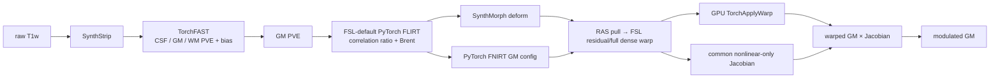

# FastVBM：原始 T1w 到 modulated GM

[返回首页](../../README.md) · [源码目录](../../src/freesurfer_torch/fast_vbm/) · [TorchFAST](../fast/README.md) · [权重](../WEIGHTS.md) · [验证记录](../../validation/fast_vbm/README.md)

`FastVBM` 接收一幅原始 3D T1w 和一幅 GM 模板，输出脑提取、三组织 PVE、偏置场校正结果，以及模板空间 warped GM、nonlinear-only Jacobian 和 modulated GM。整条流程在 Python 内运行，不调用 FreeSurfer 或 FSL 可执行文件。

非线性配准由 `registration_backend` 选择：

- `"synthmorph"`：本包 PyTorch SynthMorph `deform`，默认分支；
- `"fnirt"`：本包 CUDA/CPU PyTorch FNIRT GM-config 优化器。

两个分支只在“估计 nonlinear pull field”这一步分开；各自的目标函数、正则化和
mask 使用属于该估计器。FAST GM、FSL 默认
correlation-ratio/Brent FLIRT、template grid、RAS pull 到 FSL scaled-mm
residual 的转换、GPU `TorchApplyWarp`、nonlinear-only Jacobian 和 modulation
均使用同一段代码。每次运行的 `pre_nonlinear_signature` 会记录 moving GM、
template、reference mask、几何和 FLIRT matrix 的 SHA-256；两后端使用相同配准
上下文时，该签名必须完全一致。FNIRT estimator 消费 reference mask；官方
SynthMorph deform 网络没有 mask 输入，因此该 mask 在 SynthMorph 分支用于共同
上下文记录和配对验证，不送入网络。



## 两个非线性后端

| 项目 | `registration_backend="synthmorph"` | `registration_backend="fnirt"` |
|---|---|---|
| 实现 | 本包 `freesurfer_torch.synthmorph.SynthMorph(model="deform")` | 本包 `freesurfer_torch.fnirt.TorchFNIRT` |
| 形变模型 | 官方 SynthMorph 网络；外部仿射作为 `init`；`mid_space=False` | 固定网格上的 cubic B-spline residual displacement |
| 优化坐标 | SynthMorph/Surfa world-RAS pull | 内部为 FSL scaled-mm；输出转换为 world-RAS pull |
| 图像目标 | 由官方 SynthMorph checkpoint 定义 | 全局线性强度拟合后的 SSD |
| 正则化与优化 | SynthMorph stationary velocity field | FSL GM schedule、bending energy、Gauss–Newton/LM + PCG |
| reference mask | 网络无 mask 输入；记录在共同上下文 | 最后一层优化实际使用 |
| nonlinear-only Jacobian | 两分支统一使用 `det(I + ∂u/∂q)`；`u=source_fsl-inv(FLIRT)@target_fsl` | 相同 |
| 重采样 | 两分支统一把 full relative FSL field 交给 GPU `TorchApplyWarp` | 相同 |
| 额外权重 | `synthmorph.deform.3.h5` | 无 |
| FastVBM 文件名与输出网格 | 下列 13 个稳定文件名；后三项在模板网格 | 相同 |

FNIRT 分支沿用 UKB GM 配置的四层下采样、输入/参考平滑、10 mm 控制点
间距、bending-energy 权重和 0.2–5 Jacobian 范围。FastVBM 的 common
Jacobian 对 dense residual 使用 FSL 的中心有限差分（边界单侧差分）；独立
`TorchFNIRT` 仍保留 spline analytic Jacobian。case01 官方 intent-2007
coefficient 的对照中，common dense 与 `fnirtfileutils --jout` analytic 的全图
相关为 0.999916，MAE 0.001555，最大绝对差 0.07110；这属于 FastVBM common
postprocessing 的离散化差异，不能写成逐体素相同。

FNIRT 与 FSL 的配对比较必须传入官方 FNIRT 使用的同一 reference mask。已核对的 UKB 日志使用
`MNI152_T1_2mm_brain_mask_dil`。未提供 `reference_mask` 时，代码退化为
`template > 0`，并在 QC 标为 `derived-fixed-positive-non-fsl-exact`；该默认值不能
用于宣称 FNIRT 与 FSL 数值等价。SynthMorph 不消费该 mask。

## 单被试：Python

先配置默认 SynthMorph 分支所需的两份官方权重：

```bash
python tools/setup_weights.py --model fast-vbm
```

然后构造一个可复用实例并运行一例：

```python
from freesurfer_torch import FastVBM

pipeline = FastVBM(
    device="cuda:0",
    threads=4,
    registration_backend="synthmorph",
)

result = pipeline.run(
    "subject_T1w.nii.gz",
    "template_GM.nii.gz",
    "results/sub-01",
    reference_mask="MNI152_T1_2mm_brain_mask_dil.nii.gz",
    overwrite=False,
)
```

各行作用：

1. `from freesurfer_torch import FastVBM` 导入完整 raw-T1-to-VBM pipeline。
2. `device="cuda:0"` 让 SynthStrip、TorchFAST、仿射、非线性配准和 Jacobian 计算使用第一张可见 GPU。
3. `threads=4` 设置当前进程的 PyTorch CPU 线程数。
4. `registration_backend="synthmorph"` 选择 PyTorch SynthMorph；改为 `"fnirt"` 即选择本包 PyTorch FNIRT 分支。
5. `.run()` 的前三个参数依次是单帧 3D raw T1w、fixed GM template 和输出目录。模板的 shape 与 voxel-to-world affine 决定后三幅 VBM 图的网格。
6. `reference_mask` 是与 template 同网格的 FNIRT reference mask。比较 UKB/FSL 的 FNIRT 路径时必须传原 pipeline 使用的同一 mask；它进入两个分支的共同上下文签名，但 SynthMorph 网络不消费它。
7. `overwrite=False` 在任一同名结果存在时停止。成功后写出 13 幅影像和 `fast_vbm_report.json`，并返回 `FastVBMResult`。

只运行 FNIRT 分支时不需要 SynthMorph 权重：

```bash
python tools/setup_weights.py --model synthstrip
```

```python
pipeline = FastVBM(
    device="cuda:0",
    registration_backend="fnirt",
    synthstrip_weights="/models/synthstrip.1.pt",
)
result = pipeline.run(
    "subject_T1w.nii.gz",
    "template_GM.nii.gz",
    "results/sub-01-fnirt",
    reference_mask="MNI152_T1_2mm_brain_mask_dil.nii.gz",
)
```

已有与 T1w 同网格的脑掩膜时可跳过 SynthStrip：

```python
result = pipeline.run(
    "subject_T1w.nii.gz",
    "template_GM.nii.gz",
    "results/sub-01",
    brain_mask="subject_brain_mask.nii.gz",
)
```

只需内存结果时直接调用实例：

```python
result = pipeline("subject_T1w.nii.gz", "template_GM.nii.gz")
result.warped_gm.save("warped_gm.nii.gz")
result.jacobian.save("jacobian_nonlinear.nii.gz")
result.modulated_gm.save("modulated_gm.nii.gz")
```

`image`、`template`、`brain_mask` 和 `reference_mask` 可传路径或
`surfa.Volume`。输入必须是有限值单帧 3D 影像；`brain_mask` 必须与 T1w
同网格，`reference_mask` 必须与 template 同网格；模板必须包含正 GM 值。

### 构造参数

```text
FastVBM(
    device="cpu", threads=None,
    synthstrip_weights=None, synthmorph_weights=None,
    bias_correction=True,
    linear_strides=(4, 2, 1),
    linear_steps=(80, 60, 50),
    linear_learning_rates=(0.05, 0.025, 0.0125),
    registration_backend="synthmorph",
    synthmorph_extent=256,
    synthmorph_hyper=0.5,
    synthmorph_steps=7,
    fnirt_strides=(4, 2, 1, 1),
    fnirt_steps=(5, 5, 10, 5),
    fnirt_learning_rates=(0.5, 0.25, 0.1, 0.05),
    fnirt_input_fwhm_mm=(6, 4, 2, 2),
    fnirt_reference_fwhm_mm=(4, 2, 0, 0),
    fnirt_warp_resolution_mm=10,
    fnirt_regularization=(150, 75, 50, 30),
    fnirt_jacobian_penalty=1,
)
```

| 参数 | 作用 |
|---|---|
| `device` | `cpu` 或 `cuda:N`；选择整条流程的设备 |
| `threads` | 当前 worker 的 PyTorch CPU 线程数；`None` 保留现有设置 |
| `synthstrip_weights` | `synthstrip.1.pt` 或其目录；有显式 `brain_mask` 时不读取 |
| `synthmorph_weights` | `synthmorph.deform.3.h5` 或其目录；仅 SynthMorph 分支读取 |
| `bias_correction` | 默认 `True`；TorchFAST 同时估计平滑乘性 bias field |
| `linear_*` | 旧 NCC/Adam API 的兼容参数；公开 FastVBM 两分支固定调用 FSL-default FLIRT，不再用这些参数选择旧优化器 |
| `registration_backend` | `"synthmorph"` 或 `"fnirt"` |
| `synthmorph_*` | 仅 SynthMorph 分支使用的网络空间、正则化超参数和积分次数 |
| `fnirt_strides` | FNIRT-style 四层 fixed-grid 下采样步长 |
| `fnirt_steps` | FNIRT 四层 `miter`，默认 `(5, 5, 10, 5)` |
| `fnirt_learning_rates` | 旧 FNIRT-style Adam API 的兼容参数；exact-target 分支不使用 |
| `fnirt_input_fwhm_mm`、`fnirt_reference_fwhm_mm` | 各层 moving/reference Gaussian FWHM，单位 mm |
| `fnirt_warp_resolution_mm` | cubic B-spline 控制点目标间距，单位 mm |
| `fnirt_regularization` | 各层 bending-energy 权重 |
| `fnirt_jacobian_penalty` | 旧 FNIRT-style Adam API 的兼容参数；exact-target 分支不使用 |

已有 fixed/template-world → moving-world 的 4×4 RAS pull affine 时，可跳过线性估计：

```python
result = pipeline(
    image,
    template,
    initial_pull=matrix,
    initial_pull_convention="fixed-to-moving-world-ras",
)
```

裸矩阵没有 `initial_pull_convention` 时会被拒绝。FSL FLIRT `.mat` 是 input → reference 的 FSL scaled-mm 矩阵，不能作为上面的 RAS pull 直接传入；应先调用 `flirt_to_world_pull()`。带 source/target 几何并声明 world space 的 `surfa.Affine` 已包含方向信息，不需要约定字符串。

### 返回值

| 字段 | 内容 |
|---|---|
| `brain`、`brain_mask` | 输入 T1 网格上的脑图和二值 mask |
| `fast` | `FASTResult`：三类 PVE、分类、mixel、bias 和 restored T1 |
| `registration` | `VBMRegistrationResult`：模板空间结果和配准 QC |
| `pve_gm` | `fast.pve_gm` 的便利属性 |
| `warped_gm` | 仿射与所选非线性后端共同重采样后的 GM |
| `jacobian` | 所选后端的 nonlinear-only pull Jacobian |
| `modulated_gm` | `warped_gm × jacobian` |
| `settings` | 实际设备、线性参数和所选非线性后端参数 |
| `timing_sec` | 脑提取、FAST、配准/Jacobian/modulation 和总墙钟时间 |

`timing_sec` 包含读取和输出回到 CPU，不包含 `result.save()` 的 NIfTI 写入。第一次无显式 mask 的调用包含 SynthStrip 延迟加载；SynthMorph 分支第一次配准还包含 3.51 GB checkpoint 的加载，后续调用复用模型。FNIRT 分支没有非线性 checkpoint。

## 单被试：命令行

SynthMorph 分支：

```bash
fs-torch fast-vbm \
  -i subject_T1w.nii.gz \
  --template template_GM.nii.gz \
  -o results/sub-01 \
  --registration-backend synthmorph \
  --device cuda:0 \
  --threads 4
```

FNIRT-style 分支只需更换后端和输出目录：

```bash
fs-torch fast-vbm \
  -i subject_T1w.nii.gz \
  --template template_GM.nii.gz \
  -o results/sub-01-fnirt \
  --registration-backend fnirt \
  --device cuda:0 \
  --threads 4
```

各行作用：

1. `fs-torch fast-vbm` 选择单被试 raw-T1-to-VBM 入口。
2. `-i` 指定单帧 3D raw T1w。
3. `--template` 指定 fixed GM template，并定义三幅模板空间结果的 shape、方向和体素尺寸。
4. `-o` 是完整输出目录。
5. `--registration-backend` 在 `synthmorph` 与 `fnirt` 之间选择非线性阶段。
6. `--device` 选择 PyTorch 设备；`--threads` 设置该进程的 CPU 线程数。

| 常用参数 | 作用 |
|---|---|
| `--brain-mask MASK` | 使用现有输入网格 mask，跳过 SynthStrip |
| `--synthstrip-weights PATH` | 显式指定 SynthStrip checkpoint 或目录 |
| `--synthmorph-weights PATH` | 显式指定 deform checkpoint；仅 SynthMorph 分支读取 |
| `--linear-strides / --linear-steps / --linear-learning-rates` | affine 多尺度参数 |
| `--synthmorph-extent / --synthmorph-hyper / --synthmorph-steps` | SynthMorph 分支参数 |
| `--fnirt-strides / --fnirt-steps / --fnirt-learning-rates` | FNIRT-style 四层优化参数 |
| `--fnirt-input-fwhm-mm / --fnirt-reference-fwhm-mm` | FNIRT-style 四层平滑参数 |
| `--fnirt-warp-resolution-mm` | B-spline 控制点目标间距 |
| `--fnirt-regularization / --fnirt-jacobian-penalty` | bending 与 Jacobian 约束参数 |
| `--no-bias` | 关闭 TorchFAST bias correction，用于消融 |
| `--overwrite` | 允许覆盖同名输出 |

完整参数以 `fs-torch fast-vbm --help` 为准。多被试只提供下文 Python `BatchRunner` 形式。

## 独立 PyTorch FLIRT 接口

`TorchFLIRT` 复用 FastVBM 的 12-DOF affine 实现：三轴旋转、三轴平移、三轴缩放和三项剪切。它同时对齐 FSL FLIRT 的 input/reference 文件角色和 `.mat` 坐标约定。

### Python

```python
from pathlib import Path
from freesurfer_torch import TorchFLIRT

Path("results").mkdir(exist_ok=True)
flirt = TorchFLIRT(device="cuda:0", cost="normcorr")
result = flirt.run(
    input="subject_GM.nii.gz",
    reference="template_GM.nii.gz",
    output="results/subject_to_template.nii.gz",
    omat="results/subject_to_template.mat",
)
```

`result.moved` 是 float32 reference-grid image；其 shape 和 voxel-to-world affine 取自 reference。`result.matrix` 与 `result.fsl_matrix` 是同一个 4×4 input → reference FSL scaled-mm 矩阵。`moving_to_fixed_world` 和 `fixed_to_moving_world` 分别保存 RAS forward 与 pull 形式。

### 命令行

```bash
fs-torch flirt \
  -in subject_GM.nii.gz \
  -ref template_GM.nii.gz \
  -out results/subject_to_template.nii.gz \
  -omat results/subject_to_template.mat \
  -dof 12 \
  -cost normcorr \
  --device cuda:0
```

| 参数或输出 | FSL `flirt` 角色 | 本包保证的契约 |
|---|---|---|
| `-in` | 被变换的 input | moving 单帧 3D 影像 |
| `-ref` | reference，定义输出 FOV | fixed 影像；输出 shape 和 affine 与其一致 |
| `-out` | 重采样后的 input | float image on reference grid |
| `-omat` | input → reference 4×4 ASCII matrix | input FSL scaled-mm → reference FSL scaled-mm |
| `-dof 12` | 12 参数 affine | 当前唯一支持值 |
| `-cost normcorr` | normalized correlation | 当前唯一支持值；内部用 NCC + Adam |

这里的“一致”只指输入角色、输出网格、矩阵方向和坐标基底。FSL FLIRT 的默认 cost、搜索、优化器、多分辨率 schedule、插值和边界实现不同；本包也没有实现 FLIRT 的全部选项或 `-applyxfm` 模式。两者的估计矩阵和重采样体素值不应被称为数值相同。官方 FLIRT 对 input/reference、`-omat` 和 reference-defined output grid 的定义见 [FLIRT user guide](https://fsl.fmrib.ox.ac.uk/fsl/docs/registration/flirt/user_guide.html)，scaled-mm 与 handedness 规则见 [FLIRT FAQ](https://fsl.fmrib.ox.ac.uk/fsl/docs/registration/flirt/faq.html)。

## 坐标、warp 与 Jacobian

FSL、NIfTI world-RAS 和 Surfa/SynthMorph 表示不能按数组元素直接互换：

- FLIRT `.mat` 把 input FSL scaled-mm 映射到 reference FSL scaled-mm。正行列式 NIfTI 几何还包含 FSL 的 x 轴 handedness flip。
- FastVBM 内部 affine forward 是 moving-world → fixed-world RAS；重采样使用它的 fixed-world → moving-world 逆矩阵。
- 两个非线性后端对外均返回 fixed/template 网格上的 `surfa.Warp(format=disp_ras)`；每个 fixed 体素保存 `source_world(target) - target_world`。
- FNIRT 分支内部残差是 fixed FSL scaled-mm → moving FSL scaled-mm 的 nonlinear displacement，并在输出前与 affine pull 合成、转换为 world-RAS。

FLIRT matrix 转为 moving → fixed RAS forward 的公式为：

```text
A_world = fixed_vox2world
          @ inv(V2FSL_fixed)
          @ M_flirt
          @ V2FSL_moving
          @ inv(moving_vox2world)
```

本包的 `flirt_to_world_affine()`、`flirt_to_world_pull()` 和 `world_to_flirt_affine()` 需要 moving/fixed 两端的 affine 与 shape，因为 `V2FSL` 依赖 voxel size、shape 和 handedness。手工转换带 shear 的 sform 时，还应通过 `moving_voxel_sizes=` 和 `fixed_voxel_sizes=` 传入 NIfTI header 中保存的 pixdim；`TorchFLIRT` 和 FNIRT-style 后端已从 Surfa geometry 自动传入，普通调用无需设置。

FSL FNIRT `--jout` 用于 VBM 时是 nonlinear-only Jacobian；`fnirtfileutils --withaff` 才把 affine 计入。FNIRT-style 分支以相同的非线性 residual 定义输出 `jacobian`，但其优化过程和位移值仍不与 FSL 数值等价。SynthMorph 分支没有 FSL residual coefficient，故以 full pull determinant 除以 affine pull determinant 得到 nonlinear-only 调制项。

FSL `--cout` 是带专用 NIfTI intent/header 的 B-spline coefficient file，`--fout` 是另一种 dense field 表示。本包不读写这两种 FSL warp 文件；`FNIRTVBMResult.pull_transform` 是内存中的 Surfa world-RAS displacement。可对比同一 reference 网格上的 warped GM、Jacobian 和 modulated GM，但不能把原始 warp 数组直接逐元素比较。FSL 的文件角色和 Jacobian 定义见 [FNIRT user guide](https://fsl.fmrib.ox.ac.uk/fsl/docs/registration/fnirt/user_guide.html)。

## 13 幅稳定输出

`FastVBMResult.save()`、`FastVBM.run()` 和单被试 CLI 在两个后端下使用相同文件名。后三项均为 float32 NIfTI，并复制 GM template 的 shape 和 voxel-to-world geometry：

| Python 键 | 文件 | 网格 | 含义 |
|---|---|---|---|
| `brain` | `T1_brain.nii.gz` | 输入 T1 | mask 外清零后的 T1 |
| `brain_mask` | `brain_mask.nii.gz` | 输入 T1 | 二值脑掩膜 |
| `pve_csf` | `T1_brain_pve_0.nii.gz` | 输入 T1 | CSF PVE |
| `pve_gm` | `T1_brain_pve_1.nii.gz` | 输入 T1 | GM PVE，也是配准 moving image |
| `pve_wm` | `T1_brain_pve_2.nii.gz` | 输入 T1 | WM PVE |
| `hard_segmentation` | `T1_brain_seg.nii.gz` | 输入 T1 | PVE 前硬分类 |
| `pve_segmentation` | `T1_brain_pveseg.nii.gz` | 输入 T1 | 最大 PVE 分类 |
| `mixel_type` | `T1_brain_mixeltype.nii.gz` | 输入 T1 | pure/mixed tissue 类型 |
| `bias_field` | `T1_brain_bias.nii.gz` | 输入 T1 | 乘性 bias field；脑外为 1 |
| `restored` | `T1_brain_restore.nii.gz` | 输入 T1 | `T1_brain / bias_field`；脑外为 0 |
| `warped_gm` | `T1_GM_to_template_GM.nii.gz` | GM 模板 | affine + 所选非线性后端后的 GM |
| `jacobian` | `T1_GM_JAC_nl.nii.gz` | GM 模板 | nonlinear-only pull determinant |
| `modulated_gm` | `T1_GM_to_template_GM_mod.nii.gz` | GM 模板 | `warped_gm × jacobian` |

另写 `fast_vbm_report.json`，记录后端、参数、分阶段时间、FAST 摘要、配准 QC 和文件名，不记录输入路径。

## 与 UKB v1/FSL VBM 的对应关系

官方 UK Biobank pipeline 的 `bb_vbm` 以 FAST GM PVE 和 `template_GM` 为输入，调用 `fsl_reg ... -fnirt`，随后把 warped GM 乘以 `--jout`：

```bash
fsl_reg T1_brain_pve_1.nii.gz template_GM.nii.gz \
  T1_GM_to_template_GM -fnirt \
  "--config=GM_2_MNI152GM_2mm.cnf --jout=T1_GM_JAC_nl"
fslmaths T1_GM_to_template_GM -mul T1_GM_JAC_nl \
  T1_GM_to_template_GM_mod -odt float
```

| 阶段 | UKB/FSL | 本包 | 对齐范围 |
|---|---|---|---|
| 脑提取 | UKB 前序流程的 BET 与标准 mask | SynthStrip，或显式 input-grid mask | 输出角色一致；算法不同 |
| GM 与 bias | FSL FAST，GM 为 `T1_brain_pve_1` | TorchFAST，bias 默认开启 | 文件角色和组织顺序对应；数值算法独立 |
| affine | `fsl_reg` 内部 FLIRT | PyTorch 12-DOF NCC + Adam | input/reference、输出网格与 FSL `.mat` 坐标契约一致；优化不等价 |
| affine 文件 | `T1_GM_to_template_GM.mat` | 独立 `TorchFLIRT(...).run(omat=...)` 可写；FastVBM 不单独保存 | 4×4 input → reference FSL scaled-mm contract 对应 |
| nonlinear，SynthMorph 分支 | FNIRT | PyTorch SynthMorph deform | 共同生成 template-grid warped GM；模型不同 |
| nonlinear，FNIRT 分支 | cubic B-spline FNIRT | PyTorch cubic B-spline FNIRT-style | transform role、FSL scaled-mm residual 和输出用途对应；优化与系数文件不等价 |
| nonlinear warp 文件 | `_warp.nii.gz` 是带专用 header/intent 的 FSL coefficient file | 不输出 `_warp` 或 `_field` 文件；仅在内存返回 Surfa `disp_ras` | 文件格式未对齐，不能互换 |
| Jacobian | FNIRT nonlinear-only `--jout` | 后端对应的 nonlinear-only pull determinant | 文件角色、template grid 与 modulation 用途对应 |
| modulation | `fslmaths warped -mul jacobian` | `warped_gm * jacobian` | 公式一致 |

FastVBM 在 modulated GM 结束，不包含 UKB gradient distortion correction、群体平滑、统计模型或其他结构 IDP。官方代码见 [UK Biobank pipeline v1](https://git.fmrib.ox.ac.uk/open-science/analysis/UK_biobank_pipeline_v_1)，FSL FNIRT 源码见 [FMRIB GitLab](https://git.fmrib.ox.ac.uk/fsl/fnirt)。模板下载和 FSL 参考实验见 [UKB/FSL 专页](../ukb_vbm/README.md)。

## 权重和模板

| 场景 | 所需 checkpoint |
|---|---|
| SynthMorph 分支，从 raw T1w 开始 | `synthstrip.1.pt` + `synthmorph.deform.3.h5` |
| FNIRT 分支，从 raw T1w 开始 | `synthstrip.1.pt` |
| 任一分支，提供显式脑 mask | SynthMorph 分支只需 deform；FNIRT 分支无需 checkpoint |

`python tools/setup_weights.py --model fast-vbm` 安装两个后端的权重超集，即 SynthStrip 和 SynthMorph deform。只运行 FNIRT 分支可改用 `--model synthstrip`。TorchFAST、PyTorch affine、FNIRT-style 优化、Jacobian 和 modulation 不读取 checkpoint。

GM template 是运行输入，不是模型权重，也不由配置脚本下载。UKB 公开 `template_GM.nii.gz` 的下载和 SHA-256 见 [UKB/FSL 专页](../ukb_vbm/README.md)；模型 URL、权重校验和离线部署见[权重文档](../WEIGHTS.md)。

## 多被试：Python BatchRunner

多被试只保留 Python 调用。下面在两张 GPU 上处理全部 `*_T1w.nii.gz`，并为所有病例选择同一个 FNIRT-style 后端：

```python
from pathlib import Path

from freesurfer_torch import BatchRunner
from freesurfer_torch.fast_vbm import OUTPUT_FILENAMES


def main():
    template = "assets/template_GM.nii.gz"
    model = {
        "registration_backend": "fnirt",  # 改为 synthmorph 即切换后端
        "bias_correction": True,
        "linear_strides": (4, 2, 1),
        "linear_steps": (80, 60, 50),
        "linear_learning_rates": (0.05, 0.025, 0.0125),
    }

    jobs = []
    for image in sorted(Path("inputs").glob("*_T1w.nii.gz")):
        subject = image.name.removesuffix("_T1w.nii.gz")
        output_dir = Path("results") / subject
        jobs.append({
            "task": "fast_vbm",
            "model": model,
            "kwargs": {
                "image": str(image),
                "template": template,
            },
            "outputs": {
                name: str(output_dir / filename)
                for name, filename in OUTPUT_FILENAMES.items()
            },
        })

    with BatchRunner(
        devices=("cuda:0", "cuda:1"),
        workers_per_device=1,
        threads_per_worker=4,
    ) as runner:
        reports = runner.run(jobs, overwrite=False)

    failed = [report for report in reports if not report.ok]
    if failed:
        raise RuntimeError([report.error for report in failed])


if __name__ == "__main__":
    main()
```

调度规则：

1. 一个 job 对应一个 subject；`model` 传给 `FastVBM(...)`，`kwargs` 传给单例 `FastVBM.__call__(...)`。
2. `devices=("cuda:0", "cuda:1")` 与 `workers_per_device=1` 建立两个进程，每个进程固定到一张 GPU。
3. worker 完成一例后领取下一例，病例动态分配；返回的 `reports` 顺序仍与 `jobs` 一致。
4. 每个 worker 按 `model` 配置构造并缓存一套 FastVBM。它复用 SynthStrip、TorchFAST 和所选非线性后端；不同 worker 不共享 GPU 模型或显存。
5. `outputs` 可列全部 13 项，也可只列 `warped_gm`、`jacobian`、`modulated_gm` 以减少写盘。
6. 同一个 runner 可连续提交多批。`spawn` 多进程要求脚本用 `if __name__ == "__main__":` 保护入口。
7. 增加 `workers_per_device` 会在同一 GPU 复制模型和显存；应根据显存与实测吞吐决定。

SynthMorph 批量分支只需把 `model["registration_backend"]` 改成 `"synthmorph"`，并确保 deform checkpoint 已配置。`BatchResult.metadata` 包含该例的 `result.report()`；批量 API 不自动写 `fast_vbm_report.json`。失败信息可能含本地路径，应作为私有运行记录。

## 图示与验证

下图是公开去面容 T1w 经 SynthMorph 分支生成的完整流程示例。第一行依次为 raw T1w、brain、bias-corrected brain 和 GM PVE；第二行依次为 UKB GM template、warped GM、nonlinear-only Jacobian 和 modulated GM。


0.8 验证在 10 例真实 T1w、同一 UKB template 和固定 `template_GM > 0.01` mask 上完成。端到端 FNIRT-style 与 FSL reference 的 warped/modulated GM Pearson 中位数为 0.7156/0.6771，SynthMorph 为 0.6226/0.5357；同病例配对差为 +0.0989/+0.1463。matched GM 和 matched affine 两层也得到相同方向，说明本次 FNIRT-style 输出在该 reference 下更接近 FSL。FSL 不是人工解剖真值，因此这只表示 FSL 相似性。

FNIRT-style 端到端 CUDA-synchronized compute 中位数为 13.321 s；FSL raw-T1-to-modulated-GM reference 为 3646.025 s。两者算法、设备和前处理实现不同，时间比是本次共享节点的描述性结果。端到端 SynthMorph 复用了既有 10 例输出，本次没有执行计时，报告没有为其补写时间。三层指标、同病例差、运行时间边界与执行/复用计数见 [`report.v0.8.public.json`](../../validation/fast_vbm/report.v0.8.public.json) 和 [`backend_comparison.v0.8.public.csv`](../../validation/fast_vbm/backend_comparison.v0.8.public.csv)。TorchFLIRT 的 reference-grid header、scaled-mm matrix 和 FSL `applywarp --premat` 采样验证见 [`flirt_io.v0.8.public.json`](../../validation/fast_vbm/flirt_io.v0.8.public.json)。
