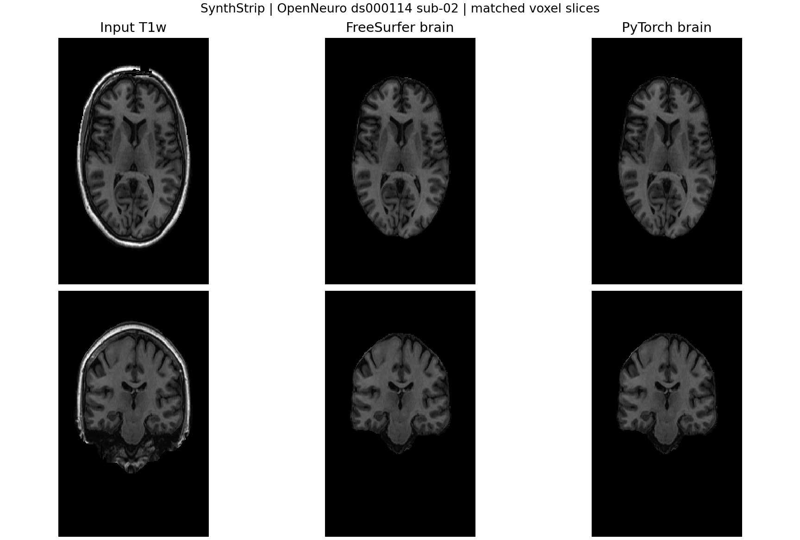
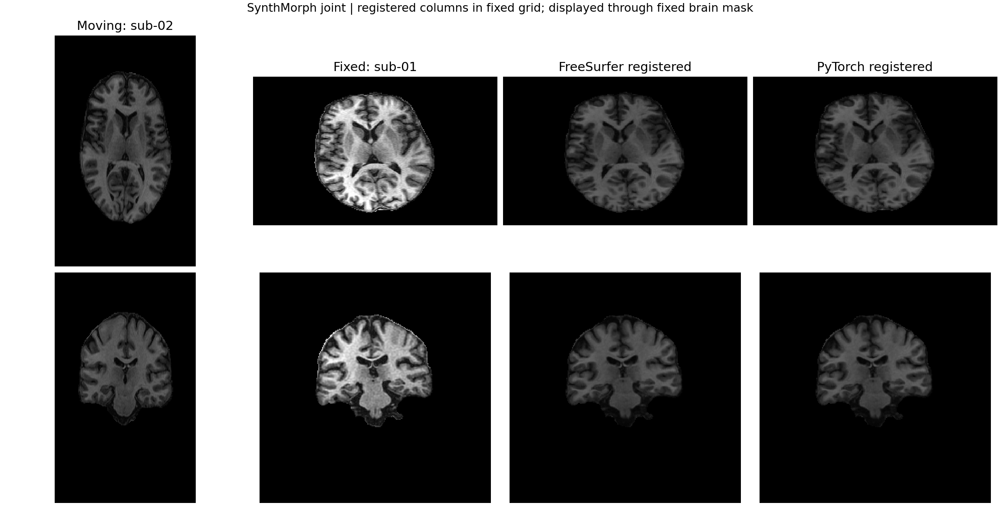
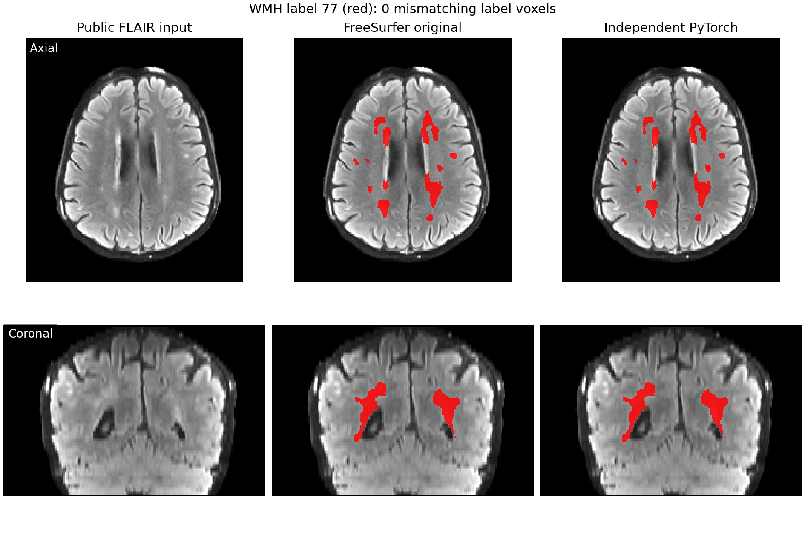

# 官方实现与 PyTorch 实现的影像对照

前两张图使用仓库的[去面容 T1w 样例](../../examples/README.md)。原图来自 [OpenNeuro ds000114](https://openneuro.org/datasets/ds000114)，许可为 CC0；发布的三个文件保留脑掩膜外扩 12 mm 内的体素，来源和 SHA-256 见 [SOURCES.json](../../examples/data/SOURCES.json)。数据没有人工标注，以下数值只比较两种实现。



SynthStrip 图使用 `sub-02`：从左到右是去面容输入、FreeSurfer 8.2.0 CPU 输出、本包 PyTorch GPU 输出。上、下分别是相同原网格体素的轴位和冠状位切面；三列用同一灰度范围。两种输出的掩膜 Dice 为 **1.000000**，不一致体素 **0**，脑图全体素最大绝对差 **0**，输出几何相同。这里的脑图强度已经由两种程序各自的掩膜处理。



SynthMorph 图以 `sub-02` 为 moving、`sub-01` 为 fixed，使用默认 `joint` 模型。从左到右为 moving 脑图、fixed 脑图、FreeSurfer CPU 配准结果、本包 PyTorch GPU 配准结果；上、下为轴位与冠状位。配准后两列都在 **fixed 的原网格**；为便于看脑组织，图中仅对显示的配准切片使用同一个 fixed 脑掩膜。数值比较针对**完整保存影像和位移场**，未使用显示掩膜：配准影像归一化 RMSE 为 **1.7880 × 10⁻⁵**，RAS 位移向量最大误差 **0.000622 mm**，输出几何相同。强度范围对 moving 与两列配准影像一致；fixed 图像单独按其正强度分布设定亮度，因此 fixed 一列不能用于视觉判断强度误差。

机器可读指标见 [metrics.json](metrics.json)。12 例 T1w 的成对数值与时间比较见 [对照报告](../COMPARISON.md)。本页图示使用的原版单进程和本包双 GPU 批量运行条件不同，不据此计算加速比。



WMH-SynthSeg 图使用仓库的 [公开 FLAIR `sub-04`](../../examples/wmh_data/sub-04_FLAIR.nii.gz)。该文件来自 [OpenNeuro ds003592](https://openneuro.org/datasets/ds003592) CC0 原图，经原版 SynthStrip 脑掩膜外扩 6 mm 后清零其余强度；三例 FLAIR 的来源、处理步骤和 SHA-256 见 [FLAIR 清单](../../examples/wmh_data/SOURCES.json)。从左到右是输入、未改动的 FreeSurfer WMH-SynthSeg CUDA 源码、本包 PyTorch CUDA；上、下为相同输出网格的轴位与冠状位，红色显示标签 77。两次推理使用同一官方 checkpoint、`--crop`、GPU 和线程。**完整三维输出的标签不一致体素为 0，WMH Dice 为 1，概率图最大绝对差为 0，仿射矩阵相同**；图示指标见 [WMH 图示数据](wmh_metrics.json)。此结果是对官方实现的复现，不是对病灶真值的测量。

## 重现这些图

从仓库根目录开始，先安装本包和绘图依赖，再校验三份随仓库发布的影像。以下 Python 脚本均假设当前目录是仓库根目录。

```bash
python -m pip install . nibabel matplotlib
python examples/check_data.py
python tools/setup_weights.py --model synthstrip --model synthmorph-joint
python examples/run_batch.py
```

`run_batch.py` 在 `cuda:0`、`cuda:1` 上各启动一个常驻 worker，处理三项 SynthStrip 和两项 joint SynthMorph 任务；十个输出及逐任务 JSON 报告写入 `examples/results/python/`。这五项均成功，两个 GPU 都承担了任务。CPU 机器可按 [batch 文档](../../examples/README.md#双-gpu-批量命令行或-python)调整设备；CPU/GPU 浮点结果可能不同。

原版对照需要 FreeSurfer 8.2.0 和其 TensorFlow 依赖。以下脚本显式指定官方模型文件路径，禁用 CUDA，使原版在 CPU 执行；它对 `sub-01/02` 做脑提取，再将 `sub-02` 配准到 `sub-01`，结果写入 `examples/results/reference/`：

```bash
module load freesurfer
export FREESURFER_TORCH_WEIGHTS="$HOME/.cache/freesurfer_torch"
python examples/run_reference.py
python examples/render_comparison.py
```

若用 `--dest` 指定了权重目录，将环境变量改为该路径。`module load freesurfer` 适用于 gpucw1；其他机器按安装位置设置 `FREESURFER_HOME`。`run_reference.py` 调用原版 `mri_synthstrip -i/-o/-m` 与 `mri_synthmorph register -m joint -o/-t`。`render_comparison.py` 要求两套结果均已存在；它核对几何、计算指标，并覆盖本目录的两个 PNG 与 `metrics.json`。

这些图在 gpucw1 上使用 FreeSurfer 8.2.0、官方固定版本权重和本包 0.2.0 生成。原版 CPU 脑提取两例分别耗时 50.28、52.42 秒，joint 配准耗时 212.65 秒；本包示例采用两张 GPU 并行且复用模型，单任务报告中的时间包含 worker 执行、读写和可能的同时运行争用。严格的时间比较使用 [详细对照报告](../COMPARISON.md) 中同任务的成对测量。

第三张图由本包 0.3.0 在 gpucw1 上生成。以下命令在仓库根目录运行；需另行安装 FreeSurfer 8.2.0-1，并在 CUDA Python 环境中安装本包及绘图依赖。原版 GPU 参考直接执行**未修改的** `inference.py`，脚本自动建立指向所选 FreeSurfer 安装及官方权重的临时目录：

```bash
python -m pip install . matplotlib
python examples/check_wmh_data.py
python tools/setup_weights.py --model wmh-synthseg
export WMH_WEIGHTS="$HOME/.cache/freesurfer_torch"
export FREESURFER_HOME=/path/to/freesurfer-8.2.0-1

python tools/benchmark_wmh.py --input-dir examples/wmh_data \
  --output-dir examples/results/wmh_reference_cuda --weights "$WMH_WEIGHTS" \
  --arm official-cuda --freesurfer-home "$FREESURFER_HOME" --threads 8
python tools/benchmark_wmh.py --input-dir examples/wmh_data \
  --output-dir examples/results/wmh_port_cuda --weights "$WMH_WEIGHTS" \
  --arm torch-cuda --threads 8
python examples/render_wmh_comparison.py \
  --image examples/wmh_data/sub-04_FLAIR.nii.gz \
  --reference examples/results/wmh_reference_cuda/sub-04_seg.nii.gz \
  --candidate examples/results/wmh_port_cuda/sub-04_seg.nii.gz \
  --output docs/figures/wmh_synthseg_comparison.png
```

`benchmark_wmh.py` 对三例逐例启动新进程、保存分割图、概率图与软体积 CSV；如只想运行本包，不需要 FreeSurfer，可单独执行第二条推理命令或使用 `fs-torch wmh-synthseg`。重跑前请清空对应 `examples/results/` 目录，脚本不会覆盖已有文件。
