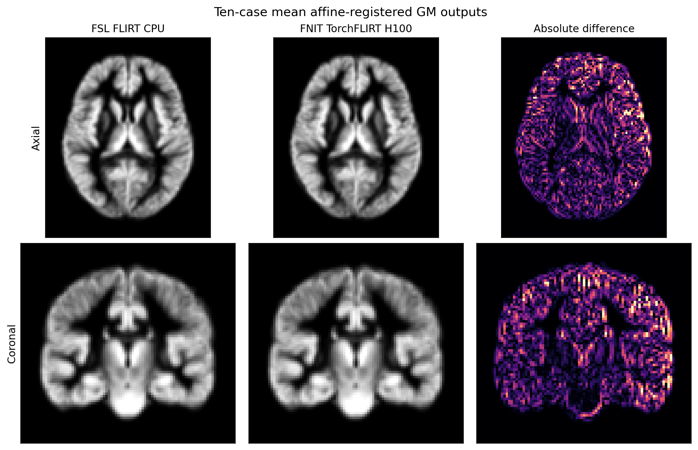

# PyTorch FLIRT

`fnit.flirt.TorchFLIRT` is the package's public affine
registration implementation. It follows the default FSL FLIRT 2111.2 path
used by `fsl_reg`: 12 degrees of freedom, correlation-ratio cost, the
8/4/2/1 mm search schedule, and the MISCMATHS Brent coordinate optimizer.
The implementation runs on a PyTorch CPU or CUDA device and does not call the
FSL executable at runtime.

CUDA execution enables TF32 matrix kernels by default while retaining the
declared float32/float64 tensor dtypes. It does not use float16 or bfloat16;
the active flags are written to `result.qc["tf32"]`.

This source-derived PyTorch port implements the supported default FSL path; it
does not claim bitwise or complete numerical equivalence. The declared
reference-suite matrix gate passed 10/10 cases at `rmsdiff <= 0.05 mm`, with a median
of 0.008544 mm and maximum of 0.028984 mm.

Runtime QC still reports `result.qc["validated_fsl_equivalent"] = False` and
`current_input_compared_with_fsl = False`. The field
`reference_validation_matrix_gate_passed = True` records the named ten-case
suite, rather than equivalence for the image currently being processed.

The port is derived from FSL source and is covered by the non-commercial FSL
Software Licence. See [the FSL licence](../../licenses/FSL-6.0.txt),
[third-party notices](../../THIRD_PARTY_NOTICES.md), and the vendored source
manifest in `src/fnit/_vendor_fsl/manifest.json`.

## Command line

The dedicated command is:

```bash
fnit-flirt \
  -in subject_GM.nii.gz \
  -ref template_GM.nii.gz \
  -out subject_GM_to_template.nii.gz \
  -omat subject_GM_to_template.mat \
  -dof 12 \
  -cost corratio \
  --device cuda:0
```

The same operation is available through the package command:

```bash
fnit flirt \
  -in subject_GM.nii.gz \
  -ref template_GM.nii.gz \
  -out subject_GM_to_template.nii.gz \
  -omat subject_GM_to_template.mat \
  -dof 12 \
  -cost corratio \
  --device cuda:0
```

Each argument has one role:

| Argument | Meaning |
|---|---|
| `-in` | Moving 3D image. The estimated transform starts in this image. |
| `-ref` | Fixed 3D reference image. Its shape and geometry define the output grid. |
| `-out` | Optional resampled input image on the reference grid. An extensionless name uses `FSLOUTPUTTYPE=NIFTI` or `NIFTI_GZ`. |
| `-omat` | Optional 4 x 4 input-to-reference matrix in FSL scaled-mm coordinates. |
| `-init` | Optional initial 4 x 4 input-to-reference matrix in the same FSL scaled-mm convention. |
| `-dof 12` | Selects the only implemented affine model. Other values are rejected. |
| `-cost corratio` | Selects the only implemented cost. Other FLIRT costs are rejected. |
| `--device cuda:0` | Runs tensor operations on the selected CUDA device. Use `cpu` for CPU execution. CUDA is selected automatically when this argument is omitted and CUDA is available. |
| `--overwrite` | Replaces existing output files. Without it, existing outputs stop the run before registration. |

At least one of `-out` and `-omat` is required. The wrapper validates every
destination before registration, prevents an output from replacing an input,
reference, or initial matrix, and stages all requested files before committing
them.

The corresponding FSL command is:

```bash
flirt \
  -in subject_GM.nii.gz \
  -ref template_GM.nii.gz \
  -out subject_GM_to_template.nii.gz \
  -omat subject_GM_to_template.mat \
  -dof 12 \
  -cost corratio
```

The package command implements this default registration path. FSL options
for other costs, degrees of freedom, schedules, masks, interpolation modes,
search ranges, and weighting images are outside the current public contract
and are rejected rather than approximated.

## Python

Use `run_flirt` when paths and atomic output handling are needed:

```python
from fnit.flirt import run_flirt

result = run_flirt(
    "subject_GM.nii.gz",                      # FSL -in
    "template_GM.nii.gz",                     # FSL -ref
    output="subject_GM_to_template.nii.gz",   # FSL -out
    omat="subject_GM_to_template.mat",         # FSL -omat
    init=None,                                  # FSL -init; identity when omitted
    dof=12,                                     # FSL -dof 12
    cost="corratio",                            # FSL -cost corratio
    device="cuda:0",
    overwrite=False,
)
```

The return value is a `FLIRTResult`:

| Field | Content |
|---|---|
| `moved` | `surfa.Volume` containing the input resampled on the reference grid. |
| `matrix` / `fsl_matrix` | NumPy 4 x 4 input-to-reference matrix using the same FSL scaled-mm file contract as `flirt -omat`. |
| `moving_to_fixed_world` | NumPy 4 x 4 input-to-reference world-RAS affine. |
| `fixed_to_moving_world` | NumPy 4 x 4 world-RAS pull affine used for resampling. |
| `qc` | Cost, optimizer, schedule, device, source versions, evaluation count, coordinate convention, and validation status. |

For in-memory work, call the model directly:

```python
from fnit.flirt import TorchFLIRT

model = TorchFLIRT(device="cuda:0")
result = model(moving_volume, reference_volume, init=None)
```

`moving_volume` and `reference_volume` can be NIfTI paths or single-frame
`surfa.Volume` objects. `init` can be a matrix path or a finite homogeneous
NumPy 4 x 4 matrix. The direct model call computes results without writing
files.

## Matrix coordinates

An FSL `.mat` file does not contain a NIfTI world-RAS affine. It maps the
input's FSL scaled-mm coordinates to the reference's FSL scaled-mm
coordinates. FSL builds each scaled-mm basis from voxel sizes and flips its
first axis when the voxel-to-world determinant is positive.

For input world matrix `W_in`, reference world matrix `W_ref`, scaled-mm
bases `S_in` and `S_ref`, and FLIRT matrix `A`, the corresponding world-RAS
forward affine is:

```text
W_ref @ inverse(S_ref) @ A @ S_in @ inverse(W_in)
```

The package applies this conversion whenever a FLIRT matrix crosses into a
world-RAS API. A matrix must not be passed directly as a FreeSurfer LTA or a
world-RAS transform.

## Validation against FSL 6.0.7.4

The validation uses 10 real T1-derived FSL FAST GM maps and one UKB VBM group
GM template. FSL 6.0.7.4 is the executable oracle.

### Current default: TF32 enabled

The 0.9 reference suite used 10 real T1-derived FSL FAST GM maps, the UKB
group-GM template, FSL 6.0.7.4, and the FSL reference image
intensity-weighted COG with an 80 mm radius.

| 指标 | median [Q1–Q3] | maximum | 判据 |
| --- | --- | --- | --- |
| matrix RMS difference | 0.008544 [0.006265–0.019436] mm | 0.028984 mm | 10/10 ≤ 0.05 mm |
| CUDA-synchronized compute | 24.015 [23.100–30.327] s | 85.818 s | 描述性计时 |

This is a tolerance-based matrix functional gate for the declared suite.
`validated_fsl_equivalent`, `bitwise_identity_claimed`, and
`complete_numerical_equivalence_claimed` remain `False`. In particular,
`reference_validation_matrix_gate_passed=True` does not mean that a new input
was compared with FSL.

### FSL and FNIT full-command comparison

The comparison executed fresh FSL 6.0.7.4 CPU and FNIT H100 commands on the same
10 GM/template pairs. Odd and even cases alternated which implementation ran
first. All output images had the same shape, numeric affine and dtype. The
metrics below use the official MNI reference mask; image Dice thresholds both
outputs at GM PVE 0.2.

| Output metric | median [Q1–Q3] | minimum / maximum |
|---|---:|---:|
| matrix RMS difference | 0.008545 [0.006265–0.019429] mm | maximum 0.028999 mm |
| moved-image Pearson | 0.999895 [0.999827–0.999929] | minimum 0.999664 |
| moved-image Dice | 0.997457 [0.996552–0.997905] | minimum 0.995489 |
| moved-image MAE | 0.002883 [0.002380–0.003848] | maximum 0.005436 |
| moved-image RMSE | 0.004697 [0.003882–0.006060] | maximum 0.008407 |

The matrix gate passed in 10/10 cases at `rmsdiff <= 0.05 mm`. These are close,
but nonzero, output differences; the result is not bitwise or complete FSL
numerical equivalence.

| Implementation | Device | Full command median [Q1–Q3] |
|---|---|---:|
| FSL 6.0.7.4 `flirt` | CPU | 27.705 [24.867–30.215] s |
| FNIT `fnit-flirt` | H100 GPU | 23.021 [22.287–23.277] s |

The timing includes process startup, image reads, optimization, resampling,
matrix/image writes, and ran on a shared node. It records observed wall time;
it is not an isolated hardware speedup measurement.

The figure shows axial and coronal slices of the 10-case mean FSL output, FNIT
output, and absolute difference. FSL and FNIT panels use the same intensity
range; the difference panels use a separate range. Numeric metrics use the
complete 3D images.



The de-identified aggregate and per-case metrics are in
[`validation/flirt/report.public.json`](../../validation/flirt/report.public.json).

The QC string
`reference_validation_report="validation/fast_vbm/report.v0.9.public.json"`
is an artifact identifier relative to the source repository. The root
`validation/` directory is not included in the installed wheel. Wheel users
can open the [public report on GitHub](https://github.com/weikanggong1/Fudan-Neuroimaging-toolkit/blob/main/validation/fast_vbm/report.v0.9.public.json); a source checkout can
use the relative link
[`report.v0.9.public.json`](../../validation/fast_vbm/report.v0.9.public.json).
