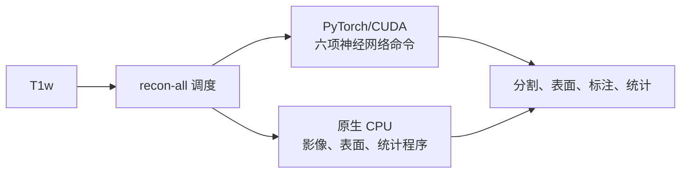

# GPU recon-all：单 T1 皮层重建与多被试调度

[返回首页](../../README.md) · [Python 实现](../../src/fnit/recon_all/) · [原生运行包构建](../../tools/recon_all_native/README.md) · [数值验收](../../validation/recon_all/README.md)

本入口对一幅 T1w 运行固定的 FreeSurfer 8.2 `recon-all -all` 流程，生成体积分割、
白质与软脑膜表面、顶点指标、脑区标注及统计表。神经网络命令由本包的 PyTorch/CUDA
实现执行，其他步骤由随本地运行包保存的 FreeSurfer 原生程序执行。单被试支持
`fnit-recon-all` 命令行和 Python 调用；多被试完整流程只提供 Python 调用。

去除原生运行包的 Python/CUDA 移植仍在逐阶段验证。
[完整替换的验收门槛](../../validation/recon_all/python_gpu_port/RELEASE_GATES.md)
列出同一 T1 的端到端、逐顶点和分阶段计时条件。
[阶段代码与配对结果](../../validation/recon_all/python_gpu_port/README.md)涵盖已通过的
体素掩膜、表面厚度、面积、顶点体积、曲率及脑区表格数值；这些独立阶段尚未接入
本页的完整入口。[双侧连续六步](../../validation/recon_all/python_gpu_port/SMOOTH_SURFACE.md)
已从冻结被试的 `filled.mgz` 与 `norm.mgz` 由 Python 依次生成
`orig.nofix`、`smoothwm.nofix`、`inflated.nofix` 和 `qsphere.nofix`，
两侧逐顶点、逐面及体积几何元数据与官方完全一致；已验证路径为 CPU。
后续 Numba 优化保留了双侧几何逐项一致；[隔离计时与哈希](../../validation/recon_all/python_gpu_port/inflate_qsphere_numba_optimized_report.json)
记录了膨胀和快速球面阶段的单次耗时，尚不是完整流程或配对加速结论。
现有 `run_initial_surface_chain` Python API 可在一个进程内串联双侧这六步；
[真实 T1 对照](../../validation/recon_all/python_gpu_port/initial_surface_chain_api_fs_sub01_report.json)
确认两侧 pretess 体素与八个表面文件的有序顶点、面和体积几何信息均与官方一致。
该调用在 CPU 上验证，输出止于 `qsphere.nofix`，尚不能替代完整 recon-all。

```python
from fnit.recon_all.initial_surface_chain import run_initial_surface_chain

report = run_initial_surface_chain(
    "/subjects/sub01/mri/filled.mgz",
    "/subjects/sub01/mri/norm.mgz",
    "/scratch/sub01_initial_surface",
    device="cpu",
)
```

输出目录须为空；返回值记录双侧各阶段耗时及输出路径。安装这些独立 Python
阶段的附加依赖使用 `python -m pip install '.[recon-all-python-stages]'`；
其中 SimpleITK 和 ANTsPy 是 CPU 算子依赖，Numba 用于按原生顺序计算的热点。
固定流程所需的 102 个非模型模板与图谱文件可按
[已核验清单](../../validation/recon_all/python_gpu_port/ASSETS_VALIDATION.md)单独下载并校验：

```bash
fnit-setup-recon-all-assets --dest /path/to/recon_all_assets
fnit-setup-recon-all-assets --dest /path/to/recon_all_assets --verify-only
```

首轮下载约 796.17 MiB，实际使用文件共 328.73 MiB；安装器逐文件校验大小与
SHA-256，数据保存在包外。此资产入口尚未接入完整 Python recon-all 调度。
[常规球面](../../validation/recon_all/python_gpu_port/SPHERE_STANDARD_STATUS.md)
已完成双侧全距离表对照；隔离首轮展开的独立步长搜索与双侧全部顶点坐标误差
也通过 `1×10⁻⁵ mm` 数值门槛。该首轮使用原生负面积修复检查点；后续轮次
和最终 `sphere` 文件仍未通过。
拓扑修复、完整表面优化与配准、
原生无依赖调度仍待完成。[pial 安装版首差报告](../../validation/recon_all/python_gpu_port/place_surface_installed_first_difference_report.json)
已定位第 1 步的 1 ULP 接受坐标差及后续近零邻点判定放大；官方最终
pial 网格和逐顶点指标尚未通过。[T1 输入转换](../../validation/recon_all/python_gpu_port/NIFTI_IMPORT.md)、
[conform 阶段](../../validation/recon_all/python_gpu_port/CONFORM.md)
和 [N4 完整包装](N4_WRAPPER_VALIDATION.md)也已分别与原生代码配对验证。
[单 T1 连续输入链](../../validation/recon_all/python_gpu_port/input_chain_fs_sub01_report.json)
现已把 NIfTI 导入、单次扫描复制、conform 和 XFORM 路径标签接成
`run_input_chain` Python API；冻结被试的前三个 MRI 文件均与官方逐体素、
MGH 头及仿射一致。该链输出止于 `orig.mgz`，已验证路径为 CPU。
从这个 Python 生成的 `orig.mgz` 接续运行 PyTorch SynthStrip 也已在 CPU 上
逐体素匹配官方 `synthstrip.mgz`，见[连续输入对照](../../validation/recon_all/python_gpu_port/connected_synthstrip_fs_sub01_report.json)。
33 类 SynthSeg 在同一 Python 输入上完成 H100 GPU 对照：关闭该阶段 cuDNN TF32 后，
16,777,216 个硬分割体素、float32 类型和 MGH 头/体素载荷均与官方一致；
经单体素临界阈值修正及按官方 `float32` 格式重写已保存 CSV 后，33 个软体积列
最大差 0.04 mm³，仍有 6 列未达到现有 0.005 mm³ 统计表门槛；格式检查未重跑 GPU
推理，阈值修正仅在此输入上验证。
详情见[连接式 GPU 验证](../../validation/recon_all/python_gpu_port/CONNECTED_SYNTHSEG_GPU_20260926.md)。
headcw CPU 测试受 PyTorch `Conv3d` 故障及内存占用阻断，未重复。
[现有混合版与未经修改的官方 FreeSurfer 被试比较](../../validation/recon_all/python_gpu_port/TRUE_OFFICIAL_BASELINE_20260926.md)
显示 138 项中 110 项通过：双侧有序表面顶点、面及逐顶点指标一致，
但 SynthSeg 软体积、SynthMorph 形变场和部分统计值仍不同。
当前连接式 GPU 推理已核验该 float32 标签类型；软体积精度仍是开放项。
连接链生成的 `nu.mgz` 已接续运行 PyTorch EntoWM：在固定 T1 上，
[独立对照](../../validation/recon_all/python_gpu_port/CONNECTED_ENTOWM_20260926.md)
的全部 16,777,216 个标签体素、MGH 头和体素载荷与官方归档一致，
四个结构软体积最大差 0.0227 mm³；从 Python 仿射变换生成的体素 LTA
计算的 eTIV 与官方相差 0.486165 mm³。其他被试尚未核验。

```python
from fnit.recon_all.input_chain import run_input_chain

report = run_input_chain("subject_T1w.nii.gz", "/scratch/sub01", device="cpu")
```

进一步的 [`run_input_talairach_chain`](../../src/fnit/recon_all/input_talairach_chain.py)
把外置权重和 MNI305 模板接入同一个 Python 进程：从原始 T1 连续生成
`orig/001.mgz`、`rawavg.mgz`、`orig.mgz`、`synthstrip.mgz` 和
`transforms/talairach.xfm` 及 `talairach.xfm.lta`。同一 T1 的四个影像文件
与未经修改的官方运行逐体素、MGH 头和仿射一致；XFM 在输入网格八角点的最大
位移差为 0.000157 mm。新体素 LTA 由已验证的 Python 仿射文件换算得到，
八角点最大差 0.0004203 mm；CPU 运行与后补 LTA 对照见
[连续链报告](../../validation/recon_all/python_gpu_port/INPUT_TALAIRACH_CHAIN.md)。
这段调用止于仿射配准，尚未产生皮层表面或统计表。
从该链生成的 `orig.mgz` 和 `talairach.xfm` 接续 Python/SimpleITK N4 后，
`nu.mgz` 与 headcw 同机新跑的官方 N4 全体素一致；相对旧版完整官方归档仍有
34/16,777,216 个体素差异（最大 2 灰度级）。详见
[连接式 N4 对照](../../validation/recon_all/python_gpu_port/CONNECTED_N4_20260926.md)。
同一段现可用 [`run_input_n4_chain`](../../src/fnit/recon_all/input_n4_chain.py)
单次 Python 调用；真实新目录回放验证到 `nu.mgz`，其中 SimpleITK N4
使用 CPU。它尚不是完整的 recon-all 入口。
接续运行 Python 的首遍 `mri_normalize` 后，`T1.mgz` 与同一 `nu.mgz`
输入的新跑官方命令全体素匹配；相对旧版完整官方归档有 112 个体素差异。
[同输入与归档对照](../../validation/recon_all/python_gpu_port/CONNECTED_T1_NORMALIZE_20260926.md)
将两种比较分开记录。
新增 [`run_input_brainmask_chain`](../../src/fnit/recon_all/input_brainmask_chain.py)
在单次 Python 调用中从原始 T1 运行至初始 `brainmask.mgz`。headcw CPU
新目录回放耗时 175.86 秒；`nu.mgz` 和 `T1.mgz` 与此前独立 Python 输出
逐体素一致。`brainmask.mgz` 相对历史官方归档的 49 个差异全部由上游
`T1.mgz` 差异经相同 SynthStrip 掩膜传递；[报告](../../validation/recon_all/python_gpu_port/CONNECTED_BRAINMASK_20260926.md)
保留了比较范围和分步时间。这个入口仍只覆盖早期体积链。

[ANTs 去噪](../../validation/recon_all/python_gpu_port/ANTS_DENOISE_STATUS.md)另以
`antspyx==0.6.3` Python API 在同一冻结 T1 输入上匹配全部 16,777,216 个输出体素；
它使用 CPU 上的编译 ANTs/ITK 算子，尚未接入完整入口。
[T1 强度标准化](NORMALIZATION.md)的第一遍和带 `-aseg -mask` 的第二遍现均有
独立 Python API 与命令行。第一遍已在 CPU/H100 上逐体素匹配；[第二遍](../../validation/recon_all/python_gpu_port/NORMALIZE_SECOND_PASS.md)
在 `fs_sub01` 上独立生成与官方一致的 16,777,216 个体素和 MGH 头，已验证路径为 CPU。
两遍均尚未接入本页完整入口。
[GCA 控制点标准化](../../validation/recon_all/python_gpu_port/CA_NORMALIZE.md)已在同一输入上
复现官方 `mri_ca_normalize` 的 `norm.mgz` 全体素及 `ctrl_pts.mgz` 六帧，
284 字节 MGH 头一致；它是独立 Python/Numba CPU 阶段，尚未接入完整入口。
[GCA 仿射配准](../../validation/recon_all/python_gpu_port/MRI_EM_REGISTER_VALIDATION.md)
在固定被试上已由独立 Python/Numba CPU 命令生成与原生数值一致的最终 LTA：
矩阵最大误差 `7.45e-9`，315,638 个 atlas 样本的源体素映射零差异。
该阶段尚未接入完整入口，其他被试和 GPU 实现仍待验证；单次同机运行耗时为
Python 230.20 秒、原生 236.52 秒，尚非严格配对速度测试。
另有 [`run_input_ca_normalize_chain`](../../src/fnit/recon_all/input_ca_normalize_chain.py)
从原始 T1 单次调用到 `norm.mgz`、六帧 `ctrl_pts.mgz`，无需 FreeSurfer
可执行程序。headcw CPU 实测 433.99 秒；LTA 的 315,638 个 atlas 样本
映射均与归档官方一致，控制点 100,663,296 个值全等，`norm.mgz` 仍有
25 个体素差异且全部落在上游 `nu.mgz` 的 34 个历史差异位置。
[一次性调用及逐段对照](../../validation/recon_all/python_gpu_port/CONNECTED_CA_NORMALIZE_20260926.md)
明确区分了归档与同输入原生基准。它仍是早期体积链，未产生完整分割和表面。

```python
from fnit.recon_all.input_ca_normalize_chain import run_input_ca_normalize_chain

report = run_input_ca_normalize_chain(
    "subject_T1w.nii.gz", "/scratch/sub01", "/models/weights", "/models/fs-assets",
    device="cpu", threads=4,
)
```
[GCA 逆场生成](../../validation/recon_all/python_gpu_port/CA_REGISTER_INVERSE_KERNELS.md)
在冻结 warp 输入上已由 Python/Numba 逐字节复现完整压缩 NIfTI；它仍是独立 CPU 阶段，
尚未接入完整入口。
[皮层脑区标注](../../validation/recon_all/python_gpu_port/MRIS_CA_LABEL_STATUS.md)
的六次 `mris_ca_label` 调用也已从冻结网格、球面配准及 GCS 输入由 Python 逐字节复现；
上游 `sphere.reg` 仍依赖尚未移植的配准阶段。
[脑区曲率四列](../../validation/recon_all/python_gpu_port/ROI_CURVATURE.md)
在已有网格和标注上通过 346 行对照；
[白质到球面 Jacobian](../../validation/recon_all/python_gpu_port/SURFACE_JACOBIAN.md)
也通过双侧 212,163 顶点的 CPU/CUDA 数值对照；
[低信号白质重标记](../../validation/recon_all/python_gpu_port/RELABEL_HYPOINTENSITIES.md)
通过 16,777,216 个体素及解压后 MGH 字节对照；
[固定输入的综合白质编辑](../../validation/recon_all/python_gpu_port/WM_ASEGEDIT_FIXED.md)
通过同一被试 16,777,216 个体素与新跑原生输出对照，其他被试仍受输入哈希门槛限制；
[ribbon 修正 aseg](../../validation/recon_all/python_gpu_port/SURF2VOLSEG_FIX.md)
通过 16,777,216 个体素对照；
[皮层 ribbon 生成](../../validation/recon_all/python_gpu_port/VOLMASK.md)
通过三个 256³ 输出及完整解压 MGH 字节对照；
[aparc、a2009s 和 DKTatlas 体积标注](../../validation/recon_all/python_gpu_port/SURF2VOLSEG_CORTEX.md)
各通过 16,777,216 个体素和完整解压 MGH 对照；
[wmparc 白质标注](../../validation/recon_all/python_gpu_port/experimental/SURF2VOLSEG_WM.md)
通过全体素和完整解压 MGH 对照；
[72 个 fsaverage 标签投射](../../validation/recon_all/python_gpu_port/LABEL2LABEL_SURFACE_STATUS.md)
与[六个 BA/VPnL 注释文件](../../validation/recon_all/python_gpu_port/LABEL2ANNOT.md)
在冻结球面输入上逐文件匹配；
[wmparc 统计](../../validation/recon_all/python_gpu_port/experimental/SEGSTATS_WMPARC.md)
通过 70 行数值与格式对照；
[aseg 统计](../../validation/recon_all/python_gpu_port/ASEG_STATS.md)
通过 45 行表格和 21 项汇总指标对照；
[白质/灰质对比度 SNR 表](../../validation/recon_all/python_gpu_port/SURFACE_SNR_STATS.md)
在冻结上游输入及 Python 生成的对比度图上通过左右半球共 70 行逐字节对照；
[其表面采样上游](../../validation/recon_all/python_gpu_port/VOL2SURF_CONTRAST_STATUS.md)
已通过左右半球白质、灰质中间图及最终对比度图逐顶点一致性验收；
[统计表 Python 写入](../../validation/recon_all/python_gpu_port/ANATOMICAL_STATS_FILE.md)
已复现同一冻结被试的 34 行左侧 aparc 白质表数值及格式，16 项脑体积指标的最大
数值误差为 0.000295 mm³。这些统计阶段仍依赖尚未全部由 Python 生成的上游网格与分割。
另有双侧连续六步验证（[左](../../validation/recon_all/python_gpu_port/six_stage_surface_chain_lh_report.json)、[右](../../validation/recon_all/python_gpu_port/six_stage_surface_chain_rh_report.json)）：
从冻结的 `filled.mgz` 与 `norm.mgz` 出发，纯 Python 顺序生成 `orig.nofix`、
`smoothwm.nofix`、`inflated.nofix` 和 `qsphere.nofix`，所有有序顶点、面及
体积几何标签均与官方输出完全一致。此链为 CPU 单被试隔离验证，尚未覆盖完整重建。



## 运行条件

- Linux、可用的 CUDA 版 PyTorch、一张或多张 GPU。
- 与固定 `fs820-single-t1-v8-all-v1` 配置匹配的 FreeSurfer 8.2 本地原生
  运行包：使用已独立验证的版本，或使用经过 0.6→0.7 源码等价审计的派生副本；
  还需用户自己的 FreeSurfer license 文件。
- 每例一幅 T1w、一个安全的被试名称和一个独立的空 `subjects_dir`。

运行时无须安装系统 FreeSurfer、FSL 或 TensorFlow。原生运行包包含此流程实际需要的
程序、脚本、影像数据、解释器和动态库；它不是纯 PyTorch 发布物。模型可放在
独立的统一权重目录。已验证的原始运行包约 4.35 GB（4.05 GiB），其中
3.65 GB 为 13 个模型和查找表资源；移出它们后，原生运行包约 0.70 GB。
仓库和 wheel 均不提供该原生运行包或个人 license，也不提供原生运行包的自动下载命令。
统一权重目录则可按下面的命令从官方地址安装并逐文件校验。
约 0.70 GB 的外置权重运行包目前是未完成全流程数值认证的候选版；
[验证记录](../../validation/recon_all/external_models_2026-09-25.md)列明已通过的
静态预检与 SynthSeg 单项检查。默认入口拒绝其 `standalone_verified=false` 清单。
制作和审计运行包的步骤见[构建说明](../../tools/recon_all_native/README.md)。
默认调用只接受其清单中 `standalone_verified=true` 且包内文件、运行配置和当前
Python 源码哈希都匹配的运行包；候选包只能显式指定 `development_bundle=True`
或 `--development-bundle` 用于开发验证。

```bash
python tools/setup_weights.py --model recon-all --dest /path/to/weights
python tools/setup_weights.py --model recon-all --dest /path/to/weights --verify-only
```

`recon-all` 权重组包含 33 类 SynthSeg、SynthStrip、SynthMorph 及三个辅助分割模型
的共 13 个文件，复用本仓库其他功能已安装的同名权重。只使用 33 类 SynthSeg 时可选
`--model synthseg`；它不同于 `--model wmh-synthseg` 的 39 类模型。外置模型运行包
的清单固定这 13 个文件的大小和 SHA-256，启动时再次校验。可显式传
`models_dir="/path/to/weights"` / `--models-dir /path/to/weights`；省略时读取
`FNIT_WEIGHTS` 或已保存的权重目录。

## 单被试 Python 调用

```python
from fnit.recon_all.standalone import run_recon_all

report = run_recon_all(
    "subject_T1w.nii.gz",
    "sub01",
    "/results/sub01_subjects",
    "/path/to/verified_native_bundle",
    device="cuda:0",
    threads=4,
    license_file="/path/to/license.txt",
    models_dir="/path/to/weights",  # 外置模型运行包
)
print(report["subject_dir"], report["elapsed_seconds"])
```

第三个参数是 **`SUBJECTS_DIR` 根目录**，不是已经创建的被试目录；它须不存在或
为空。输出位于 `/results/sub01_subjects/sub01/`。`threads=4` 是当前已验证配置的
固定值。成功时返回字典，包含输入 SHA-256、运行包、设备、耗时、进程退出码、
缺失输出列表、有效配置哈希、被试目录及日志路径。每例在输出根目录同时写入
`sub01.recon-all.log` 和 `sub01.recon-all.run.json`。失败时也保留日志和运行报告
（若已进入原生流程），并抛出异常。

## 单被试命令行

```bash
fnit-recon-all \
  -i subject_T1w.nii.gz -s sub01 -sd /results/sub01_subjects \
  --bundle /path/to/verified_native_bundle \
  --models-dir /path/to/weights \
  --license /path/to/license.txt --device cuda:0 --threads 4
```

`-i` 指 T1w，`-s` 指被试名称，`-sd` 指空输出根目录。命令行执行与上面的
`run_recon_all` 相同的流程。对应的官方命令是安装并加载 FreeSurfer 后运行
`recon-all -i subject_T1w.nii.gz -s sub01 -sd /results/sub01_subjects -all
-parallel -openmp 4 -itkthreads 1`；本入口固定了这些处理标志和运行配置。
完整选项以 `fnit-recon-all --help` 为准。

## 多被试 Python 调用

```python
from fnit.recon_all.standalone import run_recon_all_batch

jobs = [
    {"t1": "sub01_T1w.nii.gz", "subject": "sub01",
     "subjects_dir": "/results/batch_sub01_subjects"},
    {"t1": "sub02_T1w.nii.gz", "subject": "sub02",
     "subjects_dir": "/results/batch_sub02_subjects"},
]
reports = run_recon_all_batch(
    jobs,
    "/path/to/verified_native_bundle",
    devices=("cuda:0", "cuda:1"),
    threads=4,
    license_file="/path/to/license.txt",
    models_dir="/path/to/weights",
)
```

每例必须有不同且互不包含的空输出根目录；入口在启动任一例前检查所有输入和
输出路径，也拒绝把输出写入运行包。每张 GPU 同时运行一例，同一张卡上的后续例
顺序运行。成功报告按 `jobs` 顺序返回。某例失败时，其他已分配的例继续完成；
全部 worker 结束后抛出汇总错误，已完成例的结果保留。此批量入口不会提交到
通用 `BatchRunner`，也没有批量 recon-all 命令行。

## 输出和计算设备

| 阶段 | 当前实现 | 主要输出 |
|---|---|---|
| 脑提取 `mri_synthstrip` | PyTorch/CUDA | 脑图与掩膜 |
| 33 类结构分割 `mri_synthseg` | PyTorch/CUDA；模型和后处理来自本包 `synthseg_parc` | 结构分割及 `stats/synthseg.vol.csv` |
| 神经影像配准 `mri_synthmorph` | PyTorch/CUDA | 供辅助分割等步骤使用的变换 |
| EntoWM、MCA/dura、静脉窦辅助分割 | PyTorch/CUDA，须在构建运行包时分别启用替换 | 辅助结构标签 |
| 输入转换、强度校正、白质处理、拓扑修复、表面生成与配准 | 打包的原生 CPU 程序 | `mri/`、`surf/`、`label/` 下的体积与表面 |
| 皮层厚度、顶点面积/体积/曲率和脑区统计 | 打包的原生 CPU 程序 | `surf/lh.*`、`surf/rh.*` 与 `stats/` |

一次运行至少检查 `mri/orig.mgz`、`aseg.mgz`、`aparc+aseg.mgz`、`ribbon.mgz`、
`wmparc.mgz`，双侧 white/pial 表面、厚度、面积、顶点体积、DK/DKT/Destrieux
统计、DK 标注和 `sphere.reg` 等必需文件。完整清单以
[`REQUIRED_OUTPUTS`](../../src/fnit/recon_all/standalone.py) 为准。
GPU 只承担上述神经网络阶段；`--device cuda:N` 不会使拓扑或表面程序改在 GPU 上运行。

## 数值与速度验证范围

在 `gpucw1` 的公开 `sub-01` T1 上，批量功能分支冻结的 Python 源码已与官方
FreeSurfer 8.2 结果完成 52 项表面、顶点、脑区、体积和统计对照，另有
ribbon/wmparc 两项体素检查及 19 项汇总门槛；这些检查均通过。Aseg、
aparc+aseg、ribbon、wmparc 的体素标签一致；两侧白质/软脑膜表面坐标以及已
核对的厚度、面积、顶点体积和曲率图最大误差为 0。SynthSeg 软体积在预设数值
容差内，但并非逐位相同。比较方法和逐字段容差见
[验收说明](../../validation/recon_all/README.md)，本次运行与批量结果见
[集成验证记录](../../validation/recon_all/gpucw1_batch_integration_2026-09-24.md)。
合并后的 0.6.0 源码又完成一次独立的完整 sub-01 运行，耗时 4,602.741 秒，
再次通过 52+2+19 项门槛。0.7.0 的 recon-all 路径通过逐文件源码等价审计，
沿用这次认证的数值证据；按要求没有重复运行完整重建。
[0.6→0.7 等价记录](../../validation/recon_all/v06_to_v07_runtime_equivalence.json)
列出允许的源码差异。上述结果只覆盖所测 T1 和冻结配置，不代表其他被试已完成
官方对照，也不表示 0.7.0 有一次新的完整数值复测。

批量功能分支的一例完整运行耗时 5,249.754 秒（约 87.50 分钟）。这一数字包含
原生 CPU 步骤和 PyTorch/CUDA 步骤；此前官方运行的并行参数和节点状态不同，
不能从两次耗时推出加速比。分阶段日志可用
[`stage_timing.py`](../../validation/recon_all/stage_timing.py) 解析；优化的主要候选
是耗时较长的原生表面与拓扑阶段，但改动后仍需逐顶点和逐脑区重新验收。
一个独立 CUDA 表面强度项试验虽在逐顶点计算上与 CPU 一致，但预计每例仅节省
约 4 秒，未接入主流程；[源码和计时](../../validation/recon_all/native_cuda_pilot/REPORT.md)
记录了测试条件；[隔离表面子函数计时](../../validation/recon_all/native_cuda_pilot/CPU_PROFILE.md)
说明碰撞与空间哈希更值得继续研究，但当前重编译版未达到官方表面数值一致。

两被试完整流程已在 `cuda:0` 和 `cuda:1` 并行完成，批量墙钟时间为
4,801.138 秒；两例的必需输出均齐全，批量 sub-01 再次通过 52+2+19 项官方
数值门槛。sub-02 尚无完整官方 recon-all 参考，不能从输出齐全推出其所有皮层
数值与官方一致。这一批量墙钟时间不构成相对于顺序运行的受控加速比。
