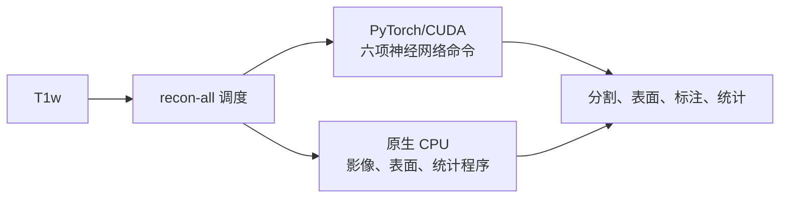

# GPU recon-all：单 T1 皮层重建与多被试调度

[返回首页](../../README.md) · [Python 实现](../../src/freesurfer_torch/recon_all/) · [原生运行包构建](../../tools/recon_all_native/README.md) · [数值验收](../../validation/recon_all/README.md)

本入口对一幅 T1w 运行固定的 FreeSurfer 8.2 `recon-all -all` 流程，生成体积分割、
白质与软脑膜表面、顶点指标、脑区标注及统计表。神经网络命令由本包的 PyTorch/CUDA
实现执行，其他步骤由随本地运行包保存的 FreeSurfer 原生程序执行。单被试支持
`fs-torch-recon-all` 命令行和 Python 调用；多被试完整流程只提供 Python 调用。



## 运行条件

- Linux、可用的 CUDA 版 PyTorch、一张或多张 GPU。
- 与固定 `fs820-single-t1-v8-all-v1` 配置匹配、已经完成独立验证的 FreeSurfer 8.2
  本地原生运行包，以及用户自己的 FreeSurfer license 文件。
- 每例一幅 T1w、一个安全的被试名称和一个独立的空 `subjects_dir`。

运行时无须安装系统 FreeSurfer、FSL 或 TensorFlow。原生运行包包含此流程实际需要的
程序、脚本、模型、影像数据、解释器和动态库；它不是纯 PyTorch 发布物。仓库和
wheel 均不提供该约 4.33 GiB 运行包或个人 license，也不提供自动下载命令。
制作和审计运行包的步骤见[构建说明](../../tools/recon_all_native/README.md)。
默认调用只接受其清单中 `standalone_verified=true` 且包内文件、运行配置和当前
Python 源码哈希都匹配的运行包；候选包只能显式指定 `development_bundle=True`
或 `--development-bundle` 用于开发验证。

## 单被试 Python 调用

```python
from freesurfer_torch.recon_all.standalone import run_recon_all

report = run_recon_all(
    "subject_T1w.nii.gz",
    "sub01",
    "/results/sub01_subjects",
    "/path/to/verified_native_bundle",
    device="cuda:0",
    threads=4,
    license_file="/path/to/license.txt",
)
print(report["subject_dir"], report["elapsed_seconds"])
```

第三个参数是 **`SUBJECTS_DIR` 根目录**，不是已经创建的被试目录；它须不存在或
为空。输出位于 `/results/sub01_subjects/sub01/`。`threads=4` 是当前已验证配置的
固定值。成功时返回字典，包含输入 SHA-256、运行包、设备、耗时、进程退出码、
缺失输出列表、有效配置哈希、被试目录及日志路径。每例在输出根目录同时写入
`sub01.recon-all.log` 和 `sub01.recon-all.run.json`。失败时也保留日志和运行报告
（若已进入原生流程），并抛出异常。

## 单被试命令行

```bash
fs-torch-recon-all \
  -i subject_T1w.nii.gz -s sub01 -sd /results/sub01_subjects \
  --bundle /path/to/verified_native_bundle \
  --license /path/to/license.txt --device cuda:0 --threads 4
```

`-i` 指 T1w，`-s` 指被试名称，`-sd` 指空输出根目录。命令行执行与上面的
`run_recon_all` 相同的流程。对应的官方命令是安装并加载 FreeSurfer 后运行
`recon-all -i subject_T1w.nii.gz -s sub01 -sd /results/sub01_subjects -all
-parallel -openmp 4 -itkthreads 1`；本入口固定了这些处理标志和运行配置。
完整选项以 `fs-torch-recon-all --help` 为准。

## 多被试 Python 调用

```python
from freesurfer_torch.recon_all.standalone import run_recon_all_batch

jobs = [
    {"t1": "sub01_T1w.nii.gz", "subject": "sub01",
     "subjects_dir": "/results/batch_sub01_subjects"},
    {"t1": "sub02_T1w.nii.gz", "subject": "sub02",
     "subjects_dir": "/results/batch_sub02_subjects"},
]
reports = run_recon_all_batch(
    jobs,
    "/path/to/verified_native_bundle",
    devices=("cuda:0", "cuda:1"),
    threads=4,
    license_file="/path/to/license.txt",
)
```

每例必须有不同且互不包含的空输出根目录；入口在启动任一例前检查所有输入和
输出路径，也拒绝把输出写入运行包。每张 GPU 同时运行一例，同一张卡上的后续例
顺序运行。成功报告按 `jobs` 顺序返回。某例失败时，其他已分配的例继续完成；
全部 worker 结束后抛出汇总错误，已完成例的结果保留。此批量入口不会提交到
通用 `BatchRunner`，也没有批量 recon-all 命令行。

## 输出和计算设备

| 阶段 | 当前实现 | 主要输出 |
|---|---|---|
| 脑提取 `mri_synthstrip` | PyTorch/CUDA | 脑图与掩膜 |
| 33 类结构分割 `mri_synthseg` | PyTorch/CUDA；模型和后处理来自本包 `synthseg_parc` | 结构分割及 `stats/synthseg.vol.csv` |
| 神经影像配准 `mri_synthmorph` | PyTorch/CUDA | 供辅助分割等步骤使用的变换 |
| EntoWM、MCA/dura、静脉窦辅助分割 | PyTorch/CUDA，须在构建运行包时分别启用替换 | 辅助结构标签 |
| 输入转换、强度校正、白质处理、拓扑修复、表面生成与配准 | 打包的原生 CPU 程序 | `mri/`、`surf/`、`label/` 下的体积与表面 |
| 皮层厚度、顶点面积/体积/曲率和脑区统计 | 打包的原生 CPU 程序 | `surf/lh.*`、`surf/rh.*` 与 `stats/` |

一次运行至少检查 `mri/orig.mgz`、`aseg.mgz`、`aparc+aseg.mgz`、`ribbon.mgz`、
`wmparc.mgz`，双侧 white/pial 表面、厚度、面积、顶点体积、DK/DKT/Destrieux
统计、DK 标注和 `sphere.reg` 等必需文件。完整清单以
[`REQUIRED_OUTPUTS`](../../src/freesurfer_torch/recon_all/standalone.py) 为准。
GPU 只承担上述神经网络阶段；`--device cuda:N` 不会使拓扑或表面程序改在 GPU 上运行。

## 数值与速度验证范围

在 `gpucw1` 的公开 `sub-01` T1 上，批量功能分支冻结的 Python 源码已与官方
FreeSurfer 8.2 结果完成 52 项表面、顶点、脑区、体积和统计对照，另有
ribbon/wmparc 两项体素检查及 19 项汇总门槛；这些检查均通过。Aseg、
aparc+aseg、ribbon、wmparc 的体素标签一致；两侧白质/软脑膜表面坐标以及已
核对的厚度、面积、顶点体积和曲率图最大误差为 0。SynthSeg 软体积在预设数值
容差内，但并非逐位相同。比较方法和逐字段容差见
[验收说明](../../validation/recon_all/README.md)，本次运行与批量结果见
[集成验证记录](../../validation/recon_all/gpucw1_batch_integration_2026-09-24.md)。
合并 main 后的源码树哈希会改变；其运行包必须重新绑定该哈希并完成独立验证。
上述结果只覆盖所测 T1 和冻结配置，不代表其他被试已完成官方对照。

批量功能分支的一例完整运行耗时 5,249.754 秒（约 87.50 分钟）。这一数字包含
原生 CPU 步骤和 PyTorch/CUDA 步骤；此前官方运行的并行参数和节点状态不同，
不能从两次耗时推出加速比。分阶段日志可用
[`stage_timing.py`](../../validation/recon_all/stage_timing.py) 解析；优化的主要候选
是耗时较长的原生表面与拓扑阶段，但改动后仍需逐顶点和逐脑区重新验收。

多被试批量的真实两 GPU 运行和跨被试官方数值对照正在进行，不能由单被试通过
推出批量性能或泛化一致性。
