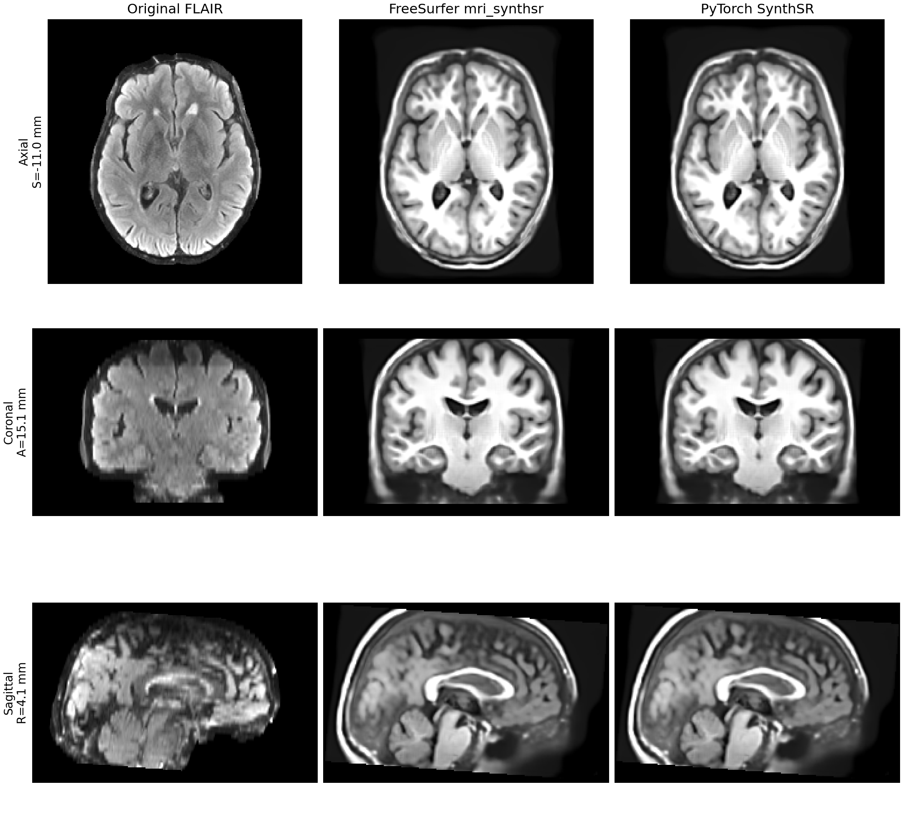

# SynthSR：从单幅扫描合成 1 mm T1w

[返回首页](../../README.md) · [FreeSurfer 使用说明](https://surfer.nmr.mgh.harvard.edu/fswiki/SynthSR) · [原版源码](https://github.com/freesurfer/freesurfer/blob/dev/mri_synthsr/mri_synthsr) · [权重配置](../WEIGHTS.md)

SynthSR 接受一幅 3D MRI 或 CT，输出标准对比度的 1 mm 等方 MP-RAGE 图像。它结合超分辨率与图像合成，并在合成时填补白质病灶。输入可以是 T1w、T2w、FLAIR 等对比度；原版不要求事先去颅骨、校正偏场或归一化强度。本包将原版的 TensorFlow 网络和推理流程改写为 PyTorch，推理时不调用 FreeSurfer。

## 原版指令与模型

单幅 FLAIR 的原版调用如下。`--i` 读取扫描，`--o` 写合成 T1w，`--threads` 指定 CPU 线程数；安装了可用的 TensorFlow GPU 时，原版可自动使用 GPU，`--cpu` 则强制使用 CPU。

```bash
mri_synthsr --i case_FLAIR.nii.gz --o case_synthsr.nii.gz --threads 4
```

原版还接受 `--ct`（将以 Hounsfield 单位保存的 CT 截到 0–80）、`--lowfield`（低场单输入模型）、`--v1`（2021 年模型）、`--disable_flipping`（关闭翻转测试增强）、`--disable_sharpening`（关闭末端锐化）和 `--model /path/to/model.h5`（指定权重）。同时给出 `--v1` 和 `--lowfield` 时，原版先选择 `--v1`。独立的双输入 `mri_synthsr_hyperfine --t1 ... --t2 ...` 使用另一模型，不属于这里的单输入接口。

| 选择 | 官方权重 | 本包配置命令 |
|---|---|---|
| 默认，2023 年通用 v2 | `synthsr_v20_230130.h5` | `python tools/setup_weights.py --model synthsr` |
| 低场单输入 v2 | `synthsr_lowfield_v20_230130.h5` | `python tools/setup_weights.py --model synthsr-lowfield` |
| 通用 v1 | `synthsr_v10_210712.h5` | `python tools/setup_weights.py --model synthsr-v1` |

这些权重来自 [FreeSurfer 官方源码目录](https://github.com/freesurfer/freesurfer/tree/dev/mri_synthsr)及其 git-annex 存储。配置脚本下载后核对文件大小和 SHA-256，并记录权重目录；仓库和 wheel 不包含权重。已有 FreeSurfer 安装时，也可直接复用 `$FREESURFER_HOME/models/` 中的文件。运行模型时不会联网。下载链接、校验值、查找顺序见[权重说明](../WEIGHTS.md)。

## Python 输入与输出

```python
from freesurfer_torch import SynthSR

sr = SynthSR(device="cuda:0")
result = sr("case_FLAIR.nii.gz")
result.image.save("case_synthsr.nii.gz")
print(result.image.data.shape, result.image.affine)
```

构造 `SynthSR` 时加载一次权重，之后可连续处理多个病例。`device="cpu"` 是 Python 默认值；要用 GPU，显式指定 `"cuda:0"` 等设备。`weights` 可以是 `.h5` 文件或包含所选官方文件的目录；省略时按[权重配置](../WEIGHTS.md)自动查找。`threads` 控制 PyTorch CPU 线程，省略时保留当前设置。

| 本包接口 | 输入或返回值 | 原版对应 |
|---|---|---|
| `SynthSR(weights=None, device="cpu", lowfield=False, v1=False, threads=None)` | 选择设备、权重和单输入模型；`v1=True` 优先于 `lowfield=True` | `--model`、`--cpu`、`--lowfield`、`--v1`、`--threads` |
| `sr(image, ct=False, disable_flipping=False, disable_sharpening=False)` | `image` 是单幅 `.nii`、`.nii.gz`、`.mgz`、`.npz` 路径或 `surfa.Volume` | `--i`、`--ct`、`--disable_flipping`、`--disable_sharpening` |
| `result.image.data` | 3D `numpy.ndarray`，`uint8`，是 NIfTI/MGZ 写盘前的量化数值 | `--o` 输出的体素数组 |
| `result.image.affine` | 4×4 RAS 仿射矩阵，描述 1 mm 输出网格 | `--o` 输出的几何信息 |
| `result.image.save(path)` | 写 `.nii`、`.nii.gz`、`.mgz` 或 `.npz` | `--o` 指定输出路径 |

原版先按输入 affine 重采样到 1 mm，再将体素轴对齐 RAS，居中补到 32 的倍数。网络是单通道、五层 3D U-Net。默认对左右翻转后的图像再推理一次并平均；预测截到 0–128，裁掉填充，再做锐化：原图加上原图与高斯模糊图之差，高斯标准差为 1.5 体素。最后转回输入的**轴方向**。因此输出与输入共享物理空间，但尺寸通常不同：它是 1 mm 网格，并未重采样回原始体素尺寸。写盘前乘以 2、截到 0–255、转换为 `uint8`。

`.npz` 是原版的特例：`save()` 将锐化后的浮点数组写在 `vol_data` 字段，**不执行 NIfTI/MGZ 的末端乘 2 和 `uint8` 转换**。因此 `result.image.data` 对应 NIfTI/MGZ 的量化数值；读 `.npz` 应使用 `numpy.load(path)["vol_data"]`，两者的数值尺度不同。原版及本包均通过 `nibabel.save(Nifti1Image(...))` 写 `.mgz`；用 nibabel 重新读入时，该格式报告的存储 dtype 为 `float32`，体素数值仍为量化后的 0–255。原版对常规输入使用单幅 3D 数据；当文件带多个通道时只取第一个通道。

## 单例命令行

```bash
fs-torch synthsr --i case_FLAIR.nii.gz --o case_synthsr.nii.gz \
  --device cuda:0 --threads 4
```

这条命令读取 `case_FLAIR.nii.gz`，在 `cuda:0` 上用通用 v2 模型合成图像，并把 1 mm `uint8` T1w 写到 `case_synthsr.nii.gz`。本包的 `--device` 可选具体 GPU，原版没有对应的 GPU 编号参数；原版自动选择可用的 TensorFlow GPU。`--cpu` 可覆盖 `--device` 强制 CPU；`--weights` 或同义的 `--model` 指定本地权重。其余模型和处理开关与上表同名。单幅输入的 `--o` 也可指定目录，输出文件名自动加 `_synthsr`。

## 多被试 Python

`predict_batch(table, ct=False, disable_flipping=False, disable_sharpening=False, workers=1, threads_per_worker=1)` 接受恰有 `input`、`output` 两列的 pandas 表。`input` 填入影像路径；`output` 是不带扩展名的绝对路径前缀，含被试 base name。每行生成 `<output>_synthsr.nii.gz`，按行顺序返回键为 `image` 的路径字典列表。

```python
from pathlib import Path
import pandas as pd
from freesurfer_torch import SynthSR

table = pd.DataFrame({
    "input": ["/data/sub-02_FLAIR.nii.gz", "/data/sub-03_FLAIR.nii.gz"],
    "output": ["/results/sub-02", "/results/sub-03"],
})
if __name__ == "__main__":
    sr = SynthSR(device="cuda:0")
    saved: list[dict[str, Path]] = sr.predict_batch(table, workers=2)
    print(saved[0]["image"])
```

低场或 v1 模型在构造 `SynthSR` 时选择；`ct` 和两个后处理开关适用于整张表。默认 `workers=1` 逐例复用模型；`workers=2` 在同一设备使用两个 Python 进程、各加载一份模型，每个进程仍逐例推理。多进程脚本须保护主入口；表格和输出路径的共同规则见[批量执行说明](../ARCHITECTURE.md#批量执行)。

### 实验性 B2 对照

在 gpucw1 的一张共享 H100 上，用相同的 12 例输入保存全部 SynthSR 输出。B1 是单个常驻 Python 程序逐例运行，B2 使用未发布的实验代码在单个常驻程序中合批运行（12 例均实际进入 B=2 网络批），P2 是两个独立常驻 Python 程序各按 B=1 运行。正序和逆序各做一次 cold 与 warm 队列；下表是两轮 warm 队列总耗时的中位数。

| B1 | B2 | P2 |
|---:|---:|---:|
| 57.95 s | 53.72 s | 30.79 s |

本次 B2 相对 B1 的热队列吞吐提速为 1.08 倍，但仍慢于 P2。表中的 P2 由两个独立常驻脚本运行，并非当前 `workers=2` API 的实测；该对照不代表单被试加速。完整条件与逐轮结果见[批量性能报告](../../benchmark/batch_modes_2026-09-24.md)。

公开 Python 表格接口在 gpucw1 的 12 例队列中，四组 `workers=1/2` 调用耗时中位数为 **53.45/36.84 s**，观察到 **1.45 倍**吞吐差；48 个输出文件对逐字节相同。两例时则为 **9.15/18.22 s**，第二个进程的启动和模型加载反而增加总耗时。逐轮数据见[Python 接口验证](../../benchmark/batch_modes_2026-09-24.md#python-table-api-with-two-processes)。

## 对照验证

在 gpucw1 上，12 例真实 T1w 使用同一份官方 v2 权重，以完整单例命令分别运行原版 TensorFlow CPU/GPU 与本包 PyTorch CPU/GPU。四组均成功；PyTorch GPU 对原版 CPU 的输出形状、仿射矩阵和 `uint8` 类型在 12 例中全部一致，逐例至少 **99.992%** 体素完全相同，最大差值 **1** 灰度级。完整命令耗时中位数（秒）如下。

| 原版 CPU | 本包 CPU | 原版 GPU | 本包 GPU |
|---:|---:|---:|---:|
| 103.60 | 42.32 | 53.27 | 13.80 |

这些时间包含模型加载、预处理、两次网络推理、后处理和写盘；原版 GPU 在此环境需另外指定 CUDA/cuDNN 动态库，TensorFlow GPU 可见性预检不计入逐例时间。共享节点负载和框架启动开销会影响时间，具体条件与匿名统计见[验证记录](../../validation/synthsr/README.md)。

下面是仓库中公开的 `sub-04` FLAIR 样例：三行分别为轴位、冠状位和矢状位；每行以相同 RAS 坐标显示原始输入、FreeSurfer 原版 CPU 输出和本包 PyTorch GPU 输出。两幅合成图使用同一显示灰度范围；数值比较使用完整三维 NIfTI，不从图片估计。



图由 [`tools/plot_synthsr_comparison.py`](../../tools/plot_synthsr_comparison.py) 从三份 NIfTI 按物理坐标生成。该样例原版与 PyTorch 输出的形状、仿射和类型相同，**99.990%** 体素完全一致，最大差值 1 灰度级。原始数据的公开来源及校验方式见[示例数据](../../examples/WMH.md)。
