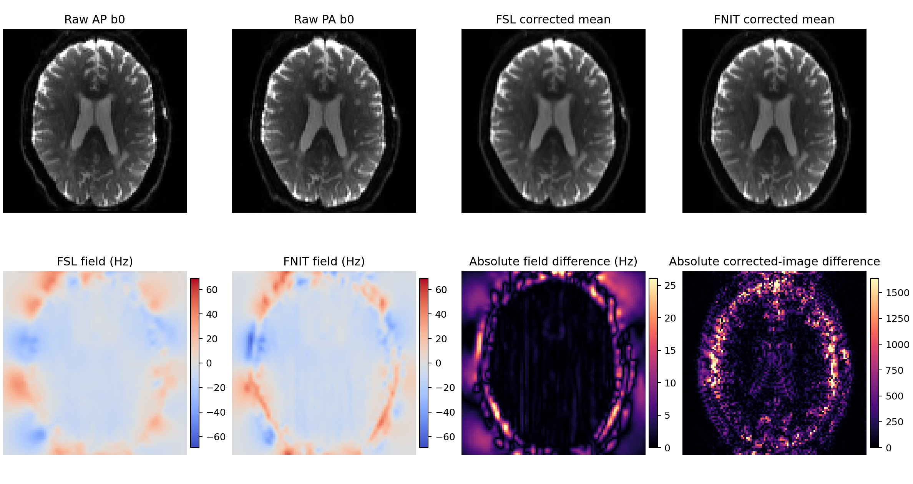

# PyTorch TOPUP：UK Biobank AP/PA b0 畸变校正

`fnit.topup.TorchTOPUP` 是 FSL TOPUP `b02b0.cnf` 路径的 PyTorch/CUDA 实现，用一对相反相位编码的 b0 图像估计 Hz 场图并生成 Jacobian 调制后的校正图。运行时不调用 FSL。当前公开接口一次处理一个被试；多被试调度由调用方完成。

本实现参照 FSL TOPUP `2203.2` 源码，并保留 FSL 输出文件合同。优化器改为适合自动微分的分层 L-BFGS，因此与原生 TOPUP 不是逐元素等价实现。真实数据对照见[验证结果](#与-fsl-6074-的真实数据对照)。

该功能不使用模型权重。CUDA 路径使用 float32，并允许 NVIDIA TF32 matmul 和 cuDNN 内核；不自动使用 float16 或 bfloat16。

## UKB 原始数据目录

`--raw-dir` 需要以下单被试文件：

```text
/path/to/subject/raw/
├── AP.nii.gz
├── AP.bval
├── AP.json
├── PA.nii.gz
├── PA.bval
└── PA.json
```

NIfTI 第四维必须与对应 `.bval` 长度相同。JSON 需要 `PhaseEncodingDirection`，并提供 `TotalReadoutTime`，或提供可换算总读出时间的 `EffectiveEchoSpacing`。当前实现支持 `i/i-` 或 `j/j-`，AP 与 PA 必须方向相反、矩阵和几何一致。

UKB 准备步骤会在 AP、PA 中分别找出 `b<100 s/mm²` 的候选帧，对候选帧执行 GPU 6-DOF 刚体 NCC 配准，计算两两相关均值，并执行 UKB 的选择规则：第一帧得分不低于 0.98 时选择第一帧，否则选择最高分帧。随后写出两帧 `B0_AP_PA.nii.gz` 和两行 `acqparams.txt`。这条 PyTorch 选择器没有调用 FLIRT；在本页的一例真实数据中，它与官方 FLIRT/`fslcc` 流程都选择 AP 第 0 帧和 PA 第 0 帧，但相关分数并不相同。

## 单被试命令行

从 UKB 原始目录完成 b0 选择和场图估计：

```bash
fnit topup \
  --raw-dir /path/to/subject/raw \
  --output-dir topup_subject \
  --device cuda:0
```

- `--raw-dir` 指向上面的六个输入文件。
- `--output-dir` 保存准备后的 AP/PA b0、采集参数和全部 TOPUP 输出。
- `--device cuda:0` 在指定 GPU 上完成候选帧配准和场图估计；可改为 `cpu`。
- 已有输出时程序停止；确认需要替换时加 `--overwrite`。

对已经准备好的 FSL 风格输入，命令为：

```bash
fnit topup \
  --imain B0_AP_PA.nii.gz \
  --datain acqparams.txt \
  --config b02b0.cnf \
  --out fieldmap_out \
  --fout fieldmap_fout \
  --iout fieldmap_iout \
  --jacout fieldmap_jacout \
  --device cuda:0
```

- `--imain` 是 `[X,Y,Z,2]` 的相反相位编码 b0 对。
- `--datain` 是两行四列的 FSL acquisition-parameter 文件；前三列为相位编码向量，第四列为总读出时间（秒）。
- `--config b02b0.cnf` 明确选择当前唯一实现的官方九级配置。
- `--out` 是无扩展名的 TOPUP 根名，用来写 coefficient 和 movement 文件。
- `--fout` 写 Hz 场图；`--iout` 写两帧校正图；`--jacout` 写两个 Jacobian 文件。
- 输出名不带扩展名时，`FSLOUTPUTTYPE=NIFTI` 写 `.nii`，未设置或 `NIFTI_GZ` 写 `.nii.gz`。

独立入口 `fnit-topup` 接受同一组参数，例如把上面命令的 `fnit topup` 换成 `fnit-topup`。

对应的原生 FSL 命令是：

```bash
topup \
  --imain=B0_AP_PA.nii.gz \
  --datain=acqparams.txt \
  --config=b02b0.cnf \
  --out=fieldmap_out \
  --fout=fieldmap_fout \
  --iout=fieldmap_iout \
  --jacout=fieldmap_jacout
```

两条命令中的 `imain/datain/config/out/fout/iout/jacout` 角色一致。FNIT 增加 `--device` 和 `--overwrite`。

## 单被试 Python 调用

直接处理 UKB 原始目录：

```python
from fnit import run_ukb_topup

result, prepared = run_ukb_topup(
    "/path/to/subject/raw",          # AP/PA NIfTI、bval 和 JSON
    "topup_subject",                 # 单被试输出目录
    device="cuda:0",                 # GPU 选择；也可为 "cpu"
    overwrite=False,                 # True 才允许替换已有文件
)
```

`prepared` 记录写出的 `imain/datain`、选中的 AP/PA 原始帧索引和候选得分。`result` 保存内存结果及 QC。

已有 b0 对时，可以按 FSL 参数逐项调用：

```python
from fnit import TorchTOPUP

model = TorchTOPUP(device="cuda:0")
result = model.run(
    "B0_AP_PA.nii.gz",       # FSL --imain
    "acqparams.txt",         # FSL --datain
    out="fieldmap_out",      # FSL --out
    fout="fieldmap_fout",    # FSL --fout
    iout="fieldmap_iout",    # FSL --iout
    jacout="fieldmap_jacout",  # FSL --jacout
    overwrite=False,
)
```

不写文件时使用 `result = model("B0_AP_PA.nii.gz", "acqparams.txt")`。

| Python 字段 | 内容 |
|---|---|
| `result.field_hz` | `--fout` 对应的 3D Hz 场图，NIfTI intent 2018。 |
| `result.corrected` | `--iout` 对应的 `[X,Y,Z,2]` Jacobian 调制校正图。 |
| `result.corrected_mean` | 两帧校正图的内存均值；原生 `topup --iout` 不单独写该文件。 |
| `result.jacobians` | `--jacout_01/02` 对应的两个 3D Jacobian。 |
| `result.coefficients` | `--out_fieldcoef` 对应的 cubic B-spline coefficient NIfTI，intent 2016。 |
| `result.movement_parameters` | `--out_movpar.txt` 对应的两行六列参数，平移单位 mm，旋转单位 rad。 |
| `result.qc` | 设备、dtype、TF32、各层 loss、同步计算时间和 CUDA 峰值显存。 |

## 输出文件合同

以 `out=fieldmap_out` 为例：

| FNIT 输出 | 原生 TOPUP 输出 | 形状与单位 |
|---|---|---|
| `fieldmap_out_fieldcoef.nii.gz` | 同名 | `[55,55,39]`（本例），float32，intent 2016；pixdim 是 knot spacing，qform offset 编码完整场尺寸。 |
| `fieldmap_out_movpar.txt` | 同名 | `[2,6]`；第一帧固定为零，反向帧沿相位编码轴的平移固定为零。 |
| `fieldmap_fout.nii.gz` | `--fout` | `[X,Y,Z]`，float32，Hz，intent 2018。 |
| `fieldmap_iout.nii.gz` | `--iout` | `[X,Y,Z,2]`，float32，输入几何。 |
| `fieldmap_jacout_01.nii.gz`、`_02` | `--jacout_01/02` | `[X,Y,Z]`，float32；保留 TOPUP 的 qform/sform-code 0 文件合同。 |

最终 coefficient 和 movement 文件已由 FSL 6.0.7.4 `applytopup` 直接读取。`applytopup` 输出与 FNIT 两帧校正均值在共同非零体素上的 Pearson `r=0.999987`，MAE `9.4876`，RMSE `23.3396`。边界掩膜与插值实现不同，因此不是逐元素一致。

## 实现范围

当前路径固定为 UKB 使用的 `b02b0.cnf`：九级 20→4 mm cubic B-spline 场、2/1 倍 subsampling、8→0 mm smoothing、SSD 加弯曲能正则、cubic 图像插值、周期性相位编码外推和 Jacobian 强度调制。第一帧固定；反向帧按照 `TopupScanManager` 仅估计五个可辨识的刚体参数。前五级交替更新场与运动，后四级固定运动并细化场。

FSL 使用 LM/SCG、显式导数和稀疏线性求解；FNIT 使用 PyTorch 自动微分和分层 L-BFGS。该优化差异是主要数值边界。当前接口要求正好两个 3D b0、单一且相反的 `i` 或 `j` 相位编码方向；不支持 `k/k-`、多于两帧、自定义配置、其他正则模型或原生 TOPUP 的全部选项。程序遇到这些输入会明确报错。

## 与 FSL 6.0.7.4 的真实数据对照

验证使用 `/path/to/subject/raw` 中一例 UKB 格式真实 dMRI。AP 为 105 帧、PA 为 6 帧；官方选择流程和 FNIT 都选择各自第 0 个 b0。FSL 和 FNIT 使用同一 `104×104×72×2` 输入、同一两行 `acqparams.txt` 和同一 `b02b0.cnf` schedule。数值指标来自完整 3D/4D 输出；“信号区”预先定义为原始 AP/PA 均值大于 100 的体素。

| 输出 | 比较范围 | Pearson r | MAE | RMSE | 最大绝对误差 |
|---|---|---:|---:|---:|---:|
| Hz 场图 | 全 FOV | 0.925534 | 4.977568 Hz | 7.624566 Hz | 104.590492 Hz |
| Hz 场图 | 信号区 | 0.945641 | 4.406024 Hz | 7.320009 Hz | 104.590492 Hz |
| 两帧校正图 | 全 FOV | 0.994358 | 226.416113 | 490.237869 | 25762.781250 |
| 校正均值图 | 全 FOV | 0.995778 | 181.485061 | 422.956005 | 23167.198242 |
| 两个 Jacobian | 全 FOV | 0.808462 | 0.075396 | 0.135923 | 2.945159 |

shape、dtype、场图/校正图 affine、NIfTI intent、coefficient shape/pixdim/qform/sform，以及 Jacobian 的 Analyze-style header 合同均与 FSL 对应输出一致。场图、Jacobian 和运动参数仍有超出数值舍入的差异，所以本包不声明 TOPUP 数值等价。

计时在共享 `gpucw1` 上完成：Intel Xeon Gold 6430、NVIDIA H100 PCIe 80 GB、FSL 6.0.7.4、PyTorch 2.5.1 CUDA。每次计时包含独立进程启动、NIfTI 读取、优化和全部输出写入；GPU 计时前后同步。三次运行使用同一真实输入。

| 实现 | 设备 | 墙钟中位数 [Q1–Q3] | 峰值内存 |
|---|---|---:|---:|
| FSL `topup` | CPU | 300.170 [299.525–300.980] s | 285,676 KB peak RSS |
| FNIT `fnit topup` | H100 GPU | 87.800 [86.955–87.810] s | 1.566 GB CUDA；1,079,372 KB peak RSS |

FNIT 内部 CUDA 同步计算中位数为 81.652 s；墙钟相对 FSL 的中位数加速比为 3.419×。节点未做独占隔离，数字表示这台共享节点上的观测时间。样本量为一个真实被试，三次重复只用于计时稳定性，不能当作三名被试。

下图显示同一轴位切片的原始 AP/PA、FSL/FNIT 校正均值、Hz 场图和绝对差值。显示色阶不参与上表计算。



公开机器可读报告位于 [`validation/topup/report.public.json`](../../validation/topup/report.public.json)。图中不含病例标识；仓库不上传该私有原始 dMRI。

## 源码与许可

UKB AP/PA b0 准备顺序参考 UK Biobank brain imaging pipeline v1.5；场估计实现参照 FSL TOPUP `2203.2`（commit `3e2cb9104e834ce18c10e4b7edddbd500d0c459c`）、basisfield、miscmaths、newimage 和 warpfns。完整、未修改的上游 TOPUP 源码、每文件 SHA-256 和 Git tree 保存在 [`src/fnit/_vendor_fsl`](../../src/fnit/_vendor_fsl/README.md)。修改后的 PyTorch 源码与上游源码一同发布，受 [`FSL Software Licence 6.0`](../../licenses/FSL-6.0.txt) 的非商业条款约束。本项目不是 FSL 官方发布。
