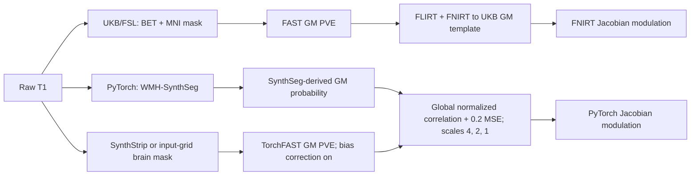

# UK Biobank v1.5 VBM：FSL 参考与实验性 PyTorch GPU 路径

[返回主页](../../README.md) · [实验脚本](../../tools/experimental/ukb_vbm/) · [10 例验证](../../validation/ukb_vbm/)

## 这组脚本复现了什么

UK Biobank v1.5 的 `bb_struct_init` 从原始 T1 开始，依次缩小视野、递归 BET 脑提取、配准到 MNI、把标准脑掩膜逆变换回 T1 空间，再用 FAST 生成 GM partial-volume estimate。`bb_vbm` 随后执行：

```bash
fsl_reg T1_brain_pve_1.nii.gz template_GM.nii.gz \
  T1_GM_to_template_GM -fnirt \
  "--config=GM_2_MNI152GM_2mm.cnf --jout=T1_GM_JAC_nl"
fslmaths T1_GM_to_template_GM -mul T1_GM_JAC_nl \
  T1_GM_to_template_GM_mod -odt float
```

本仓库的 `run_fsl_reference.py` 按该顺序运行从原始 T1 到 FAST 和 `bb_vbm` 的部分。测试数据不是 UK Biobank 扫描，缺少扫描仪梯度系数，因此按原脚本的 `coeff=none` 分支省略 gradient distortion correction。FIRST、SIENAX、去面容、T2/FLAIR、BIANCA、不被 FAST/VBM 读取的 `T1_brain_to_MNI` 派生图像和后续 IDP 未纳入。`bb_vbm` 本身不做群体平滑或统计，本实验也在 modulated GM 结束。

FSL 参考使用 FSL 6.0.7.4。UKB 早期生产文档记录的是 FSL 5.0.10，因此这里复现的是 v1.5 脚本步骤和参数，不是原生产环境的逐字节重放。
源码核对基于 v1.5 仓库 commit `0e39a7f7eb76b55437942bfa3073512506b6c8fa`；该版本 `bb_structural_pipeline/bb_vbm` 的 SHA-256 为 `efdca88961dad9eeec52e15e2d26ad5f807b2c0bd3b41c547990ba78ebb7753f`。

## 与 BWAS 脚本的关系

`BWAS_preprocess_VBM.py` 先运行 `fsl_anat`，再将 FAST 的 GM PVE 用 `fsl_reg -fnirt` 配准到 local HCP-derived GM template，乘以 `--jout` 生成的 Jacobian，最后以 `sigma = 5 / 2.3548` 执行 5 mm FWHM Gaussian 平滑并生成 QC 图。它还保存 T1、CSF、GM 和 WM 的 1 mm MNI 空间图像。

本实验的 FSL 参考臂复现 UKB v1.5 的 `bb_struct_init` 和 `bb_vbm` 路径，同时把 local HCP-derived template 作为第二个受控比较臂。两者的 VBM 核心都是 GM 非线性配准和 Jacobian modulation；前处理入口、默认模板和终点不同。UKB `bb_vbm` 在 modulated GM 结束，因此这次时间和数值比较不包含 BWAS 脚本后续的 5 mm 平滑和 QC 绘图。

## GPU 路径替换了哪些步骤



两条路径生成同名的三幅 2 mm 模板空间图像：warped GM、非线性 Jacobian 和 modulated GM。GPU 路径的命名和网格与 `bb_vbm` 对齐，但算法不同：

| 阶段 | UKB v1.5 参考 | PyTorch 实验路径 |
|---|---|---|
| 脑与组织估计 | BET、逆变换 MNI mask、FAST | `synthseg`：WMH-SynthSeg 后验汇总为 GM；`torch-fast`：SynthStrip 或现有 mask 后运行 TorchFAST，取 GM PVE |
| 仿射初始化 | `fsl_reg`/FLIRT | GM 重心加可优化仿射 |
| 图像目标 | FNIRT 强度模型 | 每个尺度对整幅展平图像计算 `1 - global normalized correlation + 0.2 × MSE` |
| 非线性模型 | FNIRT cubic B-spline | 低分辨率位移控制网格；按 4、2、1 三个尺度优化 |
| 正则化 | `GM_2_MNI152GM_2mm.cnf` | 位移平滑项；验证设置为 10 |
| Jacobian 处理 | FNIRT 配置设为 0.2–5；受控单例最终输出全为正，但范围为 0.271–5.816 | 整体缩放位移场直到落入 0.2–5；不逐体素裁剪 |
| 调制 | warped GM × nonlinear Jacobian | 同一公式 |

GPU 注册不是 FNIRT 的源码移植，也没有复现它的 B-spline、强度模型或优化器。正式验证中，原始 GPU 位移场需要约束回退；最终 Jacobian 合法是构造条件，不能单独证明配准正确。当前代码因此放在 `tools/experimental/`，没有加入 `freesurfer_torch` 稳定 API。

## 输入与输出

单例入口为 `run_gpu_vbm.py`：

```bash
python tools/experimental/ukb_vbm/run_gpu_vbm.py \
  --input subject_T1w.nii.gz \
  --template assets/template_GM.nii.gz \
  --output-dir results/sub-01 --device cuda:0
```

`--input` 是单帧 3D T1 NIfTI；`--template` 是 3D GM 模板，其 shape 和 affine 决定最终输出网格。`--device` 选择 PyTorch 设备。默认 `--affine-steps 50 --deform-steps 40 --smoothness 10` 对应本次实测；其中 smoothness 由一例调参病例选定。

默认 `--gm-method synthseg` 使用 WMH-SynthSeg 后验得到 GM，需要 checkpoint；可用
`--weights` 显式指定，或先运行 `python tools/setup_weights.py --model wmh-synthseg`。
另一入口是：

```bash
python tools/experimental/ukb_vbm/run_gpu_vbm.py \
  --input subject_T1w.nii.gz \
  --template assets/template_GM.nii.gz \
  --output-dir results/sub-01-fast --device cuda:0 \
  --gm-method torch-fast
```

`torch-fast` 默认先用 SynthStrip 脑提取，再运行三组织 TorchFAST，并以 GM PVE
进入配准；`--brain-mask` 可提供与 T1 同网格的现有 mask，跳过 SynthStrip。
TorchFAST bias correction 默认启用，`--fast-no-bias` 才关闭；该开关用于消融，不是
默认流程。TorchFAST 本身不需要权重；自动脑提取需要 SynthStrip 权重，可先运行
`python tools/setup_weights.py --model synthstrip`，或用 `--synthstrip-weights` 指定。

| 文件 | 网格和数值含义 | 原 `bb_vbm` 对应物 |
|---|---|---|
| `GM_prob.nii.gz` | 输入 T1 网格；SynthSeg-derived GM 概率或 TorchFAST GM PVE | `T1_fast/T1_brain_pve_1.nii.gz`；`torch-fast` 仍是独立实现 |
| `brain_mask.nii.gz` | 输入 T1 网格；硬脑掩膜 | `T1_brain_mask.nii.gz`，算法不同 |
| `T1_GM_to_template_GM.nii.gz` | 模板网格；warped GM | 同名文件 |
| `T1_GM_JAC_nl.nii.gz` | 模板网格；非线性 pull-map determinant | 同名文件 |
| `T1_GM_to_template_GM_mod.nii.gz` | 模板网格；warped GM × Jacobian | 同名文件 |
| `report.private.json` | 本地输入/模板路径、GM 方法、运行参数、原始/约束后 Jacobian、拟合分数和墙钟时间 | 原脚本没有统一 JSON 报告 |

`torch-fast` 还写出 `T1_brain.nii.gz`、`T1_brain_pve_0/1/2.nii.gz`、
`T1_brain_seg.nii.gz`、`T1_brain_pveseg.nii.gz`、
`T1_brain_mixeltype.nii.gz`、`T1_brain_bias.nii.gz` 和
`T1_brain_restore.nii.gz`。报告包含本地路径，不能直接作为公开聚合报告发布。

## 官方模板和权重

模型权重不进入 Git。`synthseg` 使用的 WMH-SynthSeg checkpoint 和 `torch-fast`
自动脑提取所用的 SynthStrip checkpoint 均由现有权重配置脚本从 FreeSurfer 官方
地址下载并校验 SHA-256；见[权重说明](../WEIGHTS.md)。TorchFAST 分割不读取权重。

UKB v1.5 把模板作为外部 ancillary data 使用。官方公开压缩包为：

```text
https://www.fmrib.ox.ac.uk/ukbiobank/fbp/templates/dckr_build/DATA_public.tar.gz
SHA-256: 52c2349270d4d19b8de6a0d136270e74f6a68379d02bda6635a92306c18e2319
size: 689432077 bytes
```

只运行 GPU 路径需要压缩包内的 `templates/template_GM.nii.gz`。运行 FSL 参考还需要两个脑掩膜和 `bb_pipeline_v_2.5/bb_data/bb_fnirt.cnf`。下面的命令把这些文件提取为 `assets/template_GM.nii.gz`、两个 `assets/MNI152_*.nii.gz` 和 `assets/bb_fnirt.cnf`；模板文件不由本仓库再分发。

```bash
curl -L -o DATA_public.tar.gz \
  https://www.fmrib.ox.ac.uk/ukbiobank/fbp/templates/dckr_build/DATA_public.tar.gz
echo '52c2349270d4d19b8de6a0d136270e74f6a68379d02bda6635a92306c18e2319  DATA_public.tar.gz' \
  | sha256sum -c -
mkdir -p assets
tar -xzf DATA_public.tar.gz -C assets --strip-components=1 \
  templates/template_GM.nii.gz \
  templates/MNI152_T1_1mm_brain_mask.nii.gz \
  templates/MNI152_T1_1mm_brain_mask_dil_GD7.nii.gz
tar -xzf DATA_public.tar.gz -C assets --strip-components=2 \
  bb_pipeline_v_2.5/bb_data/bb_fnirt.cnf
```

公开 UKB `template_GM.nii.gz` 的 SHA-256 为 `ab933db7455d7c4b88624d54f41a3065be4ba4289d00b9230daec0cdb1597a77`。实测比较的另一幅图像是用户现有的 local HCP-derived GM template，SHA-256 为 `2f20eeb19a8f9c3514d1bd1f4d46bca13065ca66bae723721e413688bde9110c`。它的上游来源和许可没有得到确认，因此本仓库不分发，也不称为官方 HCP 模板。

## 评估设计

验证使用 10 例真实 T1w。一例用于选择 GPU smoothness；主要稳健性结果同时报告全部 10 例和排除该例后的 9 例。病例标识、原始图像、逐例结果和服务器路径不进入 Git。

模板比较使用固定 mask：`(UKB template > 0.01) OR (local HCP-derived template > 0.01)`，共 214,263 个 2 mm 体素；受试者输出不参与 mask。每例与同一 arm 其余病例的平均图计算 leave-one-out Pearson 和 Dice；精确检验枚举全部 2^N 个受试者内模板标签交换，并在每个交换后重新建立两组 LOO 参考。普通 bootstrap 不能处理这些共享 LOO 参考带来的依赖，因此未使用。

队列内一致性可能偏好更平滑、更收缩或模板印记更强的结果。它不是人工标注的解剖准确性，也不能证明某幅模板普遍更好。完整数字、运行时间和聚合图见[验证报告](../../validation/ukb_vbm/README.md)。

## 一个几何失败及处理

10 例中有一例在原 v1.5 `xyztrans.sch` 步骤产生无效变换，随后 T1→MNI 输出为空。该例改用 NIfTI header 推导 cropped-to-original 的 FSL scaled-voxel transform，再继续原 FNIRT、逆 mask 和 FAST 步骤。其余 9 例使用原脚本的 FLIRT schedule。这个 fallback 使该例可处理，但它是数据几何兼容修复，不属于原 UKB v1.5 代码。

## 批量执行

批量脚本和双 GPU 分组示例见[实验脚本说明](../../tools/experimental/ukb_vbm/README.md)。`run_gpu_raw.py --gm-method synthseg` 在每个进程保留一份 SynthSeg estimator；`--gm-method torch-fast` 则保留 SynthStrip 和 TorchFAST，并使用默认 bias correction。每个进程依次处理分配给它的病例；多 GPU 时给各进程互不重叠的病例列表。验证报告中的 GPU 吞吐时间来自一张 H100 上的顺序批量，不把示例的双 GPU 调度写成实测加速。

## 来源

- [UK Biobank pipeline v1.5](https://git.fmrib.ox.ac.uk/falmagro/uk_biobank_pipeline_v_1.5)
- [`bb_vbm` source](https://git.fmrib.ox.ac.uk/falmagro/uk_biobank_pipeline_v_1.5/-/blob/master/bb_structural_pipeline/bb_vbm)
- [FMRIB UK Biobank pipeline and ancillary files](https://www.fmrib.ox.ac.uk/ukbiobank/fbp/)
- [FNIRT user guide](https://fsl.fmrib.ox.ac.uk/fsl/docs/registration/fnirt/user_guide.html)
- [FSL-VBM guide](https://fsl.fmrib.ox.ac.uk/fsl/docs/structural/fslvbm.html)
