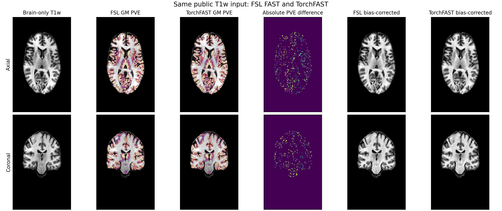

# TorchFAST validation

[返回首页](../../README.md) · [功能说明](../../docs/fast/README.md) · [聚合 JSON](report.public.json)

验证在 gpucw1 上完成。参考程序是 FSL 6.0.7.4 中的 FAST4 2111.3；实现使用
Python 3.11.7、PyTorch 2.5.1+cu118 和 NVIDIA H100 PCIe。临床数据只发布 10 例
聚合统计，不发布原始路径、逐例记录或影像。

## 相同 brain-only 输入

FSL 与 TorchFAST 都读取每例同一份 `T1_brain.nii.gz`。参考命令为：

```bash
fast -b -o T1_fast/T1_brain T1_brain.nii.gz

fs-torch fast -i T1_brain.nii.gz -o torch/T1_brain \
  --device cuda:0 --threads 1 -b
```

比较范围是输入中严格大于零的体素。PVE 的 Pearson、MAE、0.5 阈值 Dice 和
体积比均在三维输出上计算；bias 先取对数再比较。10/10 例通过有限值、PVE 范围、
脑内 PVE 和为 1、脑外 PVE 为 0、bias 正值、脑外 bias 为 1、校正图恒等式和标签
范围检查。

| 输出 | Pearson 中位数 | MAE 中位数 | Dice 0.5 中位数 | Torch/FSL 体积比中位数 |
|---|---:|---:|---:|---:|
| CSF PVE | 0.98777 | 0.00820 | 0.98687 | 1.01439 |
| GM PVE | 0.98488 | 0.01499 | 0.99232 | 0.99059 |
| WM PVE | 0.99345 | 0.00718 | 0.99713 | 1.00459 |

log-bias 的 Pearson 中位数为 **0.99999999945**，MAE 为 **1.90×10⁻⁶**。校正图
的 Pearson 中位数为 **0.99999999998**，相对 MAE 为 **1.92×10⁻⁶**。这些结果说明
默认 bias 方程、符号和物理平滑尺度与参考一致。HMRF 和 mixel 更新仍采用适合 GPU
的同步更新，而 FAST 使用逐体素原地更新，因此 PVE 不是逐体素相同。

## bias correction 消融

关闭 bias 更新时仍保留 FAST `-N` 的四次 HMRF 外循环。10 例 GM 对 FSL 的
Pearson 中位数由 **0.98488** 降到 **0.93647**，Dice 由 **0.99232** 降到
**0.93703**，MAE 由 **0.01499** 升到 **0.07205**。因此 VBM 路径默认启用偏置场
校正，并保存 `T1_brain_bias.nii.gz` 和 `T1_brain_restore.nii.gz`。

## 运行时间和 CPU/CUDA 一致性

完整命令时间包含新 Python 进程、输入读取、GPU 计算、CPU 回传和压缩 NIfTI
输出。TorchFAST `-b` 与 FSL `fast -b` 都保存 7 个对应文件。10 例中位数分别为
**12.43 s** 和 **305.80 s**；逐例 FSL/Torch 比值的中位数为 **22.97**。两组任务
在共享节点的不同时段运行，这些数值是观察到的墙钟时间，不是隔离负载下的硬件
加速上限。

一例额外使用 16 个 CPU 线程和 H100 运行同一 PyTorch 实现。输入读取加推理时间
分别为 **80.65 s** 和 **1.62 s**。CPU/CUDA GM Pearson 为
**0.9999999949**，MAE 为 **8.41×10⁻⁸**；最大差为一个 PVE 网格步长
**0.01000005**。bias MAE 为 **3.38×10⁻⁸**。该单例检查说明两个设备路径数值一致，
不作为稳定的 CPU/GPU 吞吐估计。

## 原始 T1 到 VBM

10 例均完成：

```text
raw T1 -> SynthStrip -> TorchFAST bias correction and GM PVE
       -> PyTorch registration -> Jacobian -> modulated GM
```

持久模型批处理中，`SynthStrip + TorchFAST + 11 个输入网格输出`的逐例 warm
中位数为 **23.05 s**；注册、Jacobian 和调制为 **10.99 s**；两阶段逐例 warm
时间之和的中位数为 **36.47 s**。这些 GPU 数值不含该批次一次性的模型加载。
10/10 个最终 Jacobian 在模板 mask 内均为正。FSL UKB 方法链可用的 9 例完整阶段
计时中位数为 **3637.20 s**；一例缺少完整逐阶段计时，未以 0 填补。两种方法在
共享节点的不同时段运行，因此这里不据此计算受控加速比。

原始 T1 路径同时更换了脑提取与配准算法，不能把最终差异归因于 FAST。TorchFAST
原始路径 GM 与 FSL GM 的 0.5 Dice 中位数为 **0.9541**；使用同一 PyTorch 配准器
时，warped GM 与 FSL-GM 输入臂的 Pearson 中位数为 **0.7923**。直接和 FSL/FNIRT
最终结果比较时，warped GM Pearson 为 **0.5892**、modulated GM Pearson 为
**0.5088**。这部分只证明 pipeline 可运行并给出差异边界，不证明 FNIRT 等价。

## 公开图示

下图使用仓库中的公开 `sub-02` T1w 及已经发布的参考 SynthStrip 脑图。FSL 与
TorchFAST 接收同一 brain-only 输入；中间两列叠加 GM PVE，右侧比较偏置校正图。
本例 GM Pearson 为 **0.97817**、0.5 Dice 为 **0.98742**、体积比为
**0.99350**。



图由 [`tools/plot_fast_comparison.py`](../../tools/plot_fast_comparison.py) 生成，数值见
[`figures/metrics.json`](figures/metrics.json)。聚合结果及计时口径见
[`report.public.json`](report.public.json)。

## 当前公开记录

单被试聚合结果、计时口径和公开示意图分别见 [`report.public.json`](report.public.json) 与 [`figures/metrics.json`](figures/metrics.json)。原始病例、私有路径和运行输出不进入仓库。
