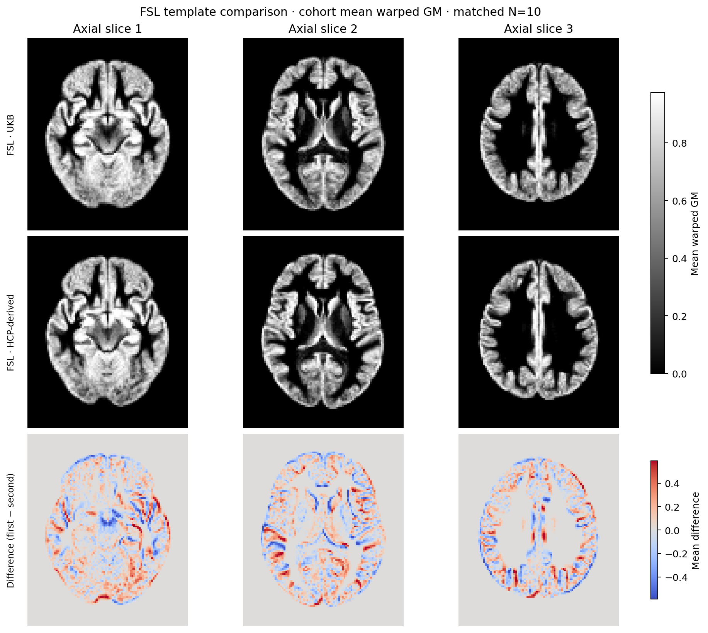
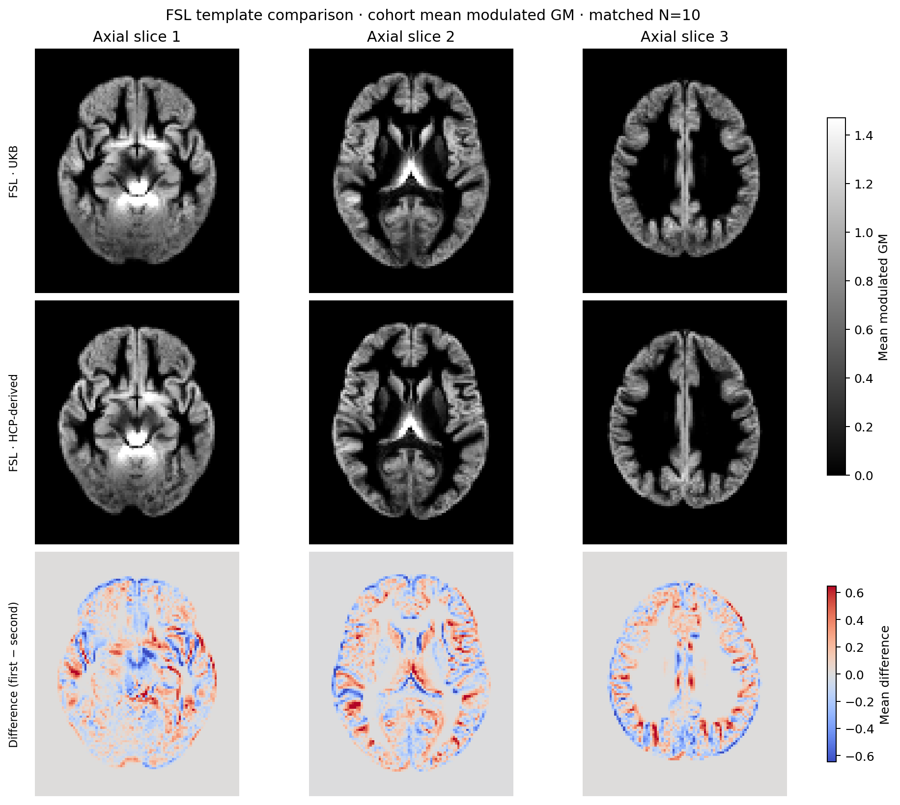
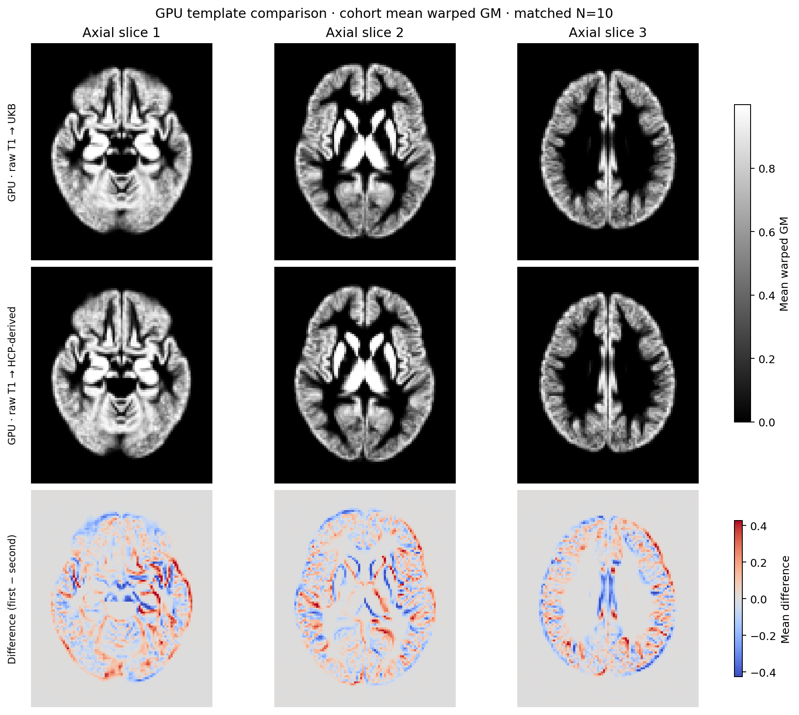
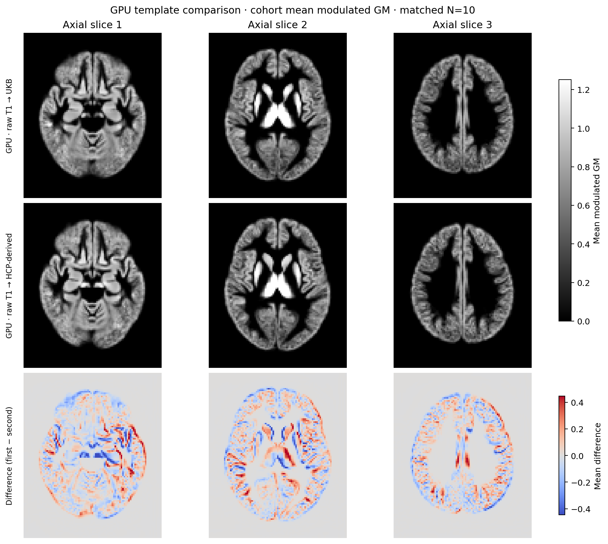
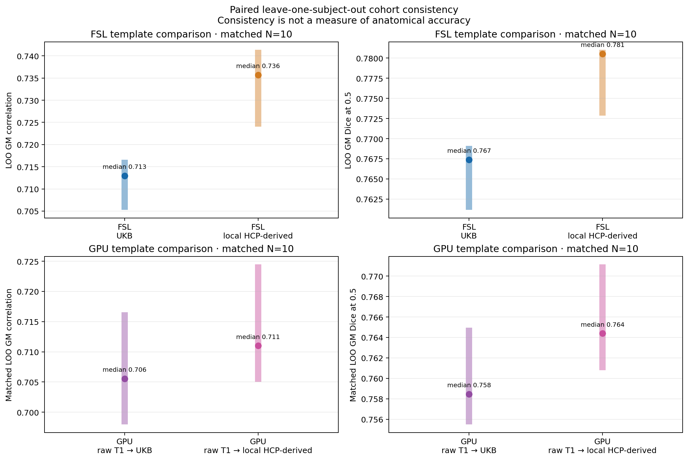
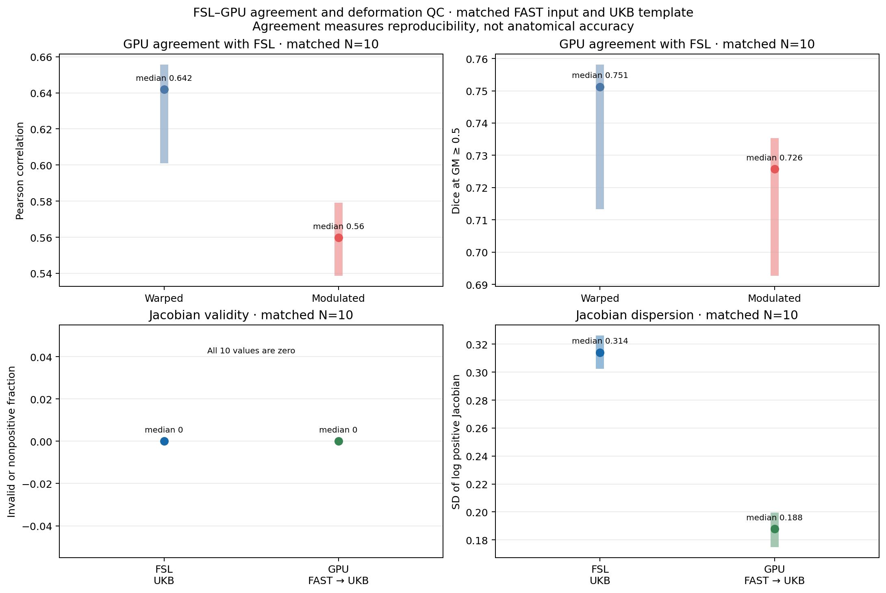
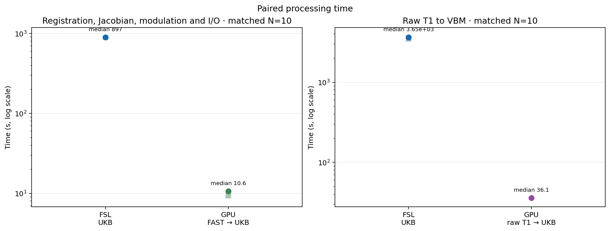

# UK Biobank v1.5 VBM reproduction and experimental PyTorch GPU alternative

Run date: 2026-09-24

Evaluation used ten real T1-weighted scans from one non-UKB clinical cohort. Only cohort aggregates and cohort-mean images are released.

This release reports an experimental PyTorch GPU alternative to the UK Biobank v1.5 FSL VBM workflow. The GPU method does not reproduce FNIRT and must not be treated as an FNIRT-equivalent implementation.

Main result: The UKB template did not improve leave-one-out cohort consistency. FSL favored the local HCP-derived template for warped Pearson, warped Dice and modulated Dice under exact paired-label tests.

## Evaluation design

The full analysis contains 10 T1-weighted scans. case01 was used to select the GPU smoothness setting. The holdout analysis contains the remaining 9 scans.

Template comparisons use the fixed union of template values above 0.01 (214,263 voxels at 2 mm); subject outputs do not define the mask. Each score compares one scan with the mean of the other scans in the same arm. The exact test enumerates every within-scan template-label assignment and rebuilds both leave-one-out references.

The FSL arm is UKB v1.5 structural and VBM commands on FSL 6.0.7.4. The reference follows the published crop, BET, standard-mask, FAST, affine, FNIRT, Jacobian and modulation sequence. The original production environment used an older FSL release, so this is a method-level reproduction rather than a bytewise replay.

The GPU arm is PyTorch GPU raw-T1 VBM alternative. WMH-SynthSeg posteriors estimate GM, followed by multiscale optimization with global normalized correlation + 0.2 MSE, affine and displacement parameters, and Jacobian modulation.

Gradient distortion correction was omitted because the non-UKB scans had no scanner gradient-coefficient file; the corresponding v1.5 branch uses no gradient correction.

The standard transform failed for case02. For that scan, a cropped-to-original FSL scaled-voxel transform derived from the image headers before the remaining reference steps was used because the original schedule produced an invalid transform and an empty standard-space image for this geometry.

## Template provenance

No template is included in this release.

| Template | Role | Source | SHA-256 | Source status |
|---|---|---|---|---|
| UKB v1.5 GM template | official reference template | [source](https://www.fmrib.ox.ac.uk/ukbiobank/fbp/templates/dckr_build/DATA_public.tar.gz) | `ab933db7455d7c4b88624d54f41a3065be4ba4289d00b9230daec0cdb1597a77` | Extracted from the official ancillary archive; archive SHA-256 is recorded in the method documentation. |
| local HCP-derived GM template | comparison template | Not public | `2f20eeb19a8f9c3514d1bd1f4d46bca13065ca66bae723721e413688bde9110c` | Upstream provenance and redistribution terms were not confirmed; it is not described as an official HCP template. |

## Runtime environment

| Group | Field | Value |
|---|---|---|
| hardware | host | gpucw1 |
| hardware | CPU | Intel Xeon Gold 6430, 128 logical CPUs |
| hardware | GPU | 2 x NVIDIA H100 PCIe, 81559 MiB each |
| hardware | driver | 535.216.03 |
| software | FSL | 6.0.7.4 |
| software | Python | 3.11.7 |
| software | PyTorch | 2.5.1 with CUDA 11.8 |
| software | nibabel | 5.4.0 |
| software | NumPy | 1.26.4 |
| software | SciPy | 1.11.4 |

## Timing definitions

### Shared-node cohort timing

Includes: Observed wall time for each complete method stage, including image I/O. Raw-T1 FSL timing includes crop, brain extraction, standard-mask propagation, FAST, registration, Jacobian and modulation.

Excludes: Gradient correction and downstream UKB stages outside VBM. The node also ran unrelated work, so these values describe the observed run rather than an isolated hardware limit.

### Matched-input registration timing

Includes: Registration, Jacobian calculation, modulation and image I/O from the identical FAST GM image and UKB template.

Excludes: Raw-T1 preprocessing, brain extraction and GM estimation.

### Monitored H100 warm timing

Includes: Ten scans processed sequentially on one H100 after a single model load. Monitoring found no competing GPU load during the run; GPU memory was 1,266 MiB before and after and peaked at 4,997 MiB. Per-scan raw-T1 time is GM inference plus registration wall time.

Excludes: The one-time 1.432-second model load, environment setup, template download and weight download.

### Separate lower-load single-scan timing windows

Includes: The same anonymous holdout scan and official UKB template were used. The CPU value is a successful fresh-output FSL run with continuous stage wall times; 317 ten-second samples had median one-minute system load 13.82 and range 6.69 to 33.78. The GPU values come from a different monitored window and report model load, GM inference and I/O, registration through finalized output, and the saved warm stage sum. Across 79 one-second GPU samples, no competing GPU compute was detected; memory was 1,266 MiB before and after and peaked at 4,997 MiB, while external resident processes were unchanged.

Excludes: The CPU and GPU windows were not simultaneous or paired. The CPU was screened only for lower load before launch. The GPU warm sum excludes model load, downloads and environment setup. No controlled speedup is calculated from these separate windows.

## Aggregate results

Leave-one-subject-out similarity measures cohort consistency. They do not measure anatomical accuracy. Timing values are interpretable only under the definitions and runtime environment recorded above.

### All scans (N=10)

The UKB template did not improve leave-one-out cohort consistency. FSL favored the local HCP-derived template for warped Pearson, warped Dice and modulated Dice under exact paired-label tests. The fixed template-only mask contained 214,263 2 mm voxels, using the union of template values above 0.01. The GPU template differences were smaller and not significant. With matched FAST GM input, GPU versus FSL mean Pearson was 0.630 for warped GM and 0.553 for modulated GM. Before registration, SynthSeg-derived GM versus FAST GM had median Pearson 0.579, Dice 0.835 and volume ratio 1.008. Every end-to-end GPU registration required whole-field deformation scaling; raw fields contained nonpositive determinants, so valid saved Jacobians are a construction constraint.

| Comparison | Metric | Statistic | N | Left | Right | Difference | Exact paired-label p |
|---|---|---:|---:|---:|---:|---:|---:|
| FSL template comparison | Warped GM: LOO Pearson correlation | mean | 10 | UKB: 0.7056 | local HCP-derived: 0.7276 | UKB minus local HCP-derived: -0.022 | 0.00195312 |
|  | Direction count |  | 10 | UKB: 0 | local HCP-derived: 10 | ties: 0 |  |
|  | Note |  |  | All paired label assignments were enumerated and each assignment rebuilt both leave-one-out references. |  |  |  |
| FSL template comparison | Warped GM: LOO Dice at GM >= 0.5 | mean | 10 | UKB: 0.7612 | local HCP-derived: 0.774 | UKB minus local HCP-derived: -0.0127 | 0.00195312 |
|  | Direction count |  | 10 | UKB: 0 | local HCP-derived: 10 | ties: 0 |  |
| FSL template comparison | Modulated GM: LOO Pearson correlation | mean | 10 | UKB: 0.6818 | local HCP-derived: 0.6907 | UKB minus local HCP-derived: -0.0089 | 0.175781 |
|  | Direction count |  | 10 | UKB: 0 | local HCP-derived: 10 | ties: 0 |  |
| FSL template comparison | Modulated GM: LOO Dice at GM >= 0.5 | mean | 10 | UKB: 0.7464 | local HCP-derived: 0.7599 | UKB minus local HCP-derived: -0.0135 | 0.00390625 |
|  | Direction count |  | 10 | UKB: 0 | local HCP-derived: 10 | ties: 0 |  |
| GPU template comparison | Warped GM: LOO Pearson correlation | mean | 10 | UKB: 0.7082 | local HCP-derived: 0.7128 | UKB minus local HCP-derived: -0.0045 | 0.224609 |
|  | Direction count |  | 10 | UKB: 1 | local HCP-derived: 9 | ties: 0 |  |
|  | Note |  |  | All paired label assignments were enumerated and each assignment rebuilt both leave-one-out references. |  |  |  |
| GPU template comparison | Warped GM: LOO Dice at GM >= 0.5 | mean | 10 | UKB: 0.761 | local HCP-derived: 0.7654 | UKB minus local HCP-derived: -0.0044 | 0.0546875 |
|  | Direction count |  | 10 | UKB: 1 | local HCP-derived: 9 | ties: 0 |  |
| GPU template comparison | Modulated GM: LOO Pearson correlation | mean | 10 | UKB: 0.6941 | local HCP-derived: 0.6913 | UKB minus local HCP-derived: 0.0028 | 0.439453 |
|  | Direction count |  | 10 | UKB: 6 | local HCP-derived: 4 | ties: 0 |  |
| GPU template comparison | Modulated GM: LOO Dice at GM >= 0.5 | mean | 10 | UKB: 0.7533 | local HCP-derived: 0.7576 | UKB minus local HCP-derived: -0.0042 | 0.0800781 |
|  | Direction count |  | 10 | UKB: 1 | local HCP-derived: 9 | ties: 0 |  |
| FSL versus GPU with matched FAST GM input and UKB template | Pearson agreement | mean across 10 matched scans | 10 | Warped GM: 0.6301 | Modulated GM: 0.5528 | Warped GM minus Modulated GM: 0.0773 | NA |
|  | Note |  |  | Agreement measures reproducibility relative to FSL, not anatomical accuracy. |  |  |  |
| FSL versus GPU with matched FAST GM input and UKB template | Dice agreement at GM >= 0.5 | mean across 10 matched scans | 10 | Warped GM: 0.7412 | Modulated GM: 0.7162 | Warped GM minus Modulated GM: 0.025 | NA |
|  | Note |  |  | Both methods received the identical FAST GM image; only registration and modulation differed. |  |  |  |
| FSL reference versus end-to-end GPU alternative | Pearson agreement | mean across 10 matched scans | 10 | Warped GM: 0.5883 | Modulated GM: 0.4765 | Warped GM minus Modulated GM: 0.1118 | NA |
|  | Note |  |  | This comparison includes both GM estimation and registration differences. |  |  |  |
| FSL reference versus end-to-end GPU alternative | Dice agreement at GM >= 0.5 | mean across 10 matched scans | 10 | Warped GM: 0.7206 | Modulated GM: 0.6945 | Warped GM minus Modulated GM: 0.0261 | NA |
|  | Note |  |  | This comparison includes both GM estimation and registration differences. |  |  |  |

| Method | Scope | Device | Statistic | N | Seconds |
|---|---|---|---:|---:|---:|
| FSL reference | raw T1 to modulated GM | CPU, shared node | median | 10 | 3646.0249 |
| PyTorch alternative | raw T1 to modulated GM | H100, shared-node cohort run | median | 10 | 36.0851 |
| FSL reference | registration, Jacobian, modulation and I/O from FAST GM | CPU, shared node | median | 10 | 897.2938 |
| PyTorch alternative | registration, Jacobian, modulation and I/O from FAST GM | H100, shared-node cohort run | median | 10 | 10.6499 |
| PyTorch alternative | GM estimation | one H100; no competing load detected | median warm per scan | 10 | 7.5842 |
| PyTorch alternative | registration, Jacobian, modulation and I/O | one H100; no competing load detected | median warm per scan | 10 | 7.779 |
| PyTorch alternative | raw T1 to modulated GM | one H100; no competing load detected | median warm per scan | 10 | 15.5347 |
| PyTorch alternative | ten sequential registrations | one H100; no competing load detected | batch wall time | 10 | 82.3173 |
| FSL reference | raw T1 to finalized modulated GM, one holdout scan | CPU, pre-screened lower-load window; OMP/MKL/OpenBLAS/ITK environment variables set to 2 | single-scan continuous wall time | 1 | 3167.0732 |
| FSL reference | raw-T1 preprocessing through FAST, one holdout scan | CPU, pre-screened lower-load window; OMP/MKL/OpenBLAS/ITK environment variables set to 2 | single-scan measured stage | 1 | 2309.7642 |
| FSL reference | GM registration and Jacobian output, one holdout scan | CPU, pre-screened lower-load window; OMP/MKL/OpenBLAS/ITK environment variables set to 2 | single-scan measured stage | 1 | 857.1431 |
| FSL reference | Jacobian modulation, one holdout scan | CPU, pre-screened lower-load window; OMP/MKL/OpenBLAS/ITK environment variables set to 2 | single-scan measured stage | 1 | 0.1554 |
| PyTorch alternative | one-time GM model load | physical H100 GPU 1, exposed as cuda:0; no competing load detected | single monitored session | 1 | 1.4322 |
| PyTorch alternative | GM estimation and I/O, one holdout scan | physical H100 GPU 1, exposed as cuda:0; separate monitored window | single-scan measured stage | 1 | 7.3842 |
| PyTorch alternative | registration through finalized modulated-GM output, one holdout scan | physical H100 GPU 1, exposed as cuda:0; separate monitored window | single-scan measured stage | 1 | 7.4268 |
| PyTorch alternative | raw-T1 warm stage sum, one holdout scan | physical H100 GPU 1, exposed as cuda:0; separate monitored window | derived sum of measured stages; model load excluded | 1 | 14.811 |

### Holdout after excluding the smoothness-tuning scan (N=9)

The holdout analysis preserved the conclusion. FSL again favored the local HCP-derived template for warped Pearson, warped Dice and modulated Dice. GPU differences remained small; no exact paired-label test reached 0.05.

| Comparison | Metric | Statistic | N | Left | Right | Difference | Exact paired-label p |
|---|---|---:|---:|---:|---:|---:|---:|
| FSL template comparison | Warped GM: LOO Pearson correlation | mean | 9 | UKB: 0.7096 | local HCP-derived: 0.7316 | UKB minus local HCP-derived: -0.022 | 0.00390625 |
|  | Direction count |  | 9 | UKB: 0 | local HCP-derived: 9 | ties: 0 |  |
|  | Note |  |  | All paired label assignments were enumerated and each assignment rebuilt both leave-one-out references. |  |  |  |
| FSL template comparison | Warped GM: LOO Dice at GM >= 0.5 | mean | 9 | UKB: 0.7663 | local HCP-derived: 0.7787 | UKB minus local HCP-derived: -0.0124 | 0.00390625 |
|  | Direction count |  | 9 | UKB: 0 | local HCP-derived: 9 | ties: 0 |  |
| FSL template comparison | Modulated GM: LOO Pearson correlation | mean | 9 | UKB: 0.6843 | local HCP-derived: 0.6913 | UKB minus local HCP-derived: -0.007 | 0.230469 |
|  | Direction count |  | 9 | UKB: 0 | local HCP-derived: 9 | ties: 0 |  |
| FSL template comparison | Modulated GM: LOO Dice at GM >= 0.5 | mean | 9 | UKB: 0.7517 | local HCP-derived: 0.7646 | UKB minus local HCP-derived: -0.0129 | 0.0078125 |
|  | Direction count |  | 9 | UKB: 0 | local HCP-derived: 9 | ties: 0 |  |
| GPU template comparison | Warped GM: LOO Pearson correlation | mean | 9 | UKB: 0.7044 | local HCP-derived: 0.7094 | UKB minus local HCP-derived: -0.005 | 0.242188 |
|  | Direction count |  | 9 | UKB: 1 | local HCP-derived: 8 | ties: 0 |  |
|  | Note |  |  | All paired label assignments were enumerated and each assignment rebuilt both leave-one-out references. |  |  |  |
| GPU template comparison | Warped GM: LOO Dice at GM >= 0.5 | mean | 9 | UKB: 0.7612 | local HCP-derived: 0.7656 | UKB minus local HCP-derived: -0.0044 | 0.101562 |
|  | Direction count |  | 9 | UKB: 1 | local HCP-derived: 8 | ties: 0 |  |
| GPU template comparison | Modulated GM: LOO Pearson correlation | mean | 9 | UKB: 0.6891 | local HCP-derived: 0.6869 | UKB minus local HCP-derived: 0.0023 | 0.570312 |
|  | Direction count |  | 9 | UKB: 4 | local HCP-derived: 5 | ties: 0 |  |
| GPU template comparison | Modulated GM: LOO Dice at GM >= 0.5 | mean | 9 | UKB: 0.754 | local HCP-derived: 0.7589 | UKB minus local HCP-derived: -0.0049 | 0.0585938 |
|  | Direction count |  | 9 | UKB: 1 | local HCP-derived: 8 | ties: 0 |  |

No separate timing summary was defined for this analysis.

## Figures



FSL cohort-mean warped GM using the UKB and local HCP-derived templates, with their mean difference. Aggregated over N=10; no individual scan is shown.



FSL cohort-mean modulated GM using the UKB and local HCP-derived templates, with their mean difference. Aggregated over N=10; no individual scan is shown.



GPU cohort-mean warped GM using the UKB and local HCP-derived templates, with their mean difference. Aggregated over N=10; no individual scan is shown.



GPU cohort-mean modulated GM using the UKB and local HCP-derived templates, with their mean difference. Aggregated over N=10; no individual scan is shown.


Cohort-mean warped GM for FSL and GPU registration from the same FAST GM input and UKB template. Aggregated over N=10; no individual scan is shown.


Cohort-mean modulated GM for FSL and GPU registration from the same FAST GM input and UKB template. Aggregated over N=10; no individual scan is shown.



Median and interquartile range of leave-one-out cohort consistency for both templates and methods. Aggregated over N=10; no individual scan is shown.



Median and interquartile range of FSL-GPU agreement and final Jacobian quality measures. Aggregated over N=10; no individual scan is shown.



Median and interquartile range of observed FSL and GPU processing times on the shared cohort run. Aggregated over N=10; no individual scan is shown.

## Rebuild this report

The committed aggregate input contains no case-level records or image paths. From the repository root, rebuild both text artifacts with:

```bash
python tools/experimental/ukb_vbm/build_public_report.py \
  --input validation/ukb_vbm/report.input.json \
  --out-dir validation/ukb_vbm
```

Verify the committed report and figures with:

```bash
(cd validation/ukb_vbm && sha256sum -c SHA256SUMS)
```

## Limits

- The cohort contains ten scans from one clinical dataset and is not a UK Biobank sample.
- One scan selected the GPU smoothness value; the other nine form the holdout analysis.
- Leave-one-out cohort consistency is not anatomical accuracy and may favor smoother results or stronger template imprinting.
- The local HCP-derived template has unconfirmed upstream provenance and redistribution terms, and no template is included in this release.
- The GPU method is an experimental alternative, not a PyTorch port of FNIRT and not an FNIRT-equivalent implementation.
- All raw GPU displacement fields needed global scaling to meet the 0.2 to 5 Jacobian range; final Jacobian validity cannot be used as independent evidence of registration quality.
- FSL 6.0.7.4 was used instead of the older FSL release recorded for early UKB production.
- In the fresh single-scan FSL timing run, the saved Jacobian field was positive but ranged from 0.270846 to 5.816415; FNIRT also emitted range warnings during optimization, so its configured 0.2 to 5 range must not be read as a strict bound on the final saved field.
- Gradient distortion correction was omitted because scanner-specific coefficient files were unavailable.
- The shared-node cohort timings include variable unrelated load. In the monitored H100 window, no competing GPU load was detected; resident processes and baseline memory remained unchanged, so this is a controlled observation rather than a guarantee of zero system interference.
- The separate lower-load CPU and GPU timing windows contain one holdout scan and do not estimate throughput variability.
- Only sequential one-H100 throughput was measured; the two-GPU split shown in the documentation is a scheduling example rather than a measured scaling result.
